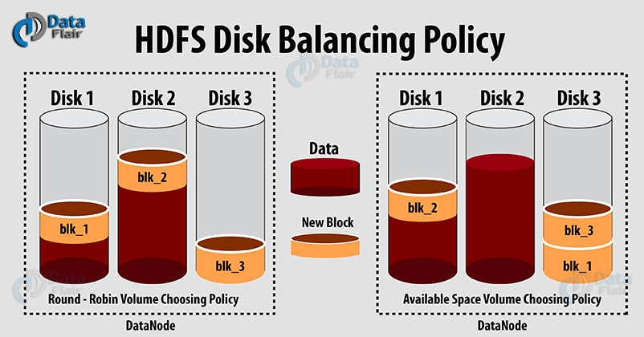
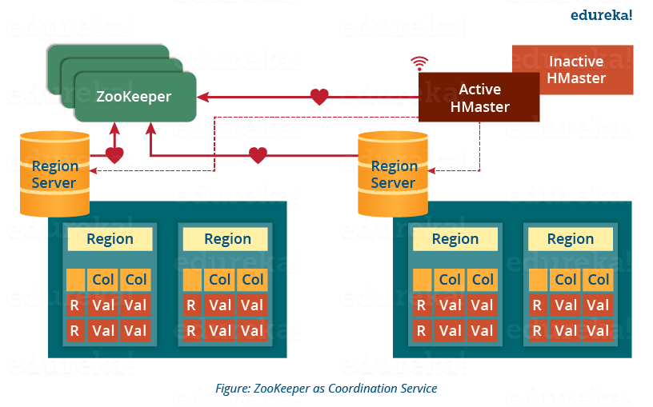
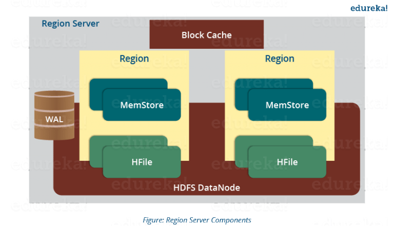

<!-- TOC -->

- [Hadoop](#hadoop)
	- [Hadoop下載](#hadoop下載)
	- [Hadoop環境變量配置](#hadoop環境變量配置)
	- [Hadoop集羣規劃](#hadoop集羣規劃)
	- [Hadoop服務配置](#hadoop服務配置)
- [HDFS](#hdfs)
	- [HDFS RPC地址](#hdfs-rpc地址)
	- [HDFS命令行工具](#hdfs命令行工具)
	- [Balancer](#balancer)
		- [Disk Balancer](#disk-balancer)
- [HBase](#hbase)
	- [HBase體系結構](#hbase體系結構)
		- [Region Server](#region-server)
	- [HBase服務配置](#hbase服務配置)
	- [HBase數據模型](#hbase數據模型)
		- [Conceptual View (概念視圖)](#conceptual-view-概念視圖)
		- [Physical View (物理視圖)](#physical-view-物理視圖)
		- [Namespace (命名空間)](#namespace-命名空間)
	- [HBase壓測工具](#hbase壓測工具)
	- [HBase Shell](#hbase-shell)
	- [HBase Client API](#hbase-client-api)
	- [Compaction (壓縮)](#compaction-壓縮)
		- [禁用自動 Major Compactions](#禁用自動-major-compactions)
		- [主動觸發 Major Compactions](#主動觸發-major-compactions)
		- [Off-peak Compactions (非高峰時間壓縮)](#off-peak-compactions-非高峰時間壓縮)
	- [TTL (Time to Live)](#ttl-time-to-live)
	- [HBase表格在HDFS中的實際存儲](#hbase表格在hdfs中的實際存儲)
- [問題註記](#問題註記)
	- [ERROR org.apache.hadoop.hdfs.server.namenode.NameNode: Failed to start namenode.org.apache.hadoop.hdfs.server.namenode.EditLogInputException: Error replaying edit log at offset 0.  Expected transaction ID was 1](#error-orgapachehadoophdfsservernamenodenamenode-failed-to-start-namenodeorgapachehadoophdfsservernamenodeeditloginputexception-error-replaying-edit-log-at-offset-0--expected-transaction-id-was-1)
	- [Call From xxx to xxx failed on connection exception: java.net.ConnectException: Connection refused;](#call-from-xxx-to-xxx-failed-on-connection-exception-javanetconnectexception-connection-refused)
	- [java.io.IOException: Got error, status message , ack with firstBadLink as xxx.xxx.xxx.xxx:xxx](#javaioioexception-got-error-status-message--ack-with-firstbadlink-as-xxxxxxxxxxxxxxx)
	- [全部HA節點處於 stand by 狀態](#全部ha節點處於-stand-by-狀態)
	- [org.apache.hadoop.hbase.client.RetriesExhaustedException](#orgapachehadoophbaseclientretriesexhaustedexception)
	- [XXX: Error: JAVA_HOME is not set and could not be found.](#xxx-error-java_home-is-not-set-and-could-not-be-found)
	- [Caused by: java.lang.ClassNotFoundException: com.yammer.metrics.core.Gauge](#caused-by-javalangclassnotfoundexception-comyammermetricscoregauge)
	- [java.io.IOException: Incompatible clusterIDs in ...](#javaioioexception-incompatible-clusterids-in-)
	- [WARN org.apache.hadoop.hdfs.server.datanode.DataNode: IOException in offerService; java.io.EOFException: End of File Exception between local host is: "xxxs/xx.xx.xx.xx"; destination host is: "xxhostname":xxxx;](#warn-orgapachehadoophdfsserverdatanodedatanode-ioexception-in-offerservice-javaioeofexception-end-of-file-exception-between-local-host-is-xxxsxxxxxxxx-destination-host-is-xxhostnamexxxx)
	- [master.ServerManager: Waiting for region servers count to settle; currently checked in 0, slept for 67247 ms, expecting minimum of 1, maximum of 2147483647, timeout of 4500 ms, interval of 1500 ms.](#masterservermanager-waiting-for-region-servers-count-to-settle-currently-checked-in-0-slept-for-67247-ms-expecting-minimum-of-1-maximum-of-2147483647-timeout-of-4500-ms-interval-of-1500-ms)
	- [INFO org.apache.hadoop.hbase.util.FSUtils: Waiting for dfs to exit safe mode...](#info-orgapachehadoophbaseutilfsutils-waiting-for-dfs-to-exit-safe-mode)
	- [org.apache.hadoop.ipc.RemoteException(org.apache.hadoop.hdfs.server.namenode.LeaseExpiredException): No lease on ... (inode ...): File does not exist. [Lease.  Holder: DFSClient_NONMAPREDUCE_1864798381_45, pendingcreates: 2]](#orgapachehadoopipcremoteexceptionorgapachehadoophdfsservernamenodeleaseexpiredexception-no-lease-on--inode--file-does-not-exist-lease--holder-dfsclient_nonmapreduce_1864798381_45-pendingcreates-2)

<!-- /TOC -->


# Hadoop
`Apache Hadoop`是一套面向**可靠性**、**可擴展性**、**分佈式計算**的開源套件。

Hadoop是一套框架，允許使用簡單的編程模型在計算機集羣中對大型數據集進行分佈式處理。
Hadoop被設計成從單個服務器擴展到數千臺機器，每臺機器都提供本地計算和存儲。
Hadoop不依靠硬件來提供高可用性，而是被設計成在應用層檢測和處理故障，因此能夠在一組計算機集羣上提供高可用性服務，
即便每一臺計算機都可能出現故障。

`Apache Hadoop`項目包含以下模塊：

- `Hadoop Common` 支持其它Hadoop模塊的公用庫
- `Hadoop Distributed File System (HDFS™)` 提供支持高數據訪問量的分佈式文件系統
- `Hadoop YARN` 作業調度與集羣資源管理的框架
- `Hadoop MapReduce` 基於YARN的並行數據計算引擎

Apache基金會中還包含大量的Hadoop關聯項目，如：

- `Ambari™` 基於Web的Hadoop集羣管理、監控工具
- `Avro™:` 數據序列化系統
- `HBase™` 支持大型表格結構化數據存儲的可擴展分佈式數據庫
- `Hive™` 提供數據彙總和隨機查詢的數據倉庫基礎設施
- `Spark™` 用於Hadoop數據的快速和通用計算引擎，用於取代MapReduce
- `ZooKeeper™` 高性能的分佈式應用程序協調服務

## Hadoop下載
在[Hadoop官網](http://hadoop.apache.org/releases.html)下載Hadoop軟件包。

截止到`2018-3-30`，Hadoop主要分爲`2.x`和`3.x`兩大版本，`3.x`版本在配置上與`2.x`版本有較大差異。
`3.x`版本正式發佈時間較晚(2017-12-13)、迭代週期較短，穩定性有待考證，本文配置使用`2.7.5`版本。

## Hadoop環境變量配置
配置環境變量，在`~/.profile`或`/etc/profile`中添加：

```sh
export HADOOP_HOME=... # 配置Hadoop軟件包路徑
PATH+=:$HADOOP_HOME/bin
PATH+=:$HADOOP_HOME/sbin # 將Hadoop相關工具加入PATH環境變量
```

## Hadoop集羣規劃
使用5臺機器構建Hadoop集羣，IP與主機映射關係寫入`/etc/hosts`文件中：

```
172.16.0.126 spark-master
172.16.0.127 spark-slave0
172.16.0.128 spark-slave1
172.16.0.129 spark-slave2
172.16.0.130 spark-slave3
```

爲集羣中的每臺機器配置SSH免密登陸，保證任意兩臺機器之間能夠免密登陸。

每個節點執行的服務規劃如下：

| 主機名稱 | 執行服務 |
| :- | :- |
| spark-master | namenode, journalnode, zkfc, kafka |
| spark-slave0 | namenode, journalnode, zkfc, kafka, datanode，nodemanager |
| spark-slave1 | journalnode, zkfc, kafka, datanode，nodemanager |
| spark-slave2 | secondarynamenode, resourcemanager, datanode，nodemanager |
| spark-slave3 | resourcemanager, datanode，nodemanager |

- `spark-master/spark-slave0`兩臺機器配置NameNode，實現HA。
- `spark-slave0 ~ spark-slave3`作爲DataNode。
- `spark-master/spark-slave0/spark-slave1`三臺機器啓動Zookeeper，並作爲JournalNode，同時運行Kafka。

Hadoop提供的HDFS等組件需要使用大量的磁盤數據空間，需要對磁盤分區做出合理規劃。
Hadoop數據目錄的根路徑由`${hadoop.tmp.dir}`配置。默認配置下，Hadoop在根路徑下會創建以下結構存儲不同的組件信息：

```
${hadoop.tmp.dir}
|- dfs
   |- name
   |- data
```

## Hadoop服務配置
Hadoop服務配置項多而繁雜，根據Hadoop版本選擇匹配的[官方文檔](http://hadoop.apache.org/docs)進行查閱。
集羣配置[官方文檔](`http://hadoop.apache.org/docs/{Hadoop版本}/hadoop-project-dist/hadoop-common/ClusterSetup.html`)。

關於配置HDFS**高可用**(HDFS High Availability)，
可參考[官方文檔](https://hadoop.apache.org/docs/stable/hadoop-project-dist/hadoop-hdfs/HDFSHighAvailabilityWithNFS.html)。

Hadoop配置文件位於`$HADOOP_HOME/etc/hadoop`路徑下，需要修改的配置文件如下：

- `core-site.xml`

	Hadoop的核心配置項。
	配置項說明：

	```xml
	<configuration>

		<!--
			指定 HDFS 的 nameservice 爲 lj-nameservice
			亦可直接使用 NameNode 的RPC通信地址，如 hdfs://spark-master:9000
		-->
		<property>
			<name>fs.defaultFS</name>
			<value>hdfs://lj-nameservice</value>
		</property>

		<!--
			指定 Hadoop 臨時文件目錄
			默認臨時文件會生成在 /tmp/hadoop-[用戶名] 路徑下，機器重啓後臨時文件會被清空
		-->
		<property>
			<name>hadoop.tmp.dir</name>
			<value>/root/data/hadoop/temp</value>
		</property>

		<!-- 指定 Zookeeper 集羣訪問地址 -->
		<property>
			<name>ha.zookeeper.quorum</name>
			<value>spark-master:2181,spark-slave0:2181,spark-slave1:2181</value>
		</property>

		<!-- 配置隔離機制方法，多個機制用換行分割，即每個機制暫用一行-->
		<property>
			<name>dfs.ha.fencing.methods</name>
			<value>
				sshfence
				shell(/bin/true)
			</value>
		</property>

		<!-- 使用 sshfence 隔離機制時需要 ssh 免登陸 -->
		<property>
			<name>dfs.ha.fencing.ssh.private-key-files</name>
			<value>/root/.ssh/id_rsa</value>
		</property>

		<!-- 配置 sshfence 隔離機制超時時間 -->
		<property>
			<name>dfs.ha.fencing.ssh.connect-timeout</name>
			<value>30000</value>
		</property>

	</configuration>
	```

	`fs.defaultFS`配置項中指定的是命令行工具默認訪問的HDFS地址。

- `hdfs-site.xml`

	包含對NameNode、DataNode、JournalNode的配置項。
	配置項說明：

	```xml
	<configuration>

		<!-- 指定副本數 -->
		<property>
			<name>dfs.replication</name>
			<value>2</value>
		</property>

		<!-- 指定 NameService，需要和 core-site.xml 中 fs.defaultFS 配置項保持一致 -->
		<property>
			<name>dfs.nameservices</name>
			<value>lj-nameservice</value>
		</property>

		<!-- 設置 NameService 下的 NameNode 名稱 -->
		<property>
			<name>dfs.ha.namenodes.lj-nameservice</name>
			<value>namenode1,namenode2</value>
		</property>

		<!-- namenode1 的 RPC 通信地址 -->
		<property>
			<name>dfs.namenode.rpc-address.lj-nameservice.namenode1</name>
			<value>spark-master:9000</value>
		</property>

		<!-- namenode1 的 HTTP 通信地址 -->
		<property>
			<name>dfs.namenode.http-address.lj-nameservice.namenode1</name>
			<value>spark-master:50070</value>
		</property>

		<!-- namenode2 的 RPC 通信地址 -->
		<property>
			<name>dfs.namenode.rpc-address.lj-nameservice.namenode2</name>
			<value>spark-slave0:9000</value>
		</property>

		<!-- namenode2 的 HTTP 通信地址 -->
		<property>
			<name>dfs.namenode.http-address.lj-nameservice.namenode2</name>
			<value>spark-slave0:50070</value>
		</property>

		<!-- 指定 NameNode 在本地磁盤存放數據的位置(可選) -->
		<property>
			<name>dfs.namenode.name.dir</name>
			<!-- 默認值 file://${hadoop.tmp.dir}/dfs/name -->
			<value>/root/data/hadoop/hdfs/name</value>
		</property>

		<!-- 指定 DataNode 在本地磁盤存放數據的位置(可選) -->
		<property>
			<name>dfs.datanode.data.dir</name>
			<!-- 默認值 file://${hadoop.tmp.dir}/dfs/data -->
			<value>/root/data/hadoop/hdfs/data</value>
		</property>

		<!-- 指定 JournalNode 在本地磁盤存放數據的位置(可選) -->
		<property>
			<name>dfs.journalnode.edits.dir</name>
			<!-- 默認值 /tmp/hadoop/dfs/journalnode -->
			<value>/root/data/hadoop/hdfs/journal</value>
		</property>

		<!--
			開啓 NameNode 失敗自動切換，會啟動ZKFailoverController進程
			(HA，單NameNode時此配置無效，需要core-site.xml中配置了Zookeeper訪問地址)
		-->
		<property>
			<name>dfs.ha.automatic-failover.enabled</name>
			<value>true</value>
		</property>

		<!--
			指定HA集羣中多個NameNode之間的共享存儲路徑(單NameNode時此配置無效)
			指定URL對應的機器上會啓動 JournalNode 服務
			設定該配置需要啓用HA(dfs.ha.automatic-failover.enabled設置爲true)
			JournalNode至少需要配置3個，數量需要爲奇數
			JournalNode配置不正確會造成NameNode啓動失敗
		-->
		<property>
			<name>dfs.namenode.shared.edits.dir</name>
			<value>qjournal://spark-master:8485;spark-slave0:8485;spark-slave1:8485/lj-nameservice</value>
		</property>

	</configuration>
	```

	只有配置了NameNode HA時才需要JournalNode，JournalNode用於同步active和standby狀態的NameNode信息。
	active狀態的NameNode會向每個JournalNode寫入改動，若active的NameNode故障，
	則standby狀態的備用NameNode會讀取JournalNode中的信息之後變為active狀態。

首次啟動集群前，應單獨啟動每個節點的JournalNode：

```c
// 集群每個節點均需要執行
$ hadoop-daemon.sh start journalnode
```

之後格式化NameNode，執行指令：

```c
// HA集群只需要選擇一個NameNode進行格式化
$ hadoop namenode -format

// 格式化NameNode成功後，在對應節點啟動NameNode
$ hadoop-daemon.sh start namenode
```

若配置HA NameNode，則需要讓其它NameNode複製最初格式化的NameNode的元數據，执行指令：

```c
// 共享先前啟動NameNode的元數據
$ hdfs namenode -bootstrapStandby

// 共享信息後之後也啟動本NameNode
$ hadoop-daemon.sh start namenode
```

HA NameNode還會啟動ZKFC服務(`DFSZKFailoverController`進程，提供活動NameNode選舉，失敗恢復等功能)，
用於提供NameNode的狀態監控、選舉Active NameNode等功能，該功能需要依賴Zookeeper。
首次啟動前同樣需要格式化，在Zookeeper中創建對應ZNode，執行指令：

```c
// 僅需在一個節點中執行即可
$ hdfs zkfc -formatZK
```

啓動/關閉Hadoop相關服務：

```c
// 啓動 NameNode、DataNode、JournalNode，DFSZKFailoverController 進程
$ start-dfs.sh
// 啓動 NodeManager、ResourceManager 進程
$ start-yarn.sh

// 停止服務
$ stop-dfs.sh && stop-yarn.sh
```

服務啓動日誌記錄在`$HADOOP_HOME/logs`路徑下，主要服務的日誌路徑：

```c
// NameNode
$HADOOP_HOME/logs/hadoop-[用戶名]-namenode-[主機名].log

// DataNode
$HADOOP_HOME/logs/hadoop-[用戶名]-datanode-[主機名].log

// JournalNode
$HADOOP_HOME/logs/hadoop-[用戶名]-journalnode-[主機名].log
```

服務啓動失敗時，可通過查詢對應日誌檢查失敗原因。


# HDFS
`Hadoop Distributed File System (HDFS)`是一個被設計成運行在商用硬件上的分佈式文件系統。
HDFS與現存的分佈式文件系統類似，不同之處在於HDFS是**高容錯**(highly fault-tolerant)的，
HDFS被設計成能夠部署在低成本的硬件上。HDFS提供了對應用數據的高吞吐訪問，適用於擁有大量數據集的應用。
HDFS放寬了一些POSIX標準的要求，以便實現流式地訪問文件系統數據。
HDFS最初被設計成`Apache Nutch`(一個Web搜索引擎項目)的基礎設施，現在HDFS是`Apache Hadoop`項目的核心部分。

## HDFS RPC地址
HDFS的RPC通信地址規則如下：

```sh
# 默認端口 8020
hdfs://主機名或IP:RPC服務端口/HDFS路徑
```

HDFS還提供了WEB管理界面，地址如下：

```sh
# 默認端口 50070
http://主機名或IP:WEB服務端口
```

對於配置了HA的namenode，使用nameservice名稱來訪問HDFS(`hdfs://[nameservices名稱]`)；
對於沒有配置HA的namenode，HDFS地址使用namenode的RPC地址(`hdfs://[namenode的RPC地址]:[namenode的RPC端口]`)。

## HDFS命令行工具
使用`hdfs dfs`指令對HDFS文件系統進行操作。
hdfs dfs指令默認訪問的HDFS地址由`$HADOOP_HOME/etc/hadoop`下的`fs.defaultFS`配置項指定，
若需要對其它的HDFS進行操作，則可以使用`-fs`參數指定地址：

```
$ hdfs dfs -fs hdfs://xxxx:xxx/xxx [指令名稱]
```

查看指令幫助信息：

```
$ hdfs dfs -help [指令名稱]
```

查看文件/目錄：

```c
// 查看目錄內容
$ hdfs dfs -ls [HDFS目錄]

// 遞歸查看目錄
$ hdfs dfs -lsr [HDFS目錄]

// 查看文件內容
$ hdfs dfs -cat [HDFS文件路徑]
$ hdfs dfs -tail [HDFS文件路徑]

// 查看目錄統計信息(文件數，大小等)
$ hdfs dfs -count [HDFS文件路徑]
$ hdfs dfs -df [HDFS文件路徑]
$ hdfs dfs -du [HDFS文件路徑]
```

創建/刪除文件：

```c
// 上傳本地文件到HDFS
$ hdfs dfs -put [本地路徑] [HDFS路徑]

// 從HDFS下載文件
$ hdfs dfs -get [HDFS路徑] [本地路徑]

// 創建目錄
// 使用 -p 參數遞歸創建不存在的路徑
$ hdfs dfs -mkdir [HDFS路徑]

// 移除文件、目錄
$ hdfs dfs -rm [HDFS路徑]
$ hdfs dfs -rmdir [HDFS路徑]
```

若操作的HDFS路徑中帶有特殊字符，則需要使用`\`對其進行轉義：

```c
// 假設存在HDFS路徑 /test-[0]

// 直接刪除提示不存在該路徑
$ hdfs dfs -rm -r /test-[0]
rm: `/test-[0]': No such file or directory

// 使用雙引號包含內容，並使用轉義字符"\"轉義
$ hdfs dfs -rm -r "/test-\[0\]"
20/11/23 14:02:34 INFO fs.TrashPolicyDefault: Namenode trash configuration: Deletion interval = 0 minutes, Emptier interval = 0 minutes.
Deleted /test-[0]
```

## Balancer
向Hadoop集群中寫入新數據時，HDFS並不保證數據會均勻地分佈到集群中的每個DataNode中，
集群長期運行會造成各個DataNode間使用率有較大差異。
HDFS中提供了`start-balancer.sh`以及`hdfs balancer`等命令行工具可手動觸發DataNode間的數據均衡操作，
以`hdfs balancer`為例：

```
$ hdfs balancer --help
Usage: java Balancer
        [-policy <policy>]       the balancing policy: datanode or blockpool
        [-threshold <threshold>]         Percentage of disk capacity
        [-exclude [-f <hosts-file>  | comma-separated list of hosts]]     Excludes
the specified datanodes.
        [-include [-f <hosts-file>  | comma-separated list of hosts]]     Includes
only the specified datanodes.
```

參數`policy`設定數據平衡策略，可取值`datanode/blockpool`，blockpool相比datanode粒度更細。
參數`exclude/include`用於設定需要進行數據平衡的主機。
參數`threshold`表示HDFS中每個DataNode使用的百分比偏差，偏差比例超過該值的的節點(無論高於/低於)將會被均衡。
更多詳細介紹可參考[官方文檔](https://hadoop.apache.org/docs/current/hadoop-project-dist/hadoop-hdfs/HDFSCommands.html#balancer)。

### Disk Balancer
`Hadoop 3`中引入了`Disk Balancer`，與之前的集群數據層面的Balancer不同，
Disk Balancer用於將一個DataNode內部**各個磁盤**的數據進行均衡。
詳情可參考[官方文檔](https://hadoop.apache.org/docs/r3.0.0/hadoop-project-dist/hadoop-hdfs/HDFSDiskbalancer.html)。

在HDFS中，寫入新數據時，DataNode會根據配置的**卷選擇策略(volume-choosing policies)**來選擇數據寫入的磁盤。
HDFS提供了兩種卷選擇策略：

- `Round-Robin Policy` 均勻地在可用的磁盤中擴展新的數據塊(默認策略)
- `Available Space Policy` 根據磁盤中剩餘空間的百分比選擇磁盤



默認的Round-Robin策略並不保證數據會均勻地分佈到集群中的每個DataNode的磁盤中，
例如發生大量的讀寫操作或是磁盤更換時。
而Available Space策略則會將所有的新增數據寫入空閒的磁盤，若集群中新增磁盤，
則舊磁盤處於空閒狀態，新增磁盤會造成寫入瓶頸，直到新磁盤被填充到與舊磁盤比例相近的數據。

默認配置下，Disk Balancer未被開啟，在`hdfs-site.xml`中設置`dfs.disk.balancer.enabled`配置項為true啟用該特性。


# HBase
`Apache HBase™`是基於Hadoop的數據庫，具有分佈式、可擴展、支持海量數據存儲等特性。

HBase常用在需要隨機、實時讀寫海量數據的場景下。項目的目標是在商業硬件集羣上管理非常巨大的表(上億行 x 上億列)。
HBase是開源(open-source)、分佈式(distributed)、版本化(versioned)、非關係型(non-relational)的數據庫，
參照了Google Bigtable的設計。
HBase在Hadoop和HDFS之上提供了類似Bigtable的功能。

HBase的詳細介紹、配置、使用說明等可查閱[官方文檔](http://hbase.apache.org/book.html)。

## HBase體系結構
HBase體系的核心組件介紹可參考[Edureka博客](https://www.edureka.co/blog/hbase-architecture/)。
組件簡介：

- `Region`/`HBase Region Server`

	一個Region包含分配的起止rowkey之間所有的行，一張HBase表可被拆分成一組Region，一個列族內的所有列存儲在一個Region中。
	每個Region包含的行是**有序**的。一個Region默認大小為`256MB`，可根據需求設置。

	一組Region被分配到一個**Region Server**，用以管理這些Region，處理讀寫請求。
	通常一個Region Server能管理上千的Region。

- `HMaster Server`

	HMaster負責執行DDL操作(創建、刪除表等)，為DDL操作提供接口；
	管理和協調多個Region Server(類似HDFS中的NameNode管理DataNode)；
	將Region分配到Region Server上，在Region Server啟動時分配Region，
	在Region Server處於Recovery狀態時重新分配Region，保證負載均衡；
	監控集羣中所有的Region Server實例，在某個Region Server離線時執行恢復操作。

- `Zookeeper`

	Zookeeper在HBase分佈式集羣中扮演協調者的角色，通過會話通信協助維護集羣狀態。
	每個Region Server和HMaster Server均會以固定的間隔向Zookeeper發送心跳，Zookeeper檢測服務是否存活和可用，如圖所示：

	

	Zookeeper還提供服務失敗通知，以執行失敗恢復操作。

	處於活躍狀態的HMaster會發送心跳給Zookeeper，而處於非活躍狀態的HMaster會監聽來自活躍HMaster的通知。
	若活躍的HMaster發送心跳失敗，則會話被刪除並且非活躍的HMaster進入活躍狀態。

	當Region Server發送心跳失敗，則會話終止，所有其它的監聽者都將得到通知。
	之後HMaster會執行合適的恢復操作。

	Zookeeper同樣管理.META服務路徑，以幫助客戶端搜索Region，
	客戶端首先需要從.META服務中查詢Region所屬的Region Server，之後得到Region Server的路徑。

- `META Table`

	META Table是特殊的HBase目錄表(HBase Catalog Table)，維護了HBase存儲系統中所有Region Server的列表，
	`.META`文件維護了`Key-Value`形式的表，Key代表了Region的起始rowkey，Value包含了Region Server的路徑。

### Region Server
Region Server運行在HDFS上，維護了一定數目的Region。
Region Server結構圖示：



相關組件介紹：

- `WAL(Write Ahead Log)`

	WAL(Write Ahead Log)是屬於每個Region Server的文件，位於分佈式環境內部。
	WAL存儲那些未被持久化貨提交到固定存儲的新數據，用於錯誤恢復。

- `Block Cache`

	Block Cache位於Region Server的頂部，用於將頻繁讀取的數據存儲在內存中。
	若數據在Block Cache中被使用的頻率降低，則該數據會被從Block Cache中移除。

- `MemStore`

	MemStore是寫入緩存，存儲了所有將要寫入磁盤或持久存儲的數據。
	一個Region內的每個列族均包含獨立的MemStore。
	在數據提交到磁盤前，會對數據按照Row Key的ASC序列進行排序。

- `HFile`

	HFile是存儲在HDFS中的實際單元，當MemStore中數據大小超過設定值時，數據會提交到HFile中。

## HBase服務配置
從[HBase官網](http://hbase.apache.org/downloads.html)中下載穩定版本的HBase。
HBase依賴於Hadoop服務，HBase與Hadoop版本的兼容性參考中的`4.1`節。

配置環境變量，在`~/.profile`或`/etc/profile`中添加：

```sh
export HBASE_HOME=... # 配置軟件包路徑
PATH+=:$HBASE_HOME/bin # 將HBase相關工具腳本加入PATH中
```

HBase相關配置文件均位於`$HBASE_HOME/conf/`路徑下，配置文件簡介：

- `backup-masters`

	定義需要啟動備用`HMaster`集成的主機。

- `regionservers`

	定義需要啟動`HRegionServer`服務的主機地址。

- `hbase-site.xml`

	HBase主要配置文件。常用配置如下所示：

	```xml
	<configuration>

		<!--
			指定 HBase 臨時文件目錄
			默認臨時文件會生成在 /tmp/hbase-[用戶名] 路徑下，機器重啓後臨時文件會被清空
		-->
		<property>
			<name>hbase.tmp.dir</name>
			<value>/root/data/hadoop/hbase-temp</value>
		</property>

		<!-- 指定 HBase 的數據存儲路徑 -->
		<property>
			<name>hbase.rootdir</name>
			<value>hdfs://spark-master:9000/hbase</value>
		</property>

		<!-- 設定 HBase 是否以分佈式方式執行 -->
		<property>
			<name>hbase.cluster.distributed</name>
			<value>true</value>
		</property>

		<!-- 指定 Zookeeper 集羣訪問地址 -->
		<property>
			<name>hbase.zookeeper.quorum</name>
			<value>spark-master:2181,spark-slave0:2181,spark-slave1:2181</value>
		</property>

	</configuration>
	```

正確編寫和分發配置文件後，在需要作為HBase Master的節點上啓動/關閉HBase服務：

```c
// 啓動 HBase 服務
$ start-hbase.sh

// 關閉 HBase 服務
$ stop-hbase.sh
```

開啟HBase服務後，作為Master節點的機器中會存在`HMaster`進程，作為RegionServer節點的機器會存在`HRegionServer`進程。
若配置了backup-masters，則啟動主服務後，對應備用主機會啟動備用HMaster進程。

HBase同樣提供了Web頁面用於查看服務狀態，默認配置下，Web頁面端口爲`16010`。

## HBase數據模型
HBase是面向**列**的數據庫，數據由行排序，表中僅能定義列族。
一張表中可以擁有多個列族，一個列族可擁有任意數量的列。表中每個單元格的數據都具有時間戳。

### Conceptual View (概念視圖)
HBase中表的概念結構如下所示：

<table style="text-align:center">
	<tr>
		<th rowspan="2">Row Key</th>
		<th rowspan="2">Time Stamp</th>
		<th colspan="4">Column Family A</th>
		<th colspan="4">Column Family B</th>
		<th rowspan="2">...</th>
	</tr>
	<tr>
		<th>column a</th>
		<th>column b</th>
		<th>column c</th>
		<th>...</th>
		<th>column e</th>
		<th>column f</th>
		<th>column g</th>
		<th>...</th>
	</tr>
	<tr>
		<td>Row Key 1</td>
		<td>t1</td>
		<td>A:a="..."</td>
		<td></td>
		<td></td>
		<td></td>
		<td></td>
		<td>B:f="..."</td>
		<td></td>
		<td></td>
		<td></td>
	</tr>
	<tr>
		<td>Row Key 2</td>
		<td>t2</td>
		<td></td>
		<td></td>
		<td>A:c="..."</td>
		<td></td>
		<td>B:e="..."</td>
		<td></td>
		<td></td>
		<td></td>
		<td></td>
	</tr>
	<tr>
		<td>Row Key 2</td>
		<td>t3</td>
		<td></td>
		<td>A:b="..."</td>
		<td></td>
		<td></td>
		<td></td>
		<td></td>
		<td></td>
		<td></td>
		<td></td>
	</tr>
	<tr>
		<td>Row Key 3</td>
		<td>t4</td>
		<td></td>
		<td></td>
		<td></td>
		<td></td>
		<td></td>
		<td></td>
		<td>B:g="..."</td>
		<td></td>
		<td></td>
	</tr>
</table>

與傳統的數據庫不同，空的單元格並不實際佔用空間，這是HBase被稱爲`sparse`(稀疏)存儲的原因。<br>
上述概念結構用JSON表示爲近似於：

```json
{
	"Row Key 1": {
		"A": {
			"t1:A:a": "..."
		},
		"B": {
			"t1:B:f": "..."
		}
	},
	"Row Key 2": {
		"A": {
			"t2:A:c": "...",
			"t3:A:b": "..."
		},
		"B": {
			"t2:B:e": "..."
		}
	},
	"Row Key 3": {
		"A": {},
		"B": {
			"t4:B:g": "..."
		}
	}
}
```

### Physical View (物理視圖)
在概念上表格可被視爲由一組稀疏行組成，但在物理結構上按**列族**分類存儲。新的列限定符(列族:列名)可以隨時追加到現有的列族中。

上述例子中的表格對應物理結構如下：

- 表 `Column Family A`

	| Row Key | Time Stamp | Column Family (A) |
	| :-: | :-: | :-: |
	| Row Key 1 | t1 | A:a="..." |
	| Row Key 2 | t3 | A:b="..." |
	| Row Key 2 | t2 | A:c="..." |

- 表 `Column Family B`

	| Row Key | Time Stamp | Column Family (B) |
	| :-: | :-: | :-: |
	| Row Key 1 | t2 | B:e="..." |
	| Row Key 2 | t1 | B:f="..." |
	| Row Key 3 | t4 | B:g="..." |

概念視圖中顯示的空單元格實際上並不存儲。
使用時間戳訪問數據時，訪問時間戳不存在的數據不會得到返回結果。
當指定的`行:列族:列名`存在多個版本的數據時，不使用時間戳訪問數據，得到的是最新(時間戳最靠後)的版本。
查詢**整行數據**時，得到的是該行數據每列各自的最新版本的數據。

### Namespace (命名空間)
命名空間是與傳統的關係型數據庫中的**數據庫**概念類似的表格邏輯分組。<br>
命名空間是多租戶(multi-tenancy)相關功能的基礎：

- 配額管理(HBASE-8410)
- 命名空間安全管理(HBASE-9206)
- 區域服務器組(HBASE-6721)

## HBase壓測工具
HBase自帶了壓測工具，基本指令：

```
$ hbase pe <OPTIONS> [-D<property=value>]* <command> <nclients>

Options:
 nomapred        Run multiple clients using threads (rather than use mapreduce)
 rows            Rows each client runs. Default: One million
 size            Total size in GiB. Mutually exclusive with --rows. Default: 1.0.
 sampleRate      Execute test on a sample of total rows. Only supported by randomRead. Default: 1.0
 traceRate       Enable HTrace spans. Initiate tracing every N rows. Default: 0
 table           Alternate table name. Default: 'TestTable'
 multiGet        If >0, when doing RandomRead, perform multiple gets instead of single gets. Default: 0
 compress        Compression type to use (GZ, LZO, ...). Default: 'NONE'
 flushCommits    Used to determine if the test should flush the table. Default: false
 writeToWAL      Set writeToWAL on puts. Default: True
 autoFlush       Set autoFlush on htable. Default: False
 oneCon          all the threads share the same connection. Default: False
 presplit        Create presplit table. Recommended for accurate perf analysis (see guide).  Default: disabled
 inmemory        Tries to keep the HFiles of the CF inmemory as far as possible. Not guaranteed that reads are always served from memory.  Default: false
 usetags         Writes tags along with KVs. Use with HFile V3. Default: false
 numoftags       Specify the no of tags that would be needed. This works only if usetags is true.
 filterAll       Helps to filter out all the rows on the server side there by not returning any thing back to the client.  Helps to check the server side performance.  Uses FilterAllFilter internally.
 latency         Set to report operation latencies. Default: False
 bloomFilter      Bloom filter type, one of [NONE, ROW, ROWCOL]
 valueSize       Pass value size to use: Default: 1024
 valueRandom     Set if we should vary value size between 0 and 'valueSize'; set on read for stats on size: Default: Not set.
 valueZipf       Set if we should vary value size between 0 and 'valueSize' in zipf form: Default: Not set.
 period          Report every 'period' rows: Default: opts.perClientRunRows / 10
 multiGet        Batch gets together into groups of N. Only supported by randomRead. Default: disabled
 addColumns      Adds columns to scans/gets explicitly. Default: true
 replicas        Enable region replica testing. Defaults: 1.
 splitPolicy     Specify a custom RegionSplitPolicy for the table.
 randomSleep     Do a random sleep before each get between 0 and entered value. Defaults: 0
 columns         Columns to write per row. Default: 1
 caching         Scan caching to use. Default: 30

 Note: -D properties will be applied to the conf used.
  For example:
   -Dmapreduce.output.fileoutputformat.compress=true
   -Dmapreduce.task.timeout=60000

Command:
 append          Append on each row; clients overlap on keyspace so some concurrent operations
 checkAndDelete  CheckAndDelete on each row; clients overlap on keyspace so some concurrent operations
 checkAndMutate  CheckAndMutate on each row; clients overlap on keyspace so some concurrent operations
 checkAndPut     CheckAndPut on each row; clients overlap on keyspace so some concurrent operations
 filterScan      Run scan test using a filter to find a specific row based on it's value (make sure to use --rows=20)
 increment       Increment on each row; clients overlap on keyspace so some concurrent operations
 randomRead      Run random read test
 randomSeekScan  Run random seek and scan 100 test
 randomWrite     Run random write test
 scan            Run scan test (read every row)
 scanRange10     Run random seek scan with both start and stop row (max 10 rows)
 scanRange100    Run random seek scan with both start and stop row (max 100 rows)
 scanRange1000   Run random seek scan with both start and stop row (max 1000 rows)
 scanRange10000  Run random seek scan with both start and stop row (max 10000 rows)
 sequentialRead  Run sequential read test
 sequentialWrite Run sequential write test

Args:
 nclients        Integer. Required. Total number of clients (and HRegionServers)
                 running: 1 <= value <= 500
```

默認參數下，以百萬行作爲測試基準，常用指令組合：

```c
$ hbase pe randomRead [客戶端數目] // 隨機讀取測試
$ hbase pe randomWrite [客戶端數目] // 隨機寫入測試
$ hbase pe sequentialRead [客戶端數目] // 連續寫入測試
$ hbase pe sequentialWrite [客戶端數目] // 連續讀取測試
$ hbase pe scan [客戶端數目] // Scan測試
```

壓測的輸出結果中可看到測試的數據量和耗時：

```
...
HBase Performance Evaluation
        Elapsed time in milliseconds=...
        Row count=...
File Input Format Counters
        Bytes Read=...
File Output Format Counters
        Bytes Written=...
```

## HBase Shell
HBase提供了基於`(J)Ruby`語言的交互式Shell(`IRB`)，提供了HBase中常用的功能函數。
IRB是標準的Ruby Shell，可直接執行Ruby代碼。

使用`hbase shell`指令可進入HBase的IRB中：

```ruby
Version 1.2.6, rUnknown, Mon May 29 02:25:32 CDT 2017

hbase(main):001:0>
```

使用`help`函數查看基本的幫助信息，使用`help "函數名"`查看具體某個功能函數的詳細用法。

常用指令函數用法：

- 表格操作

	使用`describe/desc`函數查看錶信息：

	```ruby
	hbase> describe "表名"
	hbase> desc "表名"

	# 查看帶有命名空間的表
	hbase> describe "命名空間:表名"
	hbase> desc "命名空間:表名"
	```

	使用`create`函數創建表格：

	```ruby
	# 首個參數爲表名，之後爲表中包含的列族
	hbase> create "表名", "列族1", "列族2", ...

	# HBase中每個列族擁有獨立的配置，創建表同時設置每個列族的配置
	hbase> create "表名", { NAME => "列族1", XXX => xxx, ... }, { NAME => "列族2", XXX => xxx, ... }, ...
	```

	刪除表格首先使用`disable`函數禁用表格，之後使用`drop`函數刪除：

	```ruby
	# 禁用指定表
	hbase> disable "表名"

	# 刪除指定表
	hbase> drop "表名"
	```

	使用`alter`函數調整已創建的表格的配置：

	```ruby
	hbase> alter "表名", Xxx => xxx, ...

	# 可以同時修改多個列族的配置
	hbase> alter "表名", { NAME => "列族1", Xxx => xxx, ... }, { NAME => "列族2", Xxx => xxx, ... }, ...
	```

	部分配置(如`VERSIONS`)直接修改無效，需要指定列族名稱進行修改。

- 插入、更新數據

	使用`put`函數向表中插入、更新數據：

	```ruby
	hbase> put "命名空間:表名", "RowKey", "列族:列名", "值"

	# 命名空間和列名可以不寫，默認爲空
	hbase> put "表名", "RowKey", "列族", "值"
	hbase> put "表名", "RowKey", "列族", "值", 時間
	hbase> put "表名", "RowKey", "列族", "值", ATTRIBUTES => { Xxx => xxx, ... }
	hbase> put "表名", "RowKey", "列族", "值", 時間, ATTRIBUTES => { Xxx => xxx, ... }
	hbase> put "表名", "RowKey", "列族", "值", 時間, VISIBILITY => "PRIVATE|SECRET"
	```

	根據列族的VERSIONS配置，每個單元格會保存一定版本的數據，當保存的版本數達到設定的VERSIONS值時會丟棄時間戳最早的數據。

- 刪除數據

	使用`truncate`指令刪除整張表的數據：

	```ruby
	hbase> truncate "表名"
	```

	使用`delete/deleteall`函數從表中刪除指定數據：

	```ruby
	# 使用delete函數刪除指定單元格、指定時間的數據
	hbase> delete "命名空間:表名", "RowKey", "列族:列名", 時間
	hbase> delete "表名", "RowKey", "列族", 時間
	hbase> delete "表名", "RowKey", "列族", 時間, VISIBILITY => "PRIVATE|SECRET"

	# deleteall函數支持刪除整行、所有時間戳的數據
	hbase> deleteall "命名空間:表名", "RowKey"
	hbase> deleteall "表名", "RowKey"
	hbase> deleteall "表名", "RowKey", "列族:列名"
	hbase> deleteall "表名", "RowKey", "列族", 時間
	hbase> deleteall "表名", "RowKey", "列族", 時間, VISIBILITY => "PRIVATE|SECRET"

	# delete/deleteall方法也存在於 HBase::Table 對象中，通過get_table函數構建對象
	hbase> table = get_table "表名"
	hbase> table.deleteall "RowKey" # 等價於 deleteall "表名", "RowKey"
	hbase> table.delete "RowKey", "列族", 時間 # 等價於 delete "表名", "RowKey", "列族", 時間
	```

- 查詢數據

	使用`scan`函數查看錶格內數據：

	```ruby
	# 查看整張表內的數據
	hbase> scan "表名"

	# 表名之後可攜帶查詢參數，如RowKey前綴、列族、列名、返回數目、逆序等
	hbase> scan "表名", ROWPREFIXFILTER => "RowKey前綴", COLUMNS => ["列族", "列族:列名", ...], REVERSED => 是否逆序, LIMIT => 返回數目, FLITER => "自定義過濾器...", ....
	```

	使用`get`函數查看指定表中指定行的數據：

	```ruby
	# 獲取指定表中某個RowKey的所有數據
	hbase> get "表名", "RowKey"

	# get方法也存在於 HBase::Table 對象中，通過get_table函數構建對象
	hbase> table = get_table "表名"
	hbase> table.get "RowKey" # 等價於 get "表名", "RowKey"

	# RowKey之後可添加限制條件
	hbase> get "表名", "RowKey", TIMERANGE => [時間1, 時間2]
	hbase> get "表名", "RowKey", COLUMN => "列名"
	hbase> get "表名", "RowKey", COLUMN => ["列名1", "列名2", "列名3", ...]
	hbase> get "表名", "RowKey", "列名"
	hbase> get "表名", "RowKey", "列名1", "列名2", ...
	hbase> get "表名", "RowKey", ["列名1", "列名2", ...]
	hbase> get "表名", "RowKey", COLUMN => "列名", TIMESTAMP => 時間
	hbase> get "表名", "RowKey", COLUMN => "列名", TIMERANGE => [時間1, 時間2], VERSIONS => 版本數目
	hbase> get "表名", "RowKey", COLUMN => "列名", TIMESTAMP => 時間, VERSIONS => 版本數目
	hbase> get "表名", "RowKey", FILTER => "自定義過濾器..."
	hbase> get "表名", "RowKey", CONSISTENCY => 'TIMELINE'
	hbase> get "表名", "RowKey", CONSISTENCY => 'TIMELINE', REGION_REPLICA_ID => 1
	```

## HBase Client API
使用HBase的客戶端API首先需要引入對應依賴。

- 使用`Maven`則在`pom.xml`中引入：

	```xml
	<dependency>
		<groupId>org.apache.hbase</groupId>
		<artifactId>hbase-client</artifactId>
		<version>HBase版本</version>
	</dependency>
	```

- 使用`SBT`則在`build.sbt`中引入：

	```scala
	libraryDependencies += "org.apache.hbase" % "hbase-client" % "HBase版本"
	```

HBase相關API位於`org.apache.hadoop.hbase`包路徑下，
Client相關API主要位於`org.apache.hadoop.hbase.client`包路徑下。

主要的API用法：

- 創建數據連接

	通過`org.apache.hadoop.hbase.client.ConnectionFactory`工廠類提供的`ConnectionFactory.createConnection()`靜態方法創建數據連接：

	```java
	public class ConnectionFactory {
		...
		public static Connection createConnection() throws IOException;
		public static Connection createConnection(Configuration conf) throws IOException;
		public static Connection createConnection(Configuration conf, User user) throws IOException;
		public static Connection createConnection(Configuration conf, ExecutorService pool, User user) throws IOException;
		...
	}
	```

	`ConnectionFactory.createConnection()`方法提供了多個重載，可在創建連接是設定連接配置、線程池、用戶信息等配置。

	連接配置使用`org.apache.hadoop.hbase.HBaseConfiguration`類提供的`HBaseConfiguration.create()`靜態方法創建。
	使用`Configuration.set()`方法向創建的配置實例中添加具體的配置項。

	連接創建完畢後，使用`Connection.getTable()`方法獲取指定HBase數據表的實例進行具體的數據操作。

	創建數據連接、獲取表格實例，示例代碼如下：

	```java
	// 創建連接配置
	HBaseConfiguration hbaseConfiguration = HBaseConfiguration.create();
	// 設定配置項
	hbaseConfiguration.set("hbase.zookeeper.property.clientPort", "2181");
	hbaseConfiguration.set("hbase.zookeeper.quorum", "主機名/主機IP");
	...

	// 通過連接配置構建連接實例
	Connection hBaseConnection = ConnectionFactory.createConnection(hbaseConfig);

	// 通過連接獲取指定表格實例
	Table table = hBaseConnection.getTable(TableName.valueOf("表名"));
	```


- 表格操作

	`org.apache.hadoop.hbase.client.Table`接口中聲明瞭`Table.getTableDescriptor()`方法，
	Table實例使用此方法可獲取表格的描述實例`HTableDescriptor`，該類中提供了查看、設置各類表格信息的方法：

	```java
	public class HTableDescriptor implements WritableComparable<HTableDescriptor> {

		...

		// 獲取表的配置項
		public Map<String, String> getConfiguration();

		// 獲取列族的描述信息
		public Collection<HColumnDescriptor> getFamilies();
		// 獲取指定列族的描述信息
		public HColumnDescriptor getFamily(byte[] column);
		// 移除指定列族
		public HColumnDescriptor removeFamily(byte[] column);
		// 添加列族
		public HTableDescriptor addFamily(HColumnDescriptor family);
		// 修改列族
		public HTableDescriptor modifyFamily(HColumnDescriptor family);

		...

	}
	```

	`org.apache.hadoop.hbase.client.Connection`接口中聲明瞭`Connection.getAdmin()`方法，
	Connection實例使用此方法獲取表格管理實例`Admin`，該類提供了表格的查看、創建、刪除、禁用等功能：

	```java
	public interface Admin extends Abortable, Closeable {

		...

		// 列出所有表
		HTableDescriptor[] listTables() throws IOException;

		// 創建、刪除表
		void createTable(HTableDescriptor desc) throws IOException;
		void deleteTable(TableName tableName) throws IOException;

		// 啓用、禁用表
		void enableTable(TableName tableName) throws IOException;
		void disableTable(TableName tableName) throws IOException;

		// 添加、刪除、更新表中的列
		void addColumn(TableName tableName, HColumnDescriptor desc) throws IOException;
		void deleteColumn(TableName tableName, byte[] columnName) throws IOException;
		void modifyColumn(TableName tableName, HColumnDescriptor desc) throws IOException;

		...

	}
	```

- 增、刪、改、查

	與命令行指令類似，通過創建以下類型實例描述增刪改查操作：

	| 類型 | 操作 |
	| :- | :- |
	| org.apache.hadoop.hbase.client.Put | 插入、修改 |
	| org.apache.hadoop.hbase.client.Delete | 刪除 |
	| org.apache.hadoop.hbase.client.Scan | 查詢 |
	| org.apache.hadoop.hbase.client.Get | 指定查詢 |

	Table類型中提供了同名方法，用於執行對應的操作：

	```java
	public interface Table extends Closeable {

		...

		// 查詢
		Result get(Get get) throws IOException;
		Result[] get(List<Get> gets) throws IOException;
		ResultScanner getScanner(Scan scan) throws IOException;

		// 插入、修改
		void put(Put put) throws IOException;
		void put(List<Put> puts) throws IOException;

		// 刪除
		void delete(Delete delete) throws IOException;
		void delete(List<Delete> deletes) throws IOException;

		...

	}
	```

	調用對應方法，將創建操作實例作爲參數，執行增刪改查操作。

- 條件查詢

	HBase中基本的查詢方式是通過Scan類型設置起止RowKey查詢指定範圍內的數據：

	```java
	public class Scan extends Query {
		...
		public Scan setStartRow(byte [] startRow);
		public Scan setStopRow(byte [] stopRow);
		...
	}
	```

	HBase還提供了`Filter`(過濾器)來實現複雜條件的限定查詢，需要注意常規Filter默認會掃描過濾全表數據，因而效率低下；
	正確的使用方式是搭配起止RowKey限定，先粗粒度地限制數據總量，之後再通過Filter做進一步的精細過濾。

	```java
	public class Scan extends Query {
		...
		public Scan setFilter(Filter filter);
		...
	}
	```

	HBase提供了多種Filter，其中針對RowKey進行過濾的`RowFilter`相對其它Filter效率更高，
	因爲HBase中的RowKey是高度優化的。
	過濾數據時可常見的操作是使用正則表達式：

	```kt
	Scan().apply {
		filter = RowFilter(CompareOperator.EQUAL, RegexStringComparator("..."))
	}
	```

	若僅需要查詢RowKey而不關注數據內容，則可以使用`KeyOnlyFilter`，使用該Filter僅返回Key，因而效率最高。

	多個Filter可以相互組合：

	```kt
	Scan().apply {
		// filter 存在 MUST_PASS_ALL/MUST_PASS_ONE 兩種組合策略
		filter = FilterList(FilterList.Operator.MUST_PASS_ALL, listOf(filter1, filter2, ...))
	}
	```

## Compaction (壓縮)
HBase中每張表的每個列族均擁有獨立的文件。在HBase處於高負載寫入期間，「一個文件對應一個列族」並不總是有效，
HBase會嘗試合併HFiles來減少讀取操作時磁盤對文件的最大搜索數，該過程被稱為`Compaction`(壓縮)。

壓縮操作分為兩類：

- `Minor Compactions`

	將一定數目的較小HFiles合併到一個較大的HFile中。用戶可以調整HFiles壓縮的數量以及觸發的頻率。
	Minor Compactions很重要，沒有該機制，則讀取特定某行的數據會要求多次磁盤讀取，進而拖慢全局性能。

- `Major Compactions`

	從一個Region的讀取所有存儲文件，並寫入單一的存儲文件。
	HBase中刪除指令不會立即刪除數據，而是將數據打上刪除標記，只有在Major Compactions之後，對應數據才會真正被刪除。

### 禁用自動 Major Compactions
默認配置下，HBase會定期執行壓縮操作，在壓縮過程中，HBase整體的IO會大幅度下降，
對應承載的上層業務會出現顯著的數據查詢/寫入速度下降。
在生產環境下，常見應對方案是關閉Major Compaction，在`$HBASE_HOME/conf/hbase-site.xml`中添加如下配置：

```xml
<configuration>
...
	<proerty>
		<!-- 觸發 Major Compaction 的週期(單位：ms))，默認為 86400000(1day)，設置為 0 則關閉自動觸發 -->
		<name>hbase.hregion.majorcompaction</name>
		<value>0</value>
	</property>
...
</configuration>
```

### 主動觸發 Major Compactions
在禁用Major Compactions後，需要手動觸發壓縮。在HBase Shell中可使用指令主動觸發Major Compaction：

```ruby
hbase> major_compact

ERROR: wrong number of arguments (0 for 1)

Here is some help for this command:
          Run major compaction on passed table or pass a region row
          to major compact an individual region. To compact a single
          column family within a region specify the region name
          followed by the column family name.
          Examples:
          Compact all regions in a table:
          hbase> major_compact 't1'
          hbase> major_compact 'ns1:t1'
          Compact an entire region:
          hbase> major_compact 'r1'
          Compact a single column family within a region:
          hbase> major_compact 'r1', 'c1'
          Compact a single column family within a table:
          hbase> major_compact 't1', 'c1'
```

編寫使用bash腳本時可使用管道將要壓縮的表名傳入HBase Shell中：

```sh
echo "t1","t2"... | hbase shell
```

### Off-peak Compactions (非高峰時間壓縮)
HBase中支持在不同時段設定不同的壓縮策略，在`$HBASE_HOME/conf/hbase-site.xml`中添加如下配置：

```xml
<configuration>
	...
	<!-- 非高峰時段的起止小時 -->
	<proerty>
		<name>hbase.offpeak.start.hour</name>
		<value>0-23</value>
	</property>
	<proerty>
		<name>hbase.offpeak.end.hour</name>
		<value>0-23</value>
	</property>
	...
	<proerty>
		<!-- 默認的常規壓縮級別為5.0 -->
		<name>hbase.hstore.compaction.ratio</name>
		<value>5.0</value>
	</property>
	<proerty>
		<!-- 默認的非高峰時段壓縮級別為1.2 -->
		<name>hbase.offpeak.end.hour</name>
		<value>1.2</value>
	</property>
	...
</configuration>
```

## TTL (Time to Live)
HBase中數據支持自動清理，每個**列族**可以設定參數`TTL(Time to Live)`來決定數據保存的時間(默認單位：秒)，
超過保存時間的數據將會被自動清理。TTL設定的自動數據清理對一个行內所有版本的數據生效。

當存儲文件僅包含過期的數據時將會在下一輪Minor Compaction中被刪除，
設置`hbase.store.delete.expired.storefile`屬性為false可關閉該特性，設置最小數據版本大於0時同樣會禁用該特性。

TTL相關操作示例：

```ruby
# 查看表格/列族屬性，TTL即為數據保存時間，默認值為"FOREVER"，即數據永久保存
hbase> describe "Test"
Table Test is ENABLED
Test
COLUMN FAMILIES DESCRIPTION
{NAME => 'f1', BLOOMFILTER => 'ROW', VERSIONS => '1', IN_MEMORY => 'false', KEEP_DELETED_CELLS => 'FALSE', DATA_BLOCK_EN
CODING => 'NONE', TTL => 'FOREVER', COMPRESSION => 'NONE', MIN_VERSIONS => '0', BLOCKCACHE => 'true', BLOCKSIZE => '6553
6', REPLICATION_SCOPE => '0'}
1 row(s) in 0.0470 seconds

# 修改列族的TTL為5秒
hbase> alter "Test", { NAME => "f1", TTL => 5 }
Updating all regions with the new schema...
0/1 regions updated.
1/1 regions updated.
Done.
0 row(s) in 3.4680 seconds

# 再次查看列族屬性，TTL配置已變化
hbase> describe "Test"
Table Test is ENABLED
Test
COLUMN FAMILIES DESCRIPTION
{NAME => 'f1', BLOOMFILTER => 'ROW', VERSIONS => '1', IN_MEMORY => 'false', KEEP_DELETED_CELLS => 'FALSE', DATA_BLOCK_EN
CODING => 'NONE', TTL => '5 SECONDS', COMPRESSION => 'NONE', MIN_VERSIONS => '0', BLOCKCACHE => 'true', BLOCKSIZE => '65
536', REPLICATION_SCOPE => '0'}
1 row(s) in 0.0090 seconds

# 插入數據測試
hbase> scan "Test"
ROW                             COLUMN+CELL
0 row(s) in 0.0070 seconds

# 插入數據
hbase> put "Test", "row1", "f1", "test data"
0 row(s) in 0.0080 seconds

# 立即查詢數據存在
hbase> scan "Test"
ROW                             COLUMN+CELL
 row1                           column=f1:, timestamp=1578899157756, value=test data
1 row(s) in 0.0060 seconds

# 5秒之後再度查詢，數據已被清除
hbase> scan "Test"
ROW                             COLUMN+CELL
0 row(s) in 0.0190 seconds
```

最近版本的HBase還支持了對每個單元設置數據保存時間，參考[HBASE-10560](https://issues.apache.org/jira/browse/HBASE-10560)。

## HBase表格在HDFS中的實際存儲
HBase在HDFS中實際存儲的位置默認為：

```
/hbase/data/<命名空間>/<表名>/
```

其中，未顯式設置命名空間的表命名空間為`default`。

查看一張HBase表在HDFS中實際佔用的空間大小可使用HDFS工具提供的`du`指令：

```
[root@spark-master ~]# hdfs dfs -du -h /hbase/data/default/NetworkCountBtsResult
301      /hbase/data/default/NetworkCountBtsResult/.tabledesc
0        /hbase/data/default/NetworkCountBtsResult/.tmp
473.3 M  /hbase/data/default/NetworkCountBtsResult/624e27343d4521146b3634c471935b92
432.9 M  /hbase/data/default/NetworkCountBtsResult/b47c86cdf0ac95634929b367eb52f564
```


# 問題註記
Hadoop配置中遇到問題的說明和解決方案。

## ERROR org.apache.hadoop.hdfs.server.namenode.NameNode: Failed to start namenode.org.apache.hadoop.hdfs.server.namenode.EditLogInputException: Error replaying edit log at offset 0.  Expected transaction ID was 1
問題說明：<br>
namenode啓動失敗，需要重新格式化，保證namenode的ID一致性。

解決方案：<br>
格式化失敗嘗試`hdfs namenode -format -force`同時格式化namenode和datanode。

## Call From xxx to xxx failed on connection exception: java.net.ConnectException: Connection refused;
問題說明：<br>
執行`hdfs namenode -format`指令時，JournalNode未啓動，需要在JournalNode已啓動的情況下格式化NameNode。

解決方案：<br>
啓動JournalNode後再格式化NameNode：

```
$ hadoop-daemon.sh start journalnode
$ hdfs namenode -format
```

## java.io.IOException: Got error, status message , ack with firstBadLink as xxx.xxx.xxx.xxx:xxx
問題說明：<br>
防火牆服務開啓導致HDFS節點之間訪問異常。

解決方案：<br>
關閉對應節點的防火牆服務：

```c
# systemctl stop firewalld //關閉防火牆服務
# systemctl disable firewalld //禁止防火牆服務自啓動
```

## 全部HA節點處於 stand by 狀態
問題說明：<br>
NameNode的HA狀態異常，沒有選舉出active的節點，HA節點均爲stand by。

解決方案：<br>
檢查Zookeeper運行狀態，NameNode選舉依賴Zookeeper提供的服務。
若Zookeeper正常，則可嘗試重新格式化NameNode；或者使用`haadmin`工具強制指定active節點：

```
$ hdfs haadmin -transitionToActive --forcemanual [需要激活的NameNode名稱]
```

## org.apache.hadoop.hbase.client.RetriesExhaustedException
問題說明：<br>
HBase建立連接不成功，重試次數過多後產生異常。

解決方案：<br>
在日誌中打印HBase的連接字符串，檢查連接字符串是否有錯誤。
HBase連接字符串中多個Zookeeper服務主機名之間用逗號分隔，不能帶有空格：

```scala
val hbaseConfig = HBaseConfiguration.create()

// 錯誤
hbaseConfig.set("hbase.zookeeper.quorum", "spark-master, spark-slave0, spark-slave1")

// 正確
hbaseConfig.set("hbase.zookeeper.quorum", "spark-master,spark-slave0,spark-slave1")
```

## XXX: Error: JAVA_HOME is not set and could not be found.
問題說明：<br>
Hadoop、HBase、Spark啓動時提示`JAVA_HOME`環境變量配置未配置，但實際環境變量中已設定JAVA_HOME。

解決方案：<br>
編輯`$HADOOP_HOME/etc/hadoop/hadoop-env.sh`文件，
將文件中的`export JAVA_HOME=${JAVA_HOME}`替換爲實際的絕對路徑。

## Caused by: java.lang.ClassNotFoundException: com.yammer.metrics.core.Gauge
問題說明：<br>
Spark應用使用HBase Client連接HBase數據庫，建立連接時提示找不到類。

解決方案：<br>
打包Spark應用時需要完整包含HBase相關依賴，包括`hbase*`、`metrics-core*`。

## java.io.IOException: Incompatible clusterIDs in ...
問題說明：<br>
啓動DataNode失敗，提示DataNode的`clusterID`與NameNode不匹配。

解決方案：<br>
通常是NameNode重新格式化後，DataNode數據路徑未清空，
仍保留與之前NameNode版本匹配的數據，則清空DataNode中數據路徑下的內容。
默認DataNode路徑爲`${hadoop.tmp.dir}/dfs`，若設定了`hadoop.datanode.data.dir`配置，
則路徑以該配置項爲準。

若是正常啟動出現版本不相容，則檢查NameNode、DataNode等的版本信息：

- 用當前激活的NameNode的版本信息(`${hadoop.tmp.dir}/dfs/name/current/VERSION`)覆蓋掉啟動失敗的NameNode的版本信息。
- 用當前激活的NameNode的版本信息中的`clusterID`替換掉啟動失敗的DataNode版本信息(`${hadoop.tmp.dir}/dfs/data/current/VERSION`)集群ID。

## WARN org.apache.hadoop.hdfs.server.datanode.DataNode: IOException in offerService; java.io.EOFException: End of File Exception between local host is: "xxxs/xx.xx.xx.xx"; destination host is: "xxhostname":xxxx;
問題說明：<br>
啓動DataNode時日誌中提示目標IP與本地主機IP不符。使用`hadoop fs -xx...`指令訪問HDFS文件系統時，
命令行提示`-ls: java.net.UnknownHostException: [NameService]`錯誤。

解決方案：<br>
修改`$HADOOP_HOME/etc/hadoop/core-site.xml`配置中的`fs.defaultFS`配置項，
不使用NameServices名稱作爲HDFS路徑，而是直接使用HDFS的RPC地址。
如下所示：

```xml
<property>
	<name>fs.defaultFS</name>
	<value>hdfs://localhost:9000</value>
	<!-- 不使用 hdfs://XxxNameService 形式的HDFS路徑 -->
</property>
```

## master.ServerManager: Waiting for region servers count to settle; currently checked in 0, slept for 67247 ms, expecting minimum of 1, maximum of 2147483647, timeout of 4500 ms, interval of 1500 ms.
問題說明：<br>
啟動HBase後，HBase Master一直處於初始化過程中，任何HBase請求會得到錯誤異常：

```
ERROR: org.apache.hadoop.hbase.PleaseHoldException: Master is initializing
	at org.apache.hadoop.hbase.master.HMaster.checkInitialized(HMaster.java:2379)
	at org.apache.hadoop.hbase.master.MasterRpcServices.getTableNames(MasterRpcServices.java:900)
	at org.apache.hadoop.hbase.protobuf.generated.MasterProtos$MasterService$2.callBlockingMethod(MasterProtos.java:55650)
	at org.apache.hadoop.hbase.ipc.RpcServer.call(RpcServer.java:2196)
	at org.apache.hadoop.hbase.ipc.CallRunner.run(CallRunner.java:112)
	at org.apache.hadoop.hbase.ipc.RpcExecutor.consumerLoop(RpcExecutor.java:133)
	at org.apache.hadoop.hbase.ipc.RpcExecutor$1.run(RpcExecutor.java:108)
	at java.lang.Thread.run(Thread.java:748)
```

解決方案：<br>
出現該問題通常是HBase進程所處各個節點間的時間同步出現了問題，可配置`NTP`服務保證各個服務器時間一致。

## INFO org.apache.hadoop.hbase.util.FSUtils: Waiting for dfs to exit safe mode...
問題說明：<br>
啟動HBase後，HBase Master一直處於初始化過程中，查看HBase啟動日誌，可看到一直輸出類似日誌：

```
...
2019-10-08 16:50:22,560 INFO  [spark-master:16000.activeMasterManager] util.FSUtils: Waiting for dfs to exit safe mode...
2019-10-08 16:50:32,565 INFO  [spark-master:16000.activeMasterManager] util.FSUtils: Waiting for dfs to exit safe mode...
2019-10-08 16:50:42,570 INFO  [spark-master:16000.activeMasterManager] util.FSUtils: Waiting for dfs to exit safe mode...
2019-10-08 16:50:52,575 INFO  [spark-master:16000.activeMasterManager] util.FSUtils: Waiting for dfs to exit safe mode...
2019-10-08 16:51:02,579 INFO  [spark-master:16000.activeMasterManager] util.FSUtils: Waiting for dfs to exit safe mode...
```

解決方案：<br>
該問題是由於NameNode進入了安全模式(Safe Mode)導致的，查看各個NameNode的狀態，退出安全模式：

```
$ hdfs dfsadmin -safemode get
Safe mode is ON in spark-master/172.16.1.126:9000
Safe mode is ON in spark-slave2/172.16.1.129:9000

$ hdfs dfsadmin -safemode leave
Safe mode is OFF in spark-master/172.16.1.126:9000
Safe mode is OFF in spark-slave2/172.16.1.129:9000
```

## org.apache.hadoop.ipc.RemoteException(org.apache.hadoop.hdfs.server.namenode.LeaseExpiredException): No lease on ... (inode ...): File does not exist. [Lease.  Holder: DFSClient_NONMAPREDUCE_1864798381_45, pendingcreates: 2]
問題說明：<br>
使用HDFS FileSystem API高頻率訪問HDFS中的文件時出現該異常信息。

解決方案：<br>
該類異常可能有以下兩類原因造成：

- 多線程訪問同一個文件，應保證每個線程訪問唯一的文件。
- 同時訪問的文件數目超過HDFS默認的限制。`hdfs-site.xml`中配置`dfs.datanode.max.xcivers`，
該配置決定HDFS允許同時訪問的文件數目的上限，該配置默認為`4096`，可根據需求增大。
