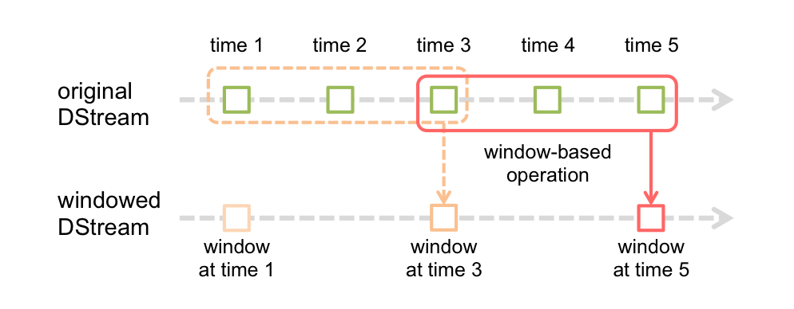

<!-- TOC -->

- [概述](#概述)
	- [學習資料](#學習資料)
	- [下載](#下載)
	- [服務配置](#服務配置)
	- [Local Dir](#local-dir)
	- [Work Dir](#work-dir)
	- [Web UI](#web-ui)
	- [History Server](#history-server)
- [Cluster Mode (集羣模型)](#cluster-mode-集羣模型)
	- [集羣管理器類型](#集羣管理器類型)
	- [術語表](#術語表)
- [Spark Submit](#spark-submit)
- [RDD (彈性分佈式數據集)](#rdd-彈性分佈式數據集)
	- [創建 RDD](#創建-rdd)
	- [RDD 操作](#rdd-操作)
	- [RDD 分區](#rdd-分區)
	- [RDD 依賴](#rdd-依賴)
	- [Shuffle 操作](#shuffle-操作)
		- [背景知識](#背景知識)
		- [性能影響](#性能影響)
- [Job Scheduling (作業調度)](#job-scheduling-作業調度)
	- [Scheduling Within an Application (應用內調度)](#scheduling-within-an-application-應用內調度)
		- [Fair Scheduler Pools (公平調度池)](#fair-scheduler-pools-公平調度池)
		- [調度池默認行為](#調度池默認行為)
		- [配置調度池屬性](#配置調度池屬性)
		- [在JDBC連接中設置調度](#在jdbc連接中設置調度)
	- [作業調度源碼分析](#作業調度源碼分析)
		- [Job Sumbit](#job-sumbit)
		- [Stage Submit](#stage-submit)
		- [Task Submit](#task-submit)
- [Spark Streaming](#spark-streaming)
	- [Streaming Context](#streaming-context)
	- [DStream](#dstream)
	- [Concurrent Jobs](#concurrent-jobs)
	- [數據變換](#數據變換)
		- [updateStateByKey()](#updatestatebykey)
		- [mapWithState()](#mapwithstate)
	- [Transform Operation (變換操作)](#transform-operation-變換操作)
	- [Window Operations (窗口操作)](#window-operations-窗口操作)
- [Spark SQL](#spark-sql)
	- [SQL](#sql)
	- [Datasets & DataFrames](#datasets--dataframes)
	- [SparkSession](#sparksession)
	- [構建 DataFame](#構建-datafame)
	- [Untyped Dataset Operations (無類型的 Dataset 操作，aka DataFrame Operations)](#untyped-dataset-operations-無類型的-dataset-操作aka-dataframe-operations)
	- [執行 SQL 查詢](#執行-sql-查詢)
		- [Global Temporary View](#global-temporary-view)
		- [視圖管理](#視圖管理)
	- [回寫數據](#回寫數據)
		- [字段類型限制](#字段類型限制)
		- [MySQL 建表異常](#mysql-建表異常)
	- [Complex Types (複合類型字段)](#complex-types-複合類型字段)
- [問題註記](#問題註記)
	- [Unable to load native-hadoop library for your platform... using builtin-java classes where applicable](#unable-to-load-native-hadoop-library-for-your-platform-using-builtin-java-classes-where-applicable)
	- [Operation category READ is not supported in state standby](#operation-category-read-is-not-supported-in-state-standby)
	- [org.apache.spark.SparkException: Failed to get broadcast_xxx of broadcast_xxx](#orgapachesparksparkexception-failed-to-get-broadcast_xxx-of-broadcast_xxx)
	- [java.sql.SQLException: No suitable driver](#javasqlsqlexception-no-suitable-driver)
	- [RDD transformations and actions are NOT invoked by the driver, but inside of other transformations;](#rdd-transformations-and-actions-are-not-invoked-by-the-driver-but-inside-of-other-transformations)
	- [java.lang.NoSuchMethodError: net.jpountz.lz4.LZ4BlockInputStream.<init>(Ljava/io/InputStream;Z)V](#javalangnosuchmethoderror-netjpountzlz4lz4blockinputstreaminitljavaioinputstreamzv)
	- [MySQL的TINYINT類型錯誤映射到JDBC的Boolean類型](#mysql的tinyint類型錯誤映射到jdbc的boolean類型)
	- [java.util.ConcurrentModificationException: KafkaConsumer is not safe for multi-threaded access](#javautilconcurrentmodificationexception-kafkaconsumer-is-not-safe-for-multi-threaded-access)
	- [org.apache.spark.streaming.scheduler.JobScheduler logError - Error running job streaming job ... org.apache.spark.SparkException: Job aborted due to stage failure: Task creation failed: java.io.FileNotFoundException: File does not exist: hdfs://...](#orgapachesparkstreamingschedulerjobscheduler-logerror---error-running-job-streaming-job--orgapachesparksparkexception-job-aborted-due-to-stage-failure-task-creation-failed-javaiofilenotfoundexception-file-does-not-exist-hdfs)
	- [Method Rference異常： java.lang.ClassCastException: Xxx cannot be cast to Xxx](#method-rference異常-javalangclasscastexception-xxx-cannot-be-cast-to-xxx)
	- [scheduler.DAGScheduler: ShuffleMapStage Xxx ...: java.io.IOException: No space left on device](#schedulerdagscheduler-shufflemapstage-xxx--javaioioexception-no-space-left-on-device)

<!-- /TOC -->


# 概述
`Apache Spark`是一套**快速**(fast)、**多用途**(general-purpose)的集羣計算系統(cluster computing system)。

Spark提供了`Scala`、`Java`、`Python`、`R`等語言的上層API和支持通用執行圖的優化引擎。
Spark同時提供了一套高級工具集包括`Spark SQL`(針對SQL和結構化數據處理)、`MLib`(針對機器學習)、
`GraphX`(針對圖處理)、`Spark Streaming`。

## 學習資料
Spark相關的學習資料主要可以參考[官方文檔](http://spark.apache.org/docs/latest/)，官方文檔的內容比較全面，但部分內容不夠細緻，
適合維護Spark環境的運維人員以及僅使用Spark API而不深入研究Spark內部機制的初級開發者。

對於Spark的內部機制，可直接閱讀項目源碼，亦可參考GitHub上的一些項目：

- [JerryLead/SparkInternals](https://github.com/JerryLead/SparkInternals)
- [japila-books/apache-spark-internals](https://github.com/japila-books/apache-spark-internals)

## 下載
在[Spark官網](http://spark.apache.org/downloads.html)下載Saprk軟件包。
下載Spark時需要注意Spark版本與Hadoop、Scala版本的對應關係：

- `Spark 2.0`之後官網提供的軟件包默認基於`Scala 2.11`構建，`Spark 2.4.2`之後開始基於`Scala 2.12`構建。
- Spark官方提供的預編譯包中包括了集成Hadoop的版本(如`spark-2.4.4-bin-hadoop2.7.tgz`)，
或未集成Hadoop的版本(`spark-2.4.4-bin-without-hadoop.tgz`)，未集成Hadoop的版本需要自行配置Hadoop路徑。

Scala版本兼容性：

- 大版本兼容性

	Scala編譯器編譯出的字節碼在不同大版本之間**不具有**二進制兼容性，如`2.10`/`2.11`/`2.12`等。
	在添加`Spark API`依賴時需要根據集羣運行的Spark版本使用正確的Scala編譯器版本。

- 小版本兼容性

	Scala編譯器在小版本之前二進制兼容，如`2.12.1`/`2.12.2`等。
	在小版本內切換編譯器版本無需重新編譯生成字節碼。

## 服務配置
編輯`/etc/profile`或`~/.profile`，配置Spark相關的環境變量：

```sh
export SPARK_HOME=... # 配置軟件包路徑
PATH+=:$SPARK_HOME/bin # 將Spark工具加入 PATH 中
PATH+=:$SPARK_HOME/sbin # 將Spark工具加入 PATH 中

# 以下配置也可寫入 $SPARK_HOME/conf/spark-env.sh 中
export SPARK_MASTER_HOST=172.16.0.126 # 指定集羣的 Master 節點
export SPARK_WORKER_CORES=4 # 指定 Worker 節點使用的核心數
export SPARK_WORKER_MEMORY=16g # 指定 Worker 節點能夠最大分配給 Executors 的內存大小
export HADOOP_CONF_DIR=$HADOOP_HOME/etc/hadoop # 指定 Hadoop 集羣的配置路徑
export SPARK_CLASSPATH=$SPARK_HOME/jars:$HBASE_HOME/lib # 指定 Spark 環境的CLASSPATH
```

若部署的是未集成Hadoop的Spark，需要額外設置`SPARK_DIST_CLASSPATH`環境變量指定Hadoop庫的路徑：

```sh
export SPARK_DIST_CLASSPATH=$(hadoop classpath)
```

之後創建`$SPARK_HOME/conf/slaves`文件，將需要做爲Worker的主機名添加到改文件中：

```sh
spark-slave0
spark-slave1
spark-slave2
...
```

保證集羣各機器間能夠免密登陸，將配置文件分發到集羣的其它機器上，執行指令啓動/關閉服務：

```c
// 啓動 Master 服務
$ start-master.sh
// 啓動 Worker 服務
$ start-slaves.sh

// 停止服務
$ stop-master.sh && stop-slaves.sh
```

正常啓動Spark服務後，使用JPS查看進程，主節點應有`Master`進程，從節點應有`Worker`進程。

## Local Dir
Spark任務在運行期間會創建一系列的運行期間的緩存文件(如RDD在磁盤中存儲的數據)，
該路徑由`$SPARK_HOME/conf/spark-defaults.conf`配置文件中的配置項`spark.local.dir`決定，默認值為`/tmp`。

`spark.local.dir`設定的值可被環境變量覆蓋，在不同的集群模式下，環境變量名稱分別為：

- SPARK_LOCAL_DIRS (Standalone)
- MESOS_SANDBOX (Mesos)
- LOCAL_DIRS (YARN)

在生產環境中，多數服務器的`/tmp`路徑不會單獨掛載，通常位於默認的`/`下；
若分區方案中沒有給予根目錄較大的空間，則在執行數據量較大的計算任務，且包含Shuffle操作時，
可能會出現`No space left on device`的異常，該異常會導致計算任務強制中斷。

## Work Dir
使用`Spark Standalone Mode`集群模式下，
提交的Spark應用會在每個`Worker Node`下創建Work Dir(工作目錄)用於記錄應用執行的日誌信息。
默認工作目錄路徑為`$SPARK_HOME/work`，工作目錄結構如下：

```
$ tree $SPARK_HOME/work
/opt/spark-2.4.4-bin-without-hadoop-scala-2.12/work
├── app-20191127160520-0000
│   └── 2
│       ├── stderr
│       └── stdout
├── app-20191129131849-0001
│   └── 2
│       ├── etl-0.1-jar-with-dependencies.jar
│       ├── stderr
│       └── stdout
...
```

長時間運行的Spark應用(如Spark Streaming應用)會在工作目錄下產生大量的運行日誌，
若Spark部署的分區較小則可能造成分區可用空間被佔滿。

使用`SPARK_WORKER_DIR`環境變量可自定義工作目錄的位置：

```sh
export SPARK_WORKER_DIR=...
```

Spark默認不會清理Work Dir下的日誌，頻繁地創建Spark任務運行，會在Work Dir留下大量的日誌，佔用大量磁盤空間。
修改`$SPARK_HOME/conf/spark-defaults.conf`配置文件，加入以下配置項：

```sh
# 是否開啟Spark工作目錄自動清理，默認為false，需要手動開啟
spark.worker.cleanup.enabled true
# Spark工作目錄清理機制的觸發間隔，單位(s)，默認1800s(30min)，配置項必須為純數字
spark.worker.cleanup.interval 86400
# Spark工作目錄的日誌保留時間，單位(s)，默認7*24*3600s(7day)
spark.worker.cleanup.appDataTtl 604800
```

## Web UI
默認配置下，Spark在`8080`端口提供集羣管理的Web界面，可在Web界面中查看集羣的工作狀態。

Web界面中的提供了以下幾類信息：

- `Workers` 展示Worker node(工作節點)的狀態。
- `Running Applications` 展示正在執行的Spark應用的信息。
- `Completed Applications` 展示已結束的Spark應用的信息。

如下圖所示：


對於正在執行的Spark應用，Spark還提供了`Application Detail UI`，用於查看應用的執行信息，
如`Event Timeline`、`DAG Visualization`：


## History Server
Application Detail UI中的信息僅在應用執行期間可查看，默認配置下，應用結束後僅能查看文本日誌。
若需要在應用結束後保留應用的執行信息，則需要啓動`Spark History Server`。

在HDFS中爲Spark創建Spark Event Log路徑:

```c
$ hdfs dfs -mkdir [HDFS路徑]
```

編輯`$SPARK_HOME/conf/spark-defaults.conf`文件，加入以下配置：

```sh
# 啓用 Spark Event Log
spark.eventLog.enabled           true
# 設置 Spark Event Log 的寫入路徑，例如：hdfs://nameservice/spark/event-log
spark.eventLog.dir               [HDFS路徑]

# 配置 Spark History Server 的服務端口和實現類
spark.history.provider           org.apache.spark.deploy.history.FsHistoryProvider
spark.history.ui.port            18080
# 配置 Spark History Server 訪問的日誌路徑，需要與 spark.eventLog.dir 路徑相同
spark.history.fs.logDirectory    [HDFS路徑]
```

之後啓用Spark History Server服務：

```c
$ start-history-server.sh

// 關閉服務
$ stop-history-server.sh
```

默認HistoryServer中的eventLog不會被清理，若需要自動清理eventLog，則添加以下配置：

```sh
# 是否開啟 eventLog 清理，默認false
spark.history.fs.cleaner.enabled true
# 清理器觸發間隔，默認 1day，配置項支持h/m/s等時間單位
spark.history.fs.cleaner.interval 1d
# eventLog 保留期限，默認 7day
spark.history.fs.cleaner.maxAge	7d
# 最大保留 eventLog 數目，默認 Int.MaxValue
spark.history.fs.cleaner.maxNum	100
```


# Cluster Mode (集羣模型)
Spark應用作爲獨立的進程集在集羣中運行，通過`SparkContext`對象在用戶主程序(`dirver program`)中與集羣組織、交互。

Spark應用在集羣中運行時，SparkContext會連接到某種類型的`cluster managers`(集羣管理器，如`Mesos`、`YARN`)，
由集羣管理器在多個應用間分配資源。一旦連接建立，Spark會在集羣的節點中獲取`executors`(執行器)，
executors是執行計算操作和存儲用戶應用數據的進程。
之後，SparkContext將用戶的應用代碼(在`JAR`中或Python源碼文件)發送到executors。
最終，SparkContext發送`tasks`(任務)到executors中運行。

集羣結構如下圖所示：


關於集羣架構的一些注意事項：

1. 每個用戶應用擁有屬於自己的執行器進程(executor processes)，這些進程保持在整個應用期間，並在多個線程中執行tasks。
這有利於隔離不同的用戶應用，包括調度端(每個driver調度自己的tasks)和執行端(來自不同應用的tasks子不同的JVM中執行)。
1. Spark並不知道底層集的羣管理器，僅需要能獲取執行器進程並能相互通信。
相對而言，將Spark運行在支持其它應用的集羣管理器上更加簡單(如`Mesos`、`YARN`)。
1. dirver program必須在整個生命週期內監聽並接受來自executors的連接。因此，driver program必須能從work nodes尋址。
1. 由於driver在集羣中調度tasks，因此需要在網絡位置上鄰近worker nodes，最好在相同的局域網中。
如果需要向遠程集羣發送請求，最好爲driver開啓RPC，在與worker nodes鄰近的網絡位置啓動driver，
使用RPC提交操作，而不是在與worker nodes較遠的網絡位置上直接執行driver。

## 集羣管理器類型
Spark當前支持以下集羣管理器：

- `Standalone` Spark內置的簡單集羣管理器
- `Apache Mesos` 通用的資源管理器，也可用於執行Hadoop MapReduce和服務應用
- `Hadoop YARN` Hadoop2的資源管理器
- `Kubernetes` 用於自動化部署、容器應用管理的開源系統

## 術語表
以下列表總結了在集羣概念中提及的術語：

| 術語 | 說明 |
| :- | :- |
| Application | Spark中的用戶應用程序，由集羣中的driver program和executors組成。 |
| Application jar | 包含用戶應用內容的JAR包。JAR包中應打包用戶代碼所需要的第三方依賴庫，但不應該包含Hadoop或Spark庫，這些庫會在應用運行時添加。 |
| Driver program | 執行用戶應用中的main()函數並創建SparkContext的進程。 |
| Cluster manager | 在集羣中獲取資源的外部服務(如Mesos、YARN)。 |
| Deploy mode | 區分driver進程的執行位置。`cluster`模式下，在集羣內部啓動driver；`client`模式下，在集羣外部啓動driver。 |
| Worker node | 可以在集羣中執行用戶應用代碼的節點(部署了Spark服務的IP)。 |
| Executor | 在woker node中啓動的用戶應用的進程，執行tasks並在內存/磁盤中保存數據。每個用戶應用都擁有屬於自身的executor。 |
| Task | 將要發往executor的工作單元(a unit of work)。 |
| Job | 由多個Spark操作(如`save()`、`collect()`等)的task組成的並行計算。 |
| Stage | 每個job被拆分成較小的、具有依賴關係的task集合，這些任務集被稱爲stage。 |


# Spark Submit
使用`spark-submit`指令提交Spark應用，腳本位於`$SPARK_HOME/bin`路徑下。
該工具管理Spark應用及其依賴的CLASSPATH設置，並且支持不同的集羣管理器和部署模式。

基本指令語法：

```c
$ spark-submit [spark-submit指令參數...] [用戶Spark應用(*.jar)] [用戶Spark應用參數...]
```

用戶參數應放在整條指令的末尾，否則會被做爲spark-submit指令參數解析，同時用戶應用參數需要避免與指令參數名稱相沖突。

指令參數：(取自Spark 2.3.0)

| 參數 | 功能 |
| :- | :- |
| --master MASTER_URL | 設置Spark集羣Master節點的URL(如`spark://host:port`、`mesos://host:port`、`yarn`)，默認值爲`locale[*]` |
| --deploy-mode DEPLOY_MODE | 設置啓動driver在本地啓動(`client`)，或在集羣的某個工作節點中啓動(`cluster`)，默認值爲`client` |
| --class CLASS_NAME | 設置driver的主類 |
| --jars JARS | 以逗號分隔的方式列出所有使用的JAR包，包括driver端和executor的CLASSPATH |
| --conf PROP=VALUE | 設置任意的Spark配置項 |
| --properties-file FILE | 指定使用的Spark配置文件，未顯式指定則使用`$SPARK_HOME/conf/spark-defaults.conf`文件中提供的配置 |
| --driver-java-options | 設置driver端的額外Java參數 |
| --driver-memory MEM | 設置driver分配的內存(如`1000M`、`2G`)，默認值爲`1G` |
| --executor-memory MEM | 設置每個executor分配的內存，默認值爲`1G` |
| --total-executor-cores NUM | 設置executor使用的CPU總核數，默認使用所有可用的CPU核心(該參數僅Standalone/Mesos集羣管理器下可用) |
| --driver-class-path [路徑1]:[路徑2]:... | 設置driver依賴的庫路徑 |
| --executor-cores NUM | 設置每個executor使用的CPU核數。YARN模式下，默認值爲`1`；Standalone模式下，默認使用所有可用的CPU核心 |

TIPS：

- 使用Standalone模式時，默認提交會使用所有的可用CPU核心，這會導致一個任務在運行期間佔用所有的CPU資源，
在該任務運行期間提交的其它任務都將處於等待狀態。
- 使用YARN、MESOS等第三方資源管理框架時，Spark UI不會顯示執行的任務，需要在對應的資源管理器中查看任務的執行狀態。
- 在Driver端代碼中創建對象會被閉包捕獲，序列化後發送到Executor端。對於一些與系統狀態相關的對象(如數據庫連接對象)，
序列化僅保證了對象的數據狀態，系統狀態並不能複製，因而在Executor端中使用Driver端創建的系統狀態相關對象時會出錯。
- 命令行參數與應用內配置衝突時，優先級是不確定的；如應用內配置了主機地址，命令行參數也設置主機地址，則根據使用參數的不同，
可能使用應用內設置的主機地址(命令行單獨設定master會被應用內覆蓋)，也可能使用命令行設定的主機地址(命令行指定集羣模式時，
同時設定master參數會覆蓋應用內的配置)。
- DriverMemory會影響Client端的可用內存大小，如果該值分配過小，
使用廣播變量等機制在Client端交互了大量的數據會造成Client端GC異常。


# RDD (彈性分佈式數據集)
`RDD`(`Resilient Distributed Datasets`，彈性分佈式數據集)是高容錯性(fault-tolerant)、可並行操作的的數據集合。
RDD是Spark中對數據的抽象，是Spark中的核心概念。

## 創建 RDD
Spark提供了兩種創建RDD的方式：

1. 並行化程序中已存在的普通數據集：

	調用`SparkContext.parallelize()`方法將已存在的普通數據集(`Seq[T]`)轉換爲`RDD[T]`。<br>
	方法定義如下(源碼取自`Spark 2.3.0`)：

	```scala
	class SparkContext(config: SparkConf) extends Logging {
	  ...
	  def parallelize[T: ClassTag](seq: Seq[T], numSlices: Int = defaultParallelism): RDD[T] = ...
	  ...
	}
	```

	使用示例：

	```scala
	scala> val normalData = 1 to 10 //構建普通數據集
	normalData: scala.collection.immutable.Range.Inclusive = Range(1, 2, 3, 4, 5, 6, 7, 8, 9, 10)

	scala> val rddData = sc.parallelize(normalData) //並行化數據集，生成RDD
	rddData: org.apache.spark.rdd.RDD[Int] = ParallelCollectionRDD[0] at parallelize at <console>:26
	```

1. 引用來自外部存儲系統的數據集，如本地文件系統、HDFS、HBase、AmazonS3等：

	以文本文件爲例，調用`SparkContext.textFile()`方法使用文本文件創建RDD。
	該方法傳入文件的URI，按行讀取文件構建文本數據集。<br>
	使用示例：

	```scala
	scala> val textRdd = sc.textFile("test.json")
	textRdd: org.apache.spark.rdd.RDD[String] = test.json MapPartitionsRDD[3] at textFile at <console>:24
	```

## RDD 操作
RDD支持兩類操作：

1. `Transformation`

	通過已有的RDD創建出新的RDD，常見的transformation操作有`map()`、`filter()`、`flatMap()`等。

1. `Action`

	對RDD進行計算並返回計算結果，常見的action操作有`reduce()`、`collect()`、`count()`、`first()`等。

所有的transformation操作是延遲執行(lazy)的，transformation操作不會立即計算結果，而僅僅是記錄要執行的操作。
transformation操作只在action操作要求返回結果時進行計算。Spark這樣的設計能夠保證計算更有效率，
例如，當一個數據集先後進行了`map()`和`reduce()`操作，Spark服務端便只會返回reduce之後的結果，而不是更大的map之後的數據集。

默認情況下，每個執行transformation操作之後的RDD會每次執行action操作時重新計算。
可以使用`persist()/cache()`方法將RDD在內存中持久化，Spark將在集羣中保留這些數據，在下次查詢時訪問會更加快速。
Spark同樣支持將RDD持久化到磁盤中，或是在多個節點之間複製。

簡單的RDD操作示例：

給定兩個數據集：數據集1(1 ~ 10)、數據集2(10 ~ 20)，篩選出數據集1中的偶數，篩選出數據集2中的奇數，並將兩個數據集拼接。

```scala
scala> val dataSet1 = sc.parallelize(Seq(1 to 10: _*))
dataSet1: org.apache.spark.rdd.RDD[Int] = ParallelCollectionRDD[2] at parallelize at <console>:24

scala> val dataSet2 = sc.parallelize(Seq(10 to 20: _*))
dataSet2: org.apache.spark.rdd.RDD[Int] = ParallelCollectionRDD[3] at parallelize at <console>:24

scala> val dataSet3 = dataSet1.filter(_ % 2 == 0)
dataSet3: org.apache.spark.rdd.RDD[Int] = MapPartitionsRDD[7] at filter at <console>:25

scala> val dataSet4 = dataSet2.filter(_ % 2 == 1)
dataSet4: org.apache.spark.rdd.RDD[Int] = MapPartitionsRDD[10] at filter at <console>:25

scala> val result = dataSet3.union(dataSet4)
result: org.apache.spark.rdd.RDD[Int] = UnionRDD[11] at union at <console>:27

scala> result foreach println
6
2
10
11
4
8
17
15
19
13
```

## RDD 分區
RDD在創建完畢後可以被並行地操作。
RDD中的一個重要的參數是分區數量(numbers of partions)，分區數量決定了數據集將會被切分成多少個部分。
Spark執行task時會在集羣中的每一個分區進行。

典型的分配方式是根據CPU數目每個CPU分配2～4個分區(CPU雙核/四核)。
通常Spark會根據集羣配置自動設置分區大小(defaultParallelism)，手動創建RDD時可通過設置`SparkContext.parallelize()`方法的第二參數來顯式地設定分區的數量。

## RDD 依賴
每個RDD操作都會依賴之前的RDD，根據對RDD分區的依賴關係，依賴可分爲兩類：

- **窄依賴**(Narrow Dependency)，父RDD中的一個分區僅被子RDD的一個分區使用(O(1)，常數級)
- **寬依賴**(Wide/Shuffle Dependency)，父RDD中的一個分區可能會被子RDD的多個分區使用(O(n)，隨分區大小線性增長)

map()、filter()等窄依賴操作中分區之間平行關係，互不影響。
每個舊分區可獨立地執行操作，因而不必要求RDD中所有分區處於相同的操作階段，舊分區執行完一個窄依賴操作後可立即執行下一個窄依賴操作。
窄依賴操作不會造成跨分區的數據重新排布，Spark將多個窄依賴操作劃分到**相同**的stage中。

groupByKey()、reduceByKey()等寬依賴操作中RDD的每個舊分區會被多次使用，
每個新分區依賴所有的父分區，因此寬依賴操作需要等待所有父分區之前的操作執行完畢。
寬依賴操作會引起跨分區的數據複製、再分佈(shuffle操作)，Spark將寬依賴操作劃分到**新**的stage中。

如下圖所示：


## Shuffle 操作
Spark中的寬依賴操作會觸發被稱爲**shuffle**的事件。
Shuffle是Spark中將不同分組、橫跨多個分區的數據再分佈(re-distributing)的一套機制，
通常會包含跨excutor、跨機器的複製數據。這使得shuffle成爲一種複雜(complex)、高開銷(costly)的操作。

### 背景知識
以`reduceByKey()`操作爲例，該操作對類型爲`RDD[(Key, Value)]`的RDD執行，
將相同Key的所有`(Key, Value)`元組通過執行傳入的reduce函數聚合到一個`(Key, NewValue)`的新元組中，構成新的RDD。
如下所示：

```
  原RDD                       新RDD
(1, Value1)
(1, Value2)  reduceByKey()  (1, NewValue1)
(1, Value3) ==============> (2, NewValue2)
(2, Value4)                 (3, NewValue3)
(2, Value5)                   ...
(3, Value6)
(4, Value7)
  ...
```

一個Key關聯的所有`(Key, Value)`元組未必在相同的分區、甚至相同的機器，但計算結果時需要在相同的位置。

在Spark中，數據通常不會跨分區分佈到某個特定操作所需要的位置。在計算期間，單個任務將在單個分區中執行。
事實上，爲執行一個reduceByKey()的reduce task，Spark需要執行所有的操作，
必須從所有分區讀取所有的Key和Value，並將多個分區中的Value組合，從而爲每個Key計算最終結果。
這個重新分配數據的過程即被稱爲shuffle。

新執行shuffle操作之後，元素在每個分區是確定的(deterministic)，分區的排序也是確定的，但元素的排序不是。
如果需要將元素排序，可以使用下列操作：

- `mapPartitions()` 使用`sorted()`等方法排序每一個分區
- `repartitionAndSortWithinPartitions()` 在重分區同時高效地排序分區
- `sortBy()` 生成一個全局已排序的RDD

會引起shuffle的操作包括：

- `repartition`操作，例如`repartition()`、`coalesce()`方法
- `byKey`操作，例如`groupByKey()`、`reduceByKey()`方法
- `join`操作，例如`join()`、`cogroup()`方法

### 性能影響
Shuffle是高開銷(expensive)的操作，因爲它涉及磁盤IO、網絡IO、數據序列化。
爲了shuffle操作組織數據，Spark會生成一系列tasks：

- `map tasks` 組織數據(organize the data)
- `reduce tasks` 聚合數據(aggregate the data)

這樣的命名來自`Hadoop MapReudce`，與Spark中的`map()`、`reduce()`方法不直接相關。


# Job Scheduling (作業調度)
Spark擁有一些在多個計算間調度資源的機制。
首先，如前文描述的[**集羣模型**](#cluster-mode-集羣模型)，
每個Spark應用(SparkContext的實例)運行在執行器進程之外。Spark運行的集羣管理器提供了應用間的調度機制。
其次，在每個Spark應用內部，多個Job(作業，由Action算子產生)在被提交到不同線程時可以併發執行。
Spark提供了公平調度器(Fair Scheduler)在每個SparkContext內部調度資源。

## Scheduling Within an Application (應用內調度)
默認配置下，Spark調度器以`FIFO`(first in first out，先進先出)模式執行作業。
每個作業會被劃分成多個stage，首個作業會優先獲取到所有可用資源，之後才輪到第二個作業。
若首個作業不需要整個集羣，則後續的作業可以立即開始執行，但若作業隊列較大，後續的作業會有顯著的延遲。

從`Spark 0.8`開始，可以將作業間配置爲公平調度。在公平調度模式下，Spark將不同作業下的任務以循環的方式分配，
因而所有的作業能夠獲得大致相等地共享集羣資源。這意味着小型作業在大型作業執行期間提交依然能夠立即開始獲取資源，
而不必等待大型作業完成。公平調度模式最適用於多用戶配置。

應用內調度的詳細內容可查看[**官方文檔**](https://spark.apache.org/docs/latest/job-scheduling.html#scheduling-within-an-application)。

開啓公平調度，僅需要在SparkContext中設置`spark.scheduler.mode`屬性爲`FAIR`：

```scala
val sparkContext = ...
sparkContext.set("spark.scheduler.mode", "FAIR")
```

### Fair Scheduler Pools (公平調度池)
公平調度模式下，支持將作業分組到不同pools(調度池)中，併爲每個pool設置不同的調度選項(如weight，權重)。
此模式可用於為某些更重要的作業創建「高優先級」的調度池，
例如，將作業根據用戶分組，無視並行作業數目給予用戶相等的共享資源，而非給予作業本身相等的共享資源。
公平調度池模型近似於[`Hadoop Fair Scheduler(Hadoop公平調度器)`](http://hadoop.apache.org/docs/current/hadoop-yarn/hadoop-yarn-site/FairScheduler.html)。

默認配置下，新提交的作業將會添加到一個默認的調度池中。
用戶可通過在SparkContext中設置本地參數(local property)`spark.scheduler.pool`來控制提交的作業所屬的調度池：

```scala
val sparkContext = ...
sparkContext.setLocalProperty("spark.scheduler.pool", "user_custom_pool")
```

在設置本地參數後，所有由該線程提交的作業(由該線程的方法調用如`RDD.save()/count()/collect()`等)將會使用設定的線程池名稱。
此本地配置使得一個線程可簡單地代表同一個用戶執行多個作業。

清除線程所屬的調度池僅需要在對應線程將調度池配置項置為null即可：

```scala
val sparkContext = ...
sparkContext.setLocalProperty("spark.scheduler.pool", null)
```

### 調度池默認行為
默認配置下，每個調度池會從集羣中獲得等價的共享資源(並且等價地共享給在默認調度池中的每個作業)，
但是在每個調度池內部，作業以FIFO次序執行。

例如，為每個用戶創建調度池意味著每個用戶將會從集羣中獲得等量的資源，並且每個用戶的查詢會按照次序進行，
而不是後進行查詢的用戶從先執行查詢的用戶中獲取資源。

### 配置調度池屬性
調度池的屬性可通過配置文件修改，每個調度池支持三種屬性：

- `schedulingMode` (調度模式)

	可設置為`FIFO`/`FAIR`，用於控制調度池中的作業是順序排隊還是公平地共享調度池的資源。

- `weight` (權重)

	用於設置每個調度池從集羣中獲取到的資源的相對值。默認所有調度池的權重均為`1`。
	例如，給特定的調度池權重設置為2，則該調度池會獲得兩倍相當於其它調度池的資源。

- `minShare` (最小CPU核心數)

	除了weight(總體權重)，每個調度池還可以配置給予的最小資源量(CPU核心數目)。
	公平調度器總是先嘗試獲取所有調度池的最小資源配置，之後再根據權重分配額外的資源。
	minShare參數是可以快讀確保特定調度池能獲取確定數目的資源而不給集羣的其它部分高優先級。
	默認該參數的值為`0`。

調度池配置可由XML文件進行設置，類似`conf/fairscheduler.xml.template`，
將名為`fairscheduler.xml`的文件加入CLASSPATH，或通過`spark.scheduler.allocation.file`配置項顯式指定：

```scala
val sparkConf = ...
sparkConf.set("spark.scheduler.allocation.file", "/path/to/file")
```

調度池配置文件結構使用`<pool/>`節點來描述每個調度池，在pool節點內部添加其它屬性。
文件結構示例：

```xml
<?xml version="1.0"?>
<allocations>
  <pool name="user_custom_pool1">
    <schedulingMode>FAIR</schedulingMode>
    <weight>1</weight>
    <minShare>2</minShare>
  </pool>
  <pool name="user_custom_pool2">
    <schedulingMode>FIFO</schedulingMode>
    <weight>2</weight>
    <minShare>3</minShare>
  </pool>
</allocations>
```

### 在JDBC連接中設置調度
在JDBC客戶端會話中設置公平調度池，可設置`spark.sql.thriftserver.scheduler.pool`配置項：

```sql
SET spark.sql.thriftserver.scheduler.pool=accounting;
```

## 作業調度源碼分析
Spark在提交作業時會爲RDD相關操作生成DAG(Directed Acyclic Graph，有向無環圖)。

`DAGScheduler`類是Spark中作業調度的核心。
在SparkContext初始化過程中會創建DAGScheduler、TaskScheduler、SchedulerBackend實例，用於作業調度、任務調度。

### Job Sumbit
在driver program中，每次對RDD調用action操作的相關方法(如count()、reduce()、collect()等)，都會提交Job，
執行SparkContext的`runJob()`方法，通過DAGScheduler執行`runJob()`、`submitJob()`，
最終調用EventLoop(實現類DAGSchedulerEventProcessLoop)中post()方法發送`JobSubmitted()`消息通知任務提交完成。

```
RDD
 |
 | action操作
\|/
SparkContext.runJob()
 |
\|/
DAGScheduler.runJob()
 |
\|/
DAGScheduler.submitJob()
 |
\|/
DAGSchedulerEventProcessLoop.post()
```

相關源碼分析如下(源碼取自`Spark 2.3.0`)：

- RDD中的action操作會調用SparkContext的`runJob()`方法提交Job(以count()、collect()、reduce()爲例)：

	```scala
	abstract class RDD[T: ClassTag](
	    @transient private var _sc: SparkContext,
	    @transient private var deps: Seq[Dependency[_]]
	  ) extends Serializable with Logging {

	  ...

	  private def sc: SparkContext = {
	    if (_sc == null) {
	      throw new SparkException(
	        "This RDD lacks a SparkContext. It could happen in the following cases: \n(1) RDD " +
	        "transformations and actions are NOT invoked by the driver, but inside of other " +
	        "transformations; for example, rdd1.map(x => rdd2.values.count() * x) is invalid " +
	        "because the values transformation and count action cannot be performed inside of the " +
	        "rdd1.map transformation. For more information, see SPARK-5063.\n(2) When a Spark " +
	        "Streaming job recovers from checkpoint, this exception will be hit if a reference to " +
	        "an RDD not defined by the streaming job is used in DStream operations. For more " +
	        "information, See SPARK-13758.")
	    }
	    _sc
	  }

	  ...

	  /**
	   * Return the number of elements in the RDD.
	   */
	  def count(): Long = sc.runJob(this, Utils.getIteratorSize _).sum

	  ...

	  /**
	   * Return an array that contains all of the elements in this RDD.
	   *
	   * @note This method should only be used if the resulting array is expected to be small, as
	   * all the data is loaded into the driver's memory.
	   */
	  def collect(): Array[T] = withScope {
	    val results = sc.runJob(this, (iter: Iterator[T]) => iter.toArray)
	    Array.concat(results: _*)
	  }

	  ...

	  /**
	   * Reduces the elements of this RDD using the specified commutative and
	   * associative binary operator.
	   */
	  def reduce(f: (T, T) => T): T = withScope {
	    val cleanF = sc.clean(f)
	    val reducePartition: Iterator[T] => Option[T] = iter => {
	      if (iter.hasNext) {
	        Some(iter.reduceLeft(cleanF))
	      } else {
	        None
	      }
	    }
	    var jobResult: Option[T] = None
	    val mergeResult = (index: Int, taskResult: Option[T]) => {
	      if (taskResult.isDefined) {
	        jobResult = jobResult match {
	          case Some(value) => Some(f(value, taskResult.get))
	          case None => taskResult
	        }
	      }
	    }
	    sc.runJob(this, reducePartition, mergeResult)
	    // Get the final result out of our Option, or throw an exception if the RDD was empty
	    jobResult.getOrElse(throw new UnsupportedOperationException("empty collection"))
	  }

	  ...

	}
	```

- SparkConext的`runJob()`方法會調用自身關聯的DAGScheduler中的`runJob()`方法
(SparkContext中的runJob()方法有多個重載，最終都會轉發到調用DAGScheduler的重載)：

	```scala
	class SparkContext(config: SparkConf) extends Logging {

	  ...

	  @volatile private var _dagScheduler: DAGScheduler = _

	  ...

	  private[spark] def dagScheduler: DAGScheduler = _dagScheduler
	  private[spark] def dagScheduler_=(ds: DAGScheduler): Unit = {
	    _dagScheduler = ds
	  }

	  ...

	  _dagScheduler = new DAGScheduler(this)

	  ...

	  /**
	   * Run a function on a given set of partitions in an RDD and pass the results to the given
	   * handler function. This is the main entry point for all actions in Spark.
	   *
	   * @param rdd target RDD to run tasks on
	   * @param func a function to run on each partition of the RDD
	   * @param partitions set of partitions to run on; some jobs may not want to compute on all
	   * partitions of the target RDD, e.g. for operations like `first()`
	   * @param resultHandler callback to pass each result to
	   */
	  def runJob[T, U: ClassTag](
	      rdd: RDD[T],
	      func: (TaskContext, Iterator[T]) => U,
	      partitions: Seq[Int],
	      resultHandler: (Int, U) => Unit): Unit = {
	    if (stopped.get()) {
	      throw new IllegalStateException("SparkContext has been shutdown")
	    }
	    val callSite = getCallSite
	    val cleanedFunc = clean(func)
	    logInfo("Starting job: " + callSite.shortForm)
	    if (conf.getBoolean("spark.logLineage", false)) {
	      logInfo("RDD's recursive dependencies:\n" + rdd.toDebugString)
	    }
	    dagScheduler.runJob(rdd, cleanedFunc, partitions, callSite, resultHandler, localProperties.get)
	    progressBar.foreach(_.finishAll())
	    rdd.doCheckpoint()
	  }

	  ...

	}
	```

- DAGScheduler中的`runJob()`會調用自身的`submitJob()`方法提交Job，在submitJob()方法中將Job最終post到EventLoop中：

	```scala
	private[spark]
	class DAGScheduler(
	    private[scheduler] val sc: SparkContext,
	    private[scheduler] val taskScheduler: TaskScheduler,
	    listenerBus: LiveListenerBus,
	    mapOutputTracker: MapOutputTrackerMaster,
	    blockManagerMaster: BlockManagerMaster,
	    env: SparkEnv,
	    clock: Clock = new SystemClock())
	  extends Logging {

	  ...

	  /**
	   * Submit an action job to the scheduler.
	   *
	   * @param rdd target RDD to run tasks on
	   * @param func a function to run on each partition of the RDD
	   * @param partitions set of partitions to run on; some jobs may not want to compute on all
	   *   partitions of the target RDD, e.g. for operations like first()
	   * @param callSite where in the user program this job was called
	   * @param resultHandler callback to pass each result to
	   * @param properties scheduler properties to attach to this job, e.g. fair scheduler pool name
	   *
	   * @return a JobWaiter object that can be used to block until the job finishes executing
	   *         or can be used to cancel the job.
	   *
	   * @throws IllegalArgumentException when partitions ids are illegal
	   */
	  def submitJob[T, U](
	      rdd: RDD[T],
	      func: (TaskContext, Iterator[T]) => U,
	      partitions: Seq[Int],
	      callSite: CallSite,
	      resultHandler: (Int, U) => Unit,
	      properties: Properties): JobWaiter[U] = {
	    // Check to make sure we are not launching a task on a partition that does not exist.
	    val maxPartitions = rdd.partitions.length
	    partitions.find(p => p >= maxPartitions || p < 0).foreach { p =>
	      throw new IllegalArgumentException(
	        "Attempting to access a non-existent partition: " + p + ". " +
	          "Total number of partitions: " + maxPartitions)
	    }

	    val jobId = nextJobId.getAndIncrement()
	    if (partitions.size == 0) {
	      // Return immediately if the job is running 0 tasks
	      return new JobWaiter[U](this, jobId, 0, resultHandler)
	    }

	    assert(partitions.size > 0)
	    val func2 = func.asInstanceOf[(TaskContext, Iterator[_]) => _]
	    val waiter = new JobWaiter(this, jobId, partitions.size, resultHandler)
	    eventProcessLoop.post(JobSubmitted(
	      jobId, rdd, func2, partitions.toArray, callSite, waiter,
	      SerializationUtils.clone(properties)))
	    waiter
	  }

	  /**
	   * Run an action job on the given RDD and pass all the results to the resultHandler function as
	   * they arrive.
	   *
	   * @param rdd target RDD to run tasks on
	   * @param func a function to run on each partition of the RDD
	   * @param partitions set of partitions to run on; some jobs may not want to compute on all
	   *   partitions of the target RDD, e.g. for operations like first()
	   * @param callSite where in the user program this job was called
	   * @param resultHandler callback to pass each result to
	   * @param properties scheduler properties to attach to this job, e.g. fair scheduler pool name
	   *
	   * @note Throws `Exception` when the job fails
	   */
	  def runJob[T, U](
	      rdd: RDD[T],
	      func: (TaskContext, Iterator[T]) => U,
	      partitions: Seq[Int],
	      callSite: CallSite,
	      resultHandler: (Int, U) => Unit,
	      properties: Properties): Unit = {
	    val start = System.nanoTime
	    val waiter = submitJob(rdd, func, partitions, callSite, resultHandler, properties)
	    ThreadUtils.awaitReady(waiter.completionFuture, Duration.Inf)
	    waiter.completionFuture.value.get match {
	      case scala.util.Success(_) =>
	        logInfo("Job %d finished: %s, took %f s".format
	          (waiter.jobId, callSite.shortForm, (System.nanoTime - start) / 1e9))
	      case scala.util.Failure(exception) =>
	        logInfo("Job %d failed: %s, took %f s".format
	          (waiter.jobId, callSite.shortForm, (System.nanoTime - start) / 1e9))
	        // SPARK-8644: Include user stack trace in exceptions coming from DAGScheduler.
	        val callerStackTrace = Thread.currentThread().getStackTrace.tail
	        exception.setStackTrace(exception.getStackTrace ++ callerStackTrace)
	        throw exception
	    }
	  }

	  ...

	}
	```

### Stage Submit
Job提交完成後，DAGScheduler的EventLoop中接收到Job提交完成的消息，開始根據Job中的finalRDD創建finalStage，
之後反向根據RDD的依賴關係類型依次劃分、創建stage。

```
DAGSchedulerEventProcessLoop
 |
 | 接收到JobSubmitted()消息
\|/
DAGScheduler.handleJobSubmitted()
 |
\|/
DAGScheduler.createResultStage()
 |
\|/
DAGScheduler.submitStage()
 |
 | 遞歸調用submitStage()方法
\|/
DAGScheduler.getMissingParentStages()
DAGScheduler.submitStage()
```

相關源碼分析如下(源碼取自`Spark 2.3.0`)：

- Job提交完成後，JobDAGSchedulerEventProcessLoop接收到`JobSubmitted()`消息，
觸發DAGScheduler的`handleJobSubmitted()`方法：

	```scala
	private[scheduler] class DAGSchedulerEventProcessLoop(dagScheduler: DAGScheduler)
	  extends EventLoop[DAGSchedulerEvent]("dag-scheduler-event-loop") with Logging {

	  ...

	    /**
	   * The main event loop of the DAG scheduler.
	   */
	  override def onReceive(event: DAGSchedulerEvent): Unit = {
	    val timerContext = timer.time()
	    try {
	      doOnReceive(event)
	    } finally {
	      timerContext.stop()
	    }
	  }

	  private def doOnReceive(event: DAGSchedulerEvent): Unit = event match {
	    case JobSubmitted(jobId, rdd, func, partitions, callSite, listener, properties) =>
	      dagScheduler.handleJobSubmitted(jobId, rdd, func, partitions, callSite, listener, properties)
	    ...
	  }

	  ...

	}
	```

- 在handleJobSubmitted()方法中，先調用`createResultStage()`根據finalRDD創建finalStage，
之後調用`submitStage()`提交finalStage：

	```scala
	private[spark]
	class DAGScheduler(
	    private[scheduler] val sc: SparkContext,
	    private[scheduler] val taskScheduler: TaskScheduler,
	    listenerBus: LiveListenerBus,
	    mapOutputTracker: MapOutputTrackerMaster,
	    blockManagerMaster: BlockManagerMaster,
	    env: SparkEnv,
	    clock: Clock = new SystemClock())
	  extends Logging {

	  ...

	  private[scheduler] def handleJobSubmitted(jobId: Int,
	      finalRDD: RDD[_],
	      func: (TaskContext, Iterator[_]) => _,
	      partitions: Array[Int],
	      callSite: CallSite,
	      listener: JobListener,
	      properties: Properties) {
	    var finalStage: ResultStage = null
	    try {
	      // New stage creation may throw an exception if, for example, jobs are run on a
	      // HadoopRDD whose underlying HDFS files have been deleted.
	      finalStage = createResultStage(finalRDD, func, partitions, jobId, callSite)
	    } catch {
	      case e: Exception =>
	        logWarning("Creating new stage failed due to exception - job: " + jobId, e)
	        listener.jobFailed(e)
	        return
	    }

	    val job = new ActiveJob(jobId, finalStage, callSite, listener, properties)
	    clearCacheLocs()
	    logInfo("Got job %s (%s) with %d output partitions".format(
	      job.jobId, callSite.shortForm, partitions.length))
	    logInfo("Final stage: " + finalStage + " (" + finalStage.name + ")")
	    logInfo("Parents of final stage: " + finalStage.parents)
	    logInfo("Missing parents: " + getMissingParentStages(finalStage))

	    val jobSubmissionTime = clock.getTimeMillis()
	    jobIdToActiveJob(jobId) = job
	    activeJobs += job
	    finalStage.setActiveJob(job)
	    val stageIds = jobIdToStageIds(jobId).toArray
	    val stageInfos = stageIds.flatMap(id => stageIdToStage.get(id).map(_.latestInfo))
	    listenerBus.post(
	      SparkListenerJobStart(job.jobId, jobSubmissionTime, stageInfos, properties))
	    submitStage(finalStage)
	  }

	  ...

	}
	```

- 在submitStage()方法中，調用了`getMissingParentStages()`方法根據finalStage計算出缺失的父stage，
循環遍歷提交這些stage，並遞歸調用submitStage()，直到沒有缺失的父stage：

	```scala
	private[spark]
	class DAGScheduler(
	    private[scheduler] val sc: SparkContext,
	    private[scheduler] val taskScheduler: TaskScheduler,
	    listenerBus: LiveListenerBus,
	    mapOutputTracker: MapOutputTrackerMaster,
	    blockManagerMaster: BlockManagerMaster,
	    env: SparkEnv,
	    clock: Clock = new SystemClock())
	  extends Logging {

	  ...

	  /** Submits stage, but first recursively submits any missing parents. */
	  private def submitStage(stage: Stage) {
	    val jobId = activeJobForStage(stage)
	    if (jobId.isDefined) {
	      logDebug("submitStage(" + stage + ")")
	      if (!waitingStages(stage) && !runningStages(stage) && !failedStages(stage)) {
	        val missing = getMissingParentStages(stage).sortBy(_.id)
	        logDebug("missing: " + missing)
	        if (missing.isEmpty) {
	          logInfo("Submitting " + stage + " (" + stage.rdd + "), which has no missing parents")
	          submitMissingTasks(stage, jobId.get)
	        } else {
	          for (parent <- missing) {
	            submitStage(parent)
	          }
	          waitingStages += stage
	        }
	      }
	    } else {
	      abortStage(stage, "No active job for stage " + stage.id, None)
	    }
	  }

	  ...

	}
	```

	getMissingParentStages()方法中描述了stage的**劃分邏輯**，即根據RDD的依賴類型進行劃分：

	- `ShuffleDependency` 該RDD需要shuffle操作才能生成，劃分新stage
	- `NarrowDependency` 普通依賴，加入當前stage

	如下所示：

	```scala
	private[spark]
	class DAGScheduler(
	    private[scheduler] val sc: SparkContext,
	    private[scheduler] val taskScheduler: TaskScheduler,
	    listenerBus: LiveListenerBus,
	    mapOutputTracker: MapOutputTrackerMaster,
	    blockManagerMaster: BlockManagerMaster,
	    env: SparkEnv,
	    clock: Clock = new SystemClock())
	  extends Logging {

	  ...

	  private def getMissingParentStages(stage: Stage): List[Stage] = {
	    val missing = new HashSet[Stage]
	    val visited = new HashSet[RDD[_]]
	    // We are manually maintaining a stack here to prevent StackOverflowError
	    // caused by recursively visiting
	    val waitingForVisit = new ArrayStack[RDD[_]]
	    def visit(rdd: RDD[_]) {
	      if (!visited(rdd)) {
	        visited += rdd
	        val rddHasUncachedPartitions = getCacheLocs(rdd).contains(Nil)
	        if (rddHasUncachedPartitions) {
	          for (dep <- rdd.dependencies) {
	            dep match {
	              case shufDep: ShuffleDependency[_, _, _] =>
	                val mapStage = getOrCreateShuffleMapStage(shufDep, stage.firstJobId)
	                if (!mapStage.isAvailable) {
	                  missing += mapStage
	                }
	              case narrowDep: NarrowDependency[_] =>
	                waitingForVisit.push(narrowDep.rdd)
	            }
	          }
	        }
	      }
	    }
	    waitingForVisit.push(stage.rdd)
	    while (waitingForVisit.nonEmpty) {
	      visit(waitingForVisit.pop())
	    }
	    missing.toList
	  }

	  ...

	}
	```

### Task Submit
提交stage會根據分區數量計算需要提交的task，根據stage類型生成對應的task，最終提交task到executor。

```
DAGScheduler.submitStage()
 |
\|/
DAGScheduler.submitMissingTasks()
 |
\|/
Stage.findMissingPartitions()
 |
\|/
TaskScheduler.submitTasks()
 |
\|/
SchedulableBuilder.addTaskSetManager()
SchedulerBackend.reviveOffers()
 |
 | SchedulerBackend存在多個實現，以CoarseGrainedSchedulerBackend爲例
\|/
DriverEndpoint.send()
 |
\|/
CoarseGrainedSchedulerBackend.makeOffers()
 |
\|/
CoarseGrainedSchedulerBackend.launchTasks()
```

相關源碼分析如下(源碼取自Spark 2.3.0)：

- 在`submitMissingTasks()`中，先通過`Stage.findMissingPartitions()`得到用於計算的分區，
根據stage類型和分區信息創建了對應的task。

	stage類型和task類型的對應關係：

	- `ShuffleMapStage` => `ShuffleMapTask`
	- `ResultStage` => `ShuffleMapStage`

	task創建完成後，調用TaskScheduler的`submitTasks()`方法提交任務：

	```scala
	private[spark]
	class DAGScheduler(
	    private[scheduler] val sc: SparkContext,
	    private[scheduler] val taskScheduler: TaskScheduler,
	    listenerBus: LiveListenerBus,
	    mapOutputTracker: MapOutputTrackerMaster,
	    blockManagerMaster: BlockManagerMaster,
	    env: SparkEnv,
	    clock: Clock = new SystemClock())
	  extends Logging {

	  ...

	  private def submitMissingTasks(stage: Stage, jobId: Int) {

	    logDebug("submitMissingTasks(" + stage + ")")

	    // First figure out the indexes of partition ids to compute.
	    val partitionsToCompute: Seq[Int] = stage.findMissingPartitions()

	    // Use the scheduling pool, job group, description, etc. from an ActiveJob associated
	    // with this Stage
	    val properties = jobIdToActiveJob(jobId).properties

	    runningStages += stage

	    ...

	    val tasks: Seq[Task[_]] = try {
	      val serializedTaskMetrics = closureSerializer.serialize(stage.latestInfo.taskMetrics).array()
	      stage match {
	        case stage: ShuffleMapStage =>
	          stage.pendingPartitions.clear()
	          partitionsToCompute.map { id =>
	            val locs = taskIdToLocations(id)
	            val part = partitions(id)
	            stage.pendingPartitions += id
	            new ShuffleMapTask(stage.id, stage.latestInfo.attemptNumber,
	              taskBinary, part, locs, properties, serializedTaskMetrics, Option(jobId),
	              Option(sc.applicationId), sc.applicationAttemptId)
	          }

	        case stage: ResultStage =>
	          partitionsToCompute.map { id =>
	            val p: Int = stage.partitions(id)
	            val part = partitions(p)
	            val locs = taskIdToLocations(id)
	            new ResultTask(stage.id, stage.latestInfo.attemptNumber,
	              taskBinary, part, locs, id, properties, serializedTaskMetrics,
	              Option(jobId), Option(sc.applicationId), sc.applicationAttemptId)
	          }
	      }
	    } catch {
	      case NonFatal(e) =>
	        abortStage(stage, s"Task creation failed: $e\n${Utils.exceptionString(e)}", Some(e))
	        runningStages -= stage
	        return
	    }

	    if (tasks.size > 0) {
	      logInfo(s"Submitting ${tasks.size} missing tasks from $stage (${stage.rdd}) (first 15 " +
	        s"tasks are for partitions ${tasks.take(15).map(_.partitionId)})")
	      taskScheduler.submitTasks(new TaskSet(
	        tasks.toArray, stage.id, stage.latestInfo.attemptNumber, jobId, properties))
	    } else {
	      ...
	    }
	  }

	  ...

	}
	```

- 在TaskScheduler的submitTasks()方法中，通過任務集TaskSet創建了任務管理器TaskSetManager，
調用`SchedulableBuilder.addTaskSetManager()`將TaskSetManager添加到SchedulableBuilder中，
之後調用`SchedulerBackend.reviveOffers()`方法，通知對應的SchedulerBackend處理提交信息。

	```scala
	private[spark] class TaskSchedulerImpl(
	    val sc: SparkContext,
	    val maxTaskFailures: Int,
	    isLocal: Boolean = false)
	  extends TaskScheduler with Logging {

	  ...

	  override def submitTasks(taskSet: TaskSet) {
	    val tasks = taskSet.tasks
	    logInfo("Adding task set " + taskSet.id + " with " + tasks.length + " tasks")
	    this.synchronized {
	      val manager = createTaskSetManager(taskSet, maxTaskFailures)
	      val stage = taskSet.stageId
	      val stageTaskSets =
	        taskSetsByStageIdAndAttempt.getOrElseUpdate(stage, new HashMap[Int, TaskSetManager])
	      stageTaskSets(taskSet.stageAttemptId) = manager
	      val conflictingTaskSet = stageTaskSets.exists { case (_, ts) =>
	        ts.taskSet != taskSet && !ts.isZombie
	      }
	      if (conflictingTaskSet) {
	        throw new IllegalStateException(s"more than one active taskSet for stage $stage:" +
	          s" ${stageTaskSets.toSeq.map{_._2.taskSet.id}.mkString(",")}")
	      }
	      schedulableBuilder.addTaskSetManager(manager, manager.taskSet.properties)

	      if (!isLocal && !hasReceivedTask) {
	        starvationTimer.scheduleAtFixedRate(new TimerTask() {
	          override def run() {
	            if (!hasLaunchedTask) {
	              logWarning("Initial job has not accepted any resources; " +
	                "check your cluster UI to ensure that workers are registered " +
	                "and have sufficient resources")
	            } else {
	              this.cancel()
	            }
	          }
	        }, STARVATION_TIMEOUT_MS, STARVATION_TIMEOUT_MS)
	      }
	      hasReceivedTask = true
	    }
	    backend.reviveOffers()
	  }

	  ...

	}
	```

- SchedulerBackend根據配置，擁有不同的實現類：

	- `LocalSchedulerBackend` 本地模式使用的實現
	- `StandaloneSchedulerBackend` 使用Spark自帶的集羣管理器時採用此實現
	- `CoarseGrainedSchedulerBackend` 使用外部集羣管理器時採用此實現

	以`CoarseGrainedSchedulerBackend`爲例，調用`reviveOffers()`方法實際是向DriverEndpoint發送`ReviveOffers`消息。

	```scala
	class CoarseGrainedSchedulerBackend(scheduler: TaskSchedulerImpl, val rpcEnv: RpcEnv)
	  extends ExecutorAllocationClient with SchedulerBackend with Logging {

	  ...

	  override def reviveOffers() {
	    driverEndpoint.send(ReviveOffers)
	  }

	  ...

	}
	```

	DriverEndpoint在CoarseGrainedSchedulerBackend啓動服務時(調用`start()`方法)初始化：

	```scala
	class CoarseGrainedSchedulerBackend(scheduler: TaskSchedulerImpl, val rpcEnv: RpcEnv)
	  extends ExecutorAllocationClient with SchedulerBackend with Logging {

	  ...

	  var driverEndpoint: RpcEndpointRef = null

	  ...

	  override def start() {
	    val properties = new ArrayBuffer[(String, String)]
	    for ((key, value) <- scheduler.sc.conf.getAll) {
	      if (key.startsWith("spark.")) {
	        properties += ((key, value))
	      }
	    }

	    // TODO (prashant) send conf instead of properties
	    driverEndpoint = createDriverEndpointRef(properties)
	  }

	  protected def createDriverEndpointRef(
	      properties: ArrayBuffer[(String, String)]): RpcEndpointRef = {
	    rpcEnv.setupEndpoint(ENDPOINT_NAME, createDriverEndpoint(properties))
	  }

	  protected def createDriverEndpoint(properties: Seq[(String, String)]): DriverEndpoint = {
	    new DriverEndpoint(rpcEnv, properties)
	  }

	  ...

	}
	```

- DriverEndpoint在接收到ReviveOffers消息時調用自身的`makeOffers()`方法，
makeOffers()方法中通過`TaskSchedulerImpl.resourceOffers()`向集羣管理器申請資源，
之後調用`launchTasks()`啓動任務：

	```scala
	private[spark]
	class CoarseGrainedSchedulerBackend(scheduler: TaskSchedulerImpl, val rpcEnv: RpcEnv)
	  extends ExecutorAllocationClient with SchedulerBackend with Logging {

	  ...

	  override def receive: PartialFunction[Any, Unit] = {
	    ...
	    case ReviveOffers =>
	      makeOffers()
	    ...
	  }

	  ...

	  // Make fake resource offers on all executors
	  private def makeOffers() {
	    // Make sure no executor is killed while some task is launching on it
	    val taskDescs = CoarseGrainedSchedulerBackend.this.synchronized {
	      // Filter out executors under killing
	      val activeExecutors = executorDataMap.filterKeys(executorIsAlive)
	      val workOffers = activeExecutors.map {
	        case (id, executorData) =>
	          new WorkerOffer(id, executorData.executorHost, executorData.freeCores)
	      }.toIndexedSeq
	      scheduler.resourceOffers(workOffers)
	    }
	    if (!taskDescs.isEmpty) {
	      launchTasks(taskDescs)
	    }
	  }

	  ...

	  // Launch tasks returned by a set of resource offers
	  private def launchTasks(tasks: Seq[Seq[TaskDescription]]) {
	    for (task <- tasks.flatten) {
	      val serializedTask = TaskDescription.encode(task)
	      if (serializedTask.limit() >= maxRpcMessageSize) {
	        scheduler.taskIdToTaskSetManager.get(task.taskId).foreach { taskSetMgr =>
	          try {
	            var msg = "Serialized task %s:%d was %d bytes, which exceeds max allowed: " +
	              "spark.rpc.message.maxSize (%d bytes). Consider increasing " +
	              "spark.rpc.message.maxSize or using broadcast variables for large values."
	            msg = msg.format(task.taskId, task.index, serializedTask.limit(), maxRpcMessageSize)
	            taskSetMgr.abort(msg)
	          } catch {
	            case e: Exception => logError("Exception in error callback", e)
	          }
	        }
	      }
	      else {
	        val executorData = executorDataMap(task.executorId)
	        executorData.freeCores -= scheduler.CPUS_PER_TASK

	        logDebug(s"Launching task ${task.taskId} on executor id: ${task.executorId} hostname: " +
	          s"${executorData.executorHost}.")

	        executorData.executorEndpoint.send(LaunchTask(new SerializableBuffer(serializedTask)))
	      }
	    }
	  }

	  ...

	}
	```

- launchTasks()方法中將任務信息通過RPC發送到執行器執行，邏輯轉到Spark的網絡層。

	發送數據的`executorEndpoint`對象爲RpcEndpointRef類型，
	實際實現類爲NettyRpcEndpointRef，調用的`send()`方法實現如下：

	```scala
	private[netty] class NettyRpcEndpointRef(
	    @transient private val conf: SparkConf,
	    private val endpointAddress: RpcEndpointAddress,
	    @transient @volatile private var nettyEnv: NettyRpcEnv) extends RpcEndpointRef(conf) {

	  ...

	  override def send(message: Any): Unit = {
	    require(message != null, "Message is null")
	    nettyEnv.send(new RequestMessage(nettyEnv.address, this, message))
	  }

	  ...

	}
	```

	`NettyRpcEndpointRef.send()`內部調用了`NettyRpcEnv.send()`，將消息添加到Dispatcher內部隊列中等待發送：

	```scala
	private[netty] class NettyRpcEnv(
	    val conf: SparkConf,
	    javaSerializerInstance: JavaSerializerInstance,
	    host: String,
	    securityManager: SecurityManager,
	    numUsableCores: Int) extends RpcEnv(conf) with Logging {

	  ...

	  private[netty] def send(message: RequestMessage): Unit = {
	    val remoteAddr = message.receiver.address
	    if (remoteAddr == address) {
	      // Message to a local RPC endpoint.
	      try {
	        dispatcher.postOneWayMessage(message)
	      } catch {
	        case e: RpcEnvStoppedException => logDebug(e.getMessage)
	      }
	    } else {
	      // Message to a remote RPC endpoint.
	      postToOutbox(message.receiver, OneWayOutboxMessage(message.serialize(this)))
	    }
	  }

	  ...

	}
	```


# Spark Streaming
`Spark Streaming`是對核心`Spark API`的擴展，包含了對實時數據流(live data streams)的可擴展(scalable)、高吞吐(high-throughput)、容錯性(fault-tolerant)的流式處理。
數據可從多種數據源中獲取，如`Kafka`、`Flume`、`HDFS`或`TCP Socket`，數據能將複雜的算法使用高階函數表達，如`map()`、`reduce()`、`join()`、`window()`等。
最終，處理過後的數據可被髮布到文件系統、數據庫、實時儀表等。
實際上，可以將Spark的`Machine Learning`(機器學習)和`Graph Processing`(圖處理)算法應用於數據流。


SparkStreaming接收實時的輸入數據流並將數據劃分批次，每個批次的數據將由Spark引擎處理並在批次中生成最終結果集的流。


SparkStreaming爲一個連續的數據流提供了高層抽象，叫做`DStream`(`discretized stream`，離散流)。
DStreams可以從多種數據源(如`Kafka`、`Flume`等)的輸入數據流創建，或者通過其它DStream的高階運算得到。
DStream本質上是一個`RDD`的序列。

## Streaming Context
`Streaming Context`是所有SparkStreaming功能的主要入口點，通過`SparkConf`或已存在的`SparkContext`構建`StreamingContext`實例：

```scala
import org.apache.spark.streaming.{Seconds, StreamingContext}
import org.apache.spark.{SparkConf, SparkContext}

val sparkConf = new SparkConf() {
  setAppName("應用名稱...")
  setMaster("spark://xxx:xxx...")
  ...
}

/* 通過 SparkConf 直接構建 StreamingContext 實例
 * 第二參數爲生成數據批次的間隔
 */
new StreamingContext(sparkConf, Seconds(1)) {
  /* CheckPoint不設置在運行時會產生異常：
   * java.lang.IllegalArgumentException: requirement failed:
   * The checkpoint directory has not been set. Please set it by StreamingContext.checkpoint().
   */
  checkpoint("hdfs://xxx:xxx...")
  ...
}

/* 獲取 SparkContent 實例時，使用伴生對象中的 getOrCreate() 方法
 * 避免分佈式場景下多個 SparkContent 實例同時存在發生異常
 */
new StreamingContext(SparkContext.getOrCreate(sparkConf), Seconds(10)) {
  checkpoint("hdfs://xxx:xxx...")
  ...
}
```

通過StreamingContext從不同的數據源構建輸入數據的DStream，常見的數據源獲取方式如下：

```scala
// 使用 Socket 做爲數據源，返回值類型爲 org.apache.spark.streaming.dstream.DStream
streamingContext.socketTextStream(...)

// 使用 HDFS 做爲數據源
streamingContext.textFileStream(...)
```

## DStream
`DStream`(Discretized Stream)是SparkStreaming提供的基礎抽象，表示一串連續的數據流，可以是來自數據源的輸入數據流，
也可以由其它數據流轉換生成。實質上，DStream是一組連續的RDD，每個DStream中的RDD包含者來自某個時間間隔的數據，如下所示：


DStream中執行的操作將會應用到底層的每個RDD中。例如，對**lines DStream**執行`flatMap()`操作得到**words DStream**，
lines中的每一個RDD均會通過flatMap()生成新的RDD，並構成words，如下所示：


底層的RDD變化由Spark引擎完成計算。DStream操作隱藏了多數的底層細節，給開發者提供了便利的高層次API。

## Concurrent Jobs
默認SparkStreaming中各個數據批次的任務是順序執行的，當一個批次的數據被處理完畢才會開始下一個批次數據的處理。

Client端設置`spark.streaming.concurrentjobs`參數可讓SparkStreaming各個批次並行執行。
到`Spark 2.4.4`版本，該參數為實驗性的，官方文檔中未提及該參數。

默認該參數數值為`1`，在實際使用中，推薦配置為與Executor數目相同，能夠更好的利用集羣的並行計算能力。

對於部分狀態相關的算子(如`mapWithState()/updateStateByKey()`)，若concurrentjobs參數設置過大，
在同一Executor上存在任務積壓時，可能會存在後到達的Batch先執行完畢進而導致同節點上之前的Batch產生異常：

```
org.apache.spark.streaming.scheduler.JobScheduler logError - Error running job streaming job ... org.apache.spark.SparkException: Job aborted due to stage failure: Task creation failed: java.io.FileNotFoundException: File does not exist: hdfs://...
```

造成該異常的原因是state存儲的checkpoint被後續操作生成的結果所覆蓋。

## 數據變換
與RDD類似，DStream允許對輸入的數據進行變換操作。
DStream支持多數RDD中可用的變換操作，如`map()`、`flatMap()`、`fliter()`、`reduce()`等，
其中較爲特殊的是支持存儲狀態的`updateStateByKey()`和`mapWithState()`操作。

### updateStateByKey()
`updateStateByKey()`允許保存任意的狀態並一直使用數據流中的新數據來更新它。
使用updateStateByKey()需要以下兩個步驟：

1. 定義狀態，狀態可以任意的數據類型。
1. 定義狀態更新函數，指定如何根據輸入數據和之前的狀態來更新狀態、輸出數據。

updateStateByKey()方法並未直接定義在DStream類型中，而是由`PairDStreamFunctions[K, V]`類型提供，
`PairDStreamFunctions[K, V]`由`DStream[(K, V)]`隱式轉換得到，如下所示(源碼取自`Spark 2.3.0`)：

```scala
object DStream {

  implicit def toPairDStreamFunctions[K, V](stream: DStream[(K, V)])
      (implicit kt: ClassTag[K], vt: ClassTag[V], ord: Ordering[K] = null):
    PairDStreamFunctions[K, V] = {
    new PairDStreamFunctions[K, V](stream)
  }
  ...
}
```

即調用updateStateByKey()方法的DStream需要爲`DStream[(K, V)]`類型。
updateStateByKey()方法包含多個重載，定義如下(源碼取自`Spark 2.3.0`)：

```scala
class PairDStreamFunctions[K, V](self: DStream[(K, V)])
  (implicit kt: ClassTag[K], vt: ClassTag[V], ord: Ordering[K]) extends Serializable {
  ...
  def updateStateByKey[S: ClassTag](
    updateFunc: (Seq[V], Option[S]) => Option[S]): DStream[(K, S)] = ...
  def updateStateByKey[S: ClassTag](
    updateFunc: (Seq[V], Option[S]) => Option[S],
    partitioner: Partitioner): DStream[(K, S)] = ...
  def updateStateByKey[S: ClassTag](
    updateFunc: (Seq[V], Option[S]) => Option[S],
    partitioner: Partitioner, initialRDD: RDD[(K, S)]): DStream[(K, S)] = ...
  ...
}
```

方法參數`updateFunc`即爲真正的數據處理邏輯，參數類型爲：

```scala
(Seq[V], Option[S]) => Option[S]
```

數據處理函數的輸入/輸出如下：

1. 第一參數爲根據Key值歸類的值序列，原DStream中Key相同的Value構成`Seq[V]`做爲第一輸入參數。
1. 第二參數爲存儲的狀態，首次調用爲空，之後調用爲上一次計算返回的狀態。
1. 返回值是更新的狀態，下次觸發updateStateByKey()方法時相同Key會使用此刻的返回值。

輸入數據類型由原DStream的Value類型(`V`)決定，狀態類型(`S`)由用戶決定。
經過updateStateByKey()處理，生成新的類型爲`DStream[(K, S)]`的DStream。

整個計算流程的類型變化關係：

```scala
DStream[(K, V)] => PairDStreamFunctions[K, V] => PairDStreamFunctions.updateStateByKey[S]() => DStream[(K, S)]
```

### mapWithState()
`mapWithState()`直接處理**每一條**數據，通過每一條數據的Key、Value、之前的狀態計算出新的數據。

mapWithState()方法同樣由`PairDStreamFunctions[K, V]`類型提供，需要原DStream爲`DStream[(K, V)]`類型。
截止到`Spark 2.3.0`版本，mapWithState相關API依然帶有`@Experimental`註解(實驗性的)，定義如下(源碼取自`Spark 2.3.0`)：

```scala
class PairDStreamFunctions[K, V](self: DStream[(K, V)])
  (implicit kt: ClassTag[K], vt: ClassTag[V], ord: Ordering[K]) extends Serializable {
  ...
  @Experimental
  def mapWithState[StateType: ClassTag, MappedType: ClassTag](
    spec: StateSpec[K, V, StateType, MappedType]
    ): MapWithStateDStream[K, V, StateType, MappedType] = ...
  ...
}
```

mapWithState()方法接收的參數爲`StateSpec`類型，可以使用StateSpec伴生對象中提供的`function()`相關方法構建。
相關方法定義如下(源碼取自`Spark 2.3.0`)：

```scala
@Experimental
object StateSpec {
  ...
  def function[KeyType, ValueType, StateType, MappedType](
    mappingFunction: (KeyType, Option[ValueType], State[StateType]) => MappedType
    ): StateSpec[KeyType, ValueType, StateType, MappedType] = ...
  def function[KeyType, ValueType, StateType, MappedType](
    mappingFunction: JFunction3[KeyType, Optional[ValueType], State[StateType], MappedType]
    ): StateSpec[KeyType, ValueType, StateType, MappedType] = ...
  ...
}
```

傳入StateSpec.function()的參數`mappingFunction`即爲mapWithState()方法真正的處理邏輯，參數類型爲：

```scala
(KeyType, Option[ValueType], State[StateType]) => MappedType
```

數據處理函數的輸入/輸出如下：

1. 第一參數爲原DStream中的Key。
1. 第二參數爲原DStream中的Value。
1. 第三參數爲Key對應存儲狀態。類型爲`State[StateType]`，使用`State.update()`添加、更新狀態值，使用`State.remove()`移除狀態。
1. 返回值爲通過Key、Value、存儲狀態計算得到的新數據。

KeyType、ValueType實際類型由原DStream決定，存儲狀態類型StateType、目標數據類型MappedType由用戶決定。
經過mapWithState()處理，生成新的類型爲`MapWithStateDStream[K, V, StateType, MappedType]`的DStream。

整個計算流程的類型變化關係：

```scala
DStream[(K, V)] => PairDStreamFunctions[K, V] => PairDStreamFunctions.mapWithState[K, V, StateType, MappedType]() => MapWithStateDStream[K, V, StateType, MappedType]
```

`MapWithStateDStream[K, V, StateType, MappedType]`類型繼承自`DStream[MappedType]`，
即mapWithState()操作最終生成的是目標數據類型MappedType的DStream。
定義如下所示(源碼取自`Spark 2.3.0`)：

```scala
@Experimental
sealed abstract class MapWithStateDStream[KeyType, ValueType, StateType, MappedType: ClassTag](
    ssc: StreamingContext) extends DStream[MappedType](ssc) {
  ...
}
```

## Transform Operation (變換操作)
DStream提供了`transform()/transformWith()`方法可以直接將RDD的變換操作應用到DStream，
通過transform()相關方法可以使用任何DStream API中未直接提供的RDD操作。

相關方法定義如下(源碼取自`Spark 2.3.0`)：

```scala
abstract class DStream[T: ClassTag] (
    @transient private[streaming] var ssc: StreamingContext
  ) extends Serializable with Logging {

  ...

  /**
   * Return a new DStream in which each RDD is generated by applying a function
   * on each RDD of 'this' DStream.
   */
  def transform[U: ClassTag](transformFunc: RDD[T] => RDD[U]): DStream[U] = ssc.withScope {
    // because the DStream is reachable from the outer object here, and because
    // DStreams can't be serialized with closures, we can't proactively check
    // it for serializability and so we pass the optional false to SparkContext.clean
    val cleanedF = context.sparkContext.clean(transformFunc, false)
    transform((r: RDD[T], _: Time) => cleanedF(r))
  }

  /**
   * Return a new DStream in which each RDD is generated by applying a function
   * on each RDD of 'this' DStream.
   */
  def transform[U: ClassTag](transformFunc: (RDD[T], Time) => RDD[U]): DStream[U] = ssc.withScope {
    // because the DStream is reachable from the outer object here, and because
    // DStreams can't be serialized with closures, we can't proactively check
    // it for serializability and so we pass the optional false to SparkContext.clean
    val cleanedF = context.sparkContext.clean(transformFunc, false)
    val realTransformFunc = (rdds: Seq[RDD[_]], time: Time) => {
      assert(rdds.length == 1)
      cleanedF(rdds.head.asInstanceOf[RDD[T]], time)
    }
    new TransformedDStream[U](Seq(this), realTransformFunc)
  }

  /**
   * Return a new DStream in which each RDD is generated by applying a function
   * on each RDD of 'this' DStream and 'other' DStream.
   */
  def transformWith[U: ClassTag, V: ClassTag](
      other: DStream[U], transformFunc: (RDD[T], RDD[U]) => RDD[V]
    ): DStream[V] = ssc.withScope {
    // because the DStream is reachable from the outer object here, and because
    // DStreams can't be serialized with closures, we can't proactively check
    // it for serializability and so we pass the optional false to SparkContext.clean
    val cleanedF = ssc.sparkContext.clean(transformFunc, false)
    transformWith(other, (rdd1: RDD[T], rdd2: RDD[U], time: Time) => cleanedF(rdd1, rdd2))
  }

  /**
   * Return a new DStream in which each RDD is generated by applying a function
   * on each RDD of 'this' DStream and 'other' DStream.
   */
  def transformWith[U: ClassTag, V: ClassTag](
      other: DStream[U], transformFunc: (RDD[T], RDD[U], Time) => RDD[V]
    ): DStream[V] = ssc.withScope {
    // because the DStream is reachable from the outer object here, and because
    // DStreams can't be serialized with closures, we can't proactively check
    // it for serializability and so we pass the optional false to SparkContext.clean
    val cleanedF = ssc.sparkContext.clean(transformFunc, false)
    val realTransformFunc = (rdds: Seq[RDD[_]], time: Time) => {
      assert(rdds.length == 2)
      val rdd1 = rdds(0).asInstanceOf[RDD[T]]
      val rdd2 = rdds(1).asInstanceOf[RDD[U]]
      cleanedF(rdd1, rdd2, time)
    }
    new TransformedDStream[V](Seq(this, other), realTransformFunc)
  }

  ...

}
```

使用示例：

```scala
val resultDStream = inputDStream transform { rdd =>
  rdd.join(...).filter(...).union(...) ...
  ...
}
```

使用transform()相關方法，能夠直接操作每一個批次數據的RDD本體，通過在RDD上直接執行變換操作來實現那些未在DStream API中提供的功能。

transform()相關方法還可用於執行隨時間變化的操作，通過回調方法參數中的時間戳判斷時間來執行不同的邏輯：

```scala
val resultDStream = inputDStream transform { (rdd, time) =>
  if (time > ...) {
    ...
  } else if (time < ...) {
    ...
  } else {
    ...
  }
}
```

## Window Operations (窗口操作)
Spark Streaming也提供了窗口操作(windowed computations)，可以對滑動窗口中的數據(sliding window of data)進行變換。
如下所示：



如圖所示，落入滑動窗口的源RDD通過窗口操作生成新的RDD，這些新的RDD構成了新DStream。

窗口操作至少需要指定以下參數：

- `window length` 窗口大小，窗口的持續時間
- `sliding interval` 滑動間隔，以多少時間間隔執行窗口操作

| 操作 | 含義 |
| :- | :- |
| **window**(windowLength, slideInterval) | 返回根據原窗口批次計算出的新DStream |
| **countByWindow**(windowLength, slideInterval) | 返回當前滑動窗口內元素的數目 |
| **reduceByWindow**(func, windowLength, slideInterval) | 返回單元素的新DStream，新DStream由原DStream中的元素執func方法聚合得到 |
| **reduceByKeyAndWindow**(func, windowLength, slideInterval, [numTasks]) | 對元素爲`(Key, Value)`類型的DStream根據Key歸類，對Key相同的元素執行func操作進行聚合 |
| **countByValueAndWindow**(windowLength, slideInterval, [numTasks]) | 統計元素爲`(Key, Value)`類型的DStream中每個Key對應的元素數目，構成元素類型爲`(Key, Long)`類型的新DStream |


# Spark SQL
`Spark SQL`是用於結構化數據(structured data)處理的Spark模塊。與基礎的Spark RDD API不同，
Spark SQL提供的接口爲Spark提供了更多關於數據結構和正在執行的計算的信息。Spark使用這些額外的信息來進行額外的優化。
可以使用SQL語句或Dataset API與Spark SQL交互。無論用SQL語句或是Dataset API來表達計算邏輯，計算時都採用相同的執行引擎。
開發者可以簡單地在不同接口上自由切換，從中選擇最自然的方式來描述給定的數據變換。

## SQL
Spark SQL的作用之一是用來執行SQL查詢。Spark SQL也可以從已安裝的Hive中讀取數據。
當使用API執行SQL時，結果將會以`Dataset/DataFrame`類型返回。還可以通過命令行或JDBC/ODBC來使用SQL接口交互。

## Datasets & DataFrames
`Dataset`是分佈式的數據集合。Dataset是`Spark 1.6`中新引入的接口，
結合了RDD的優點(強類型，能夠使用Lambda)和Spark SQL優化執行引擎的優點。
Dataset可由JVM對象構建並且使用高階函數進行變換(如`map`、`flatMap`等)。Dataset僅提供Scala和Java的API。
Python不支持Dataset API。但由於Python動態特性，許多Dataset API中的優秀特性已經提供
(如使用`row.cloumnName`通過字段名稱來訪問一行數據中的某個字段)。R語言的情況類似。

`DataFrame`由Dataset組織到命名的列中構成，概念上等價於關係型數據庫中的表或Python/R中的data frame，但具有更深層次的優化。
DataFrame可由各種數據源構造，如：結構化的數據文件、Hive中的表、外部數據庫、已存在的RDD等。
DataFrame提供了Scala、Java、Python、R等語言的API，在Scala和Java中，
DataFrame類型由泛型參數爲`Row`的Dataset表示，如`Dataset[Row]`(Scala)和`Dataset<Row>`(Java)。

## SparkSession
自`Spark 2.0`開始，Spark SQL提供的`SparkSession`代替了原先的SparkContext做爲Spark功能的主要入口點。
使用`SparkSession.builder()`構建SparkSession實例：

```scala
import org.apache.spark.sql.SparkSession

val sparkSession = SparkSession
  .builder()
  .appName(...)
  .master(...)
  .config(...)
  .getOrCreate()

// 導入 Spark SQL 相關的隱式轉換，如將 RDD 轉換到 DataFrame
import sparkSession.implicits._
```

在`Spark Shell`中，直接提供了配置好的SparkSession實例`spark`：

```scala
scala> spark
res0: org.apache.spark.sql.SparkSession = org.apache.spark.sql.SparkSession@2e8986b6
```

可通過SparkSession獲取封裝的SparkContext和SQLContext：

```scala
scala> spark.sparkContext
res1: org.apache.spark.SparkContext = org.apache.spark.SparkContext@379df603

scala> spark.sqlContext
res2: org.apache.spark.sql.SQLContext = org.apache.spark.sql.SQLContext@53741683
```

Spark 2.0後的SparkSession提供了內置的Hive特性支持，如使用`HiveQL`、訪問`Hive UDFs`、從Hive表中讀取數據等。

## 構建 DataFame
Spark應用可通過SparkSession從已存在的RDD、Hive表、Spark Data Source中構建`DataFrame`。

SparkSession類中定義了`createDataFrame()`方法，包含多個重載，提供了多種構建DataFrame的方式：

```scala
class SparkSession private(
    @transient val sparkContext: SparkContext,
    @transient private val existingSharedState: Option[SharedState],
    @transient private val parentSessionState: Option[SessionState],
    @transient private[sql] val extensions: SparkSessionExtensions)
  extends Serializable with Closeable with Logging { self =>
  ...
  def createDataFrame[A <: Product : TypeTag](rdd: RDD[A]): DataFrame = ...
  def createDataFrame[A <: Product : TypeTag](data: Seq[A]): DataFrame = ...
  def createDataFrame(rdd: RDD[_], beanClass: Class[_]): DataFrame = ...
  def createDataFrame(rdd: JavaRDD[_], beanClass: Class[_]): DataFrame = ...
  def createDataFrame(data: java.util.List[_], beanClass: Class[_]): DataFrame = ...
  ...
}
```

從Seq、RDD構建DataFrame時，表格的結構取決於做爲RDD的泛型參數的結構：

```scala
// 定義數據結構
scala> case class Test(name: String, age: Int)
defined class Test

scala> val seq = Seq(Test("Haskell", 25), Test("Rust", 6), Test("Scala", 15))
seq: Seq[Test] = List(Test(Haskell,25), Test(Rust,6), Test(Scala,15))

scala> val rdd = sc.parallelize(seq)
rdd: org.apache.spark.rdd.RDD[Test] = ParallelCollectionRDD[0] at parallelize at <console>:26

// 從 Seq 中構建 DataFrame
scala> val dataFrameFromSeq = spark.createDataFrame(seq)
dataFrameFromSeq: org.apache.spark.sql.DataFrame = [name: string, age: int]

// 打印 DataFrame 內容
scala> dataFrameFromSeq.show()
+-------+---+
|   name|age|
+-------+---+
|Haskell| 25|
|   Rust|  6|
|  Scala| 15|
+-------+---+

// 從 RDD 中構建 DataFrame
scala> val dataFrameFromRdd = spark.createDataFrame(rdd)
dataFrameFromRdd: org.apache.spark.sql.DataFrame = [name: string, age: int]

// 打印 DataFrame 內容
scala> dataFrameFromRdd.show()
+-------+---+
|   name|age|
+-------+---+
|Haskell| 25|
|   Rust|  6|
|  Scala| 15|
+-------+---+
```

SparkSession類中定義了`implicits`單例，提供了常用的隱式轉換：

```scala
class SparkSession private(
    @transient val sparkContext: SparkContext,
    @transient private val existingSharedState: Option[SharedState],
    @transient private val parentSessionState: Option[SessionState],
    @transient private[sql] val extensions: SparkSessionExtensions)
  extends Serializable with Closeable with Logging { self =>
  ...
  object implicits extends SQLImplicits with Serializable {
    ...
  }
  ...
}
```

編寫SparkSQL應用時，需要導入SparkSession實例中提供的隱式轉換(導入`SparkSession.implicits`單例內的成員)。
SparkShell環境下默認已經導入了SparkSQL相關的隱式轉換。

Seq/RDD經過隱式方法`rddToDatasetHolder()/localSeqToDatasetHolder()`被隱式轉換爲`DatasetHolder[T]`類型。
DatasetHolder類型提供了`toDF()`方法生成DataFrame：

```scala
abstract class SQLImplicits extends LowPrioritySQLImplicits {
  ...
  implicit def rddToDatasetHolder[T : Encoder](rdd: RDD[T]): DatasetHolder[T] = {
    DatasetHolder(_sqlContext.createDataset(rdd))
  }
  implicit def localSeqToDatasetHolder[T : Encoder](s: Seq[T]): DatasetHolder[T] = {
    DatasetHolder(_sqlContext.createDataset(s))
  }
  ...
}

case class DatasetHolder[T] private[sql](private val ds: Dataset[T]) {
  ...
  def toDF(): DataFrame = ds.toDF()
  def toDF(colNames: String*): DataFrame = ds.toDF(colNames : _*)
  ...
}
```

使用隱式轉換構建DataFrame：

```scala
// 使用無參的 toDF() 方法構建DataFrame會使用結構字段名稱做爲列名
scala> rdd.toDF().show()
+-------+---+
|   name|age|
+-------+---+
|Haskell| 25|
|   Rust|  6|
|  Scala| 15|
+-------+---+

// 使用有參的 toDF() 方法構建DataFrame時可自定義列名
scala> seq.toDF("name1", "age1").show()
+-------+----+
|  name1|age1|
+-------+----+
|Haskell|  25|
|   Rust|   6|
|  Scala|  15|
+-------+----+
```

從各類文件中構建DataFrame：

```scala
val sparkSession: SparkSession = ...

// 從JSON文件中創建DataFrame
val dataFrameJson1 = sparkSession.read.json("xxx/xxx.json")
val dataFrameJson2 = sparkSession.read.format("json").load("xxx/xxx.json")

// 從CSV文件中創建DataFrame
val dataFrameCsv1 = sparkSession.read.csv("xxx/xxx.csv")
val dataFrameCsv2 = sparkSession.read
  .format("csv")
  .option("sep", ";") //設定CSV文件的分隔符
  .option("inferSchema", "true") //使用推斷Schema結構的方式
  .option("header", "true") //包含Header
  .load("xxx/xxx.csv")
```

從JDBC數據源中構建DataFrame：

```scala
val sparkSession: SparkSession = ...

val dataFrameJdbc1 = sparkSession.read.jdbc(
  "jdbc:mysql://ip:port/db_name?xxx=xxx...", "tablename",
  new Properties { put("user", "xxx"); put("password", "xxx") })
val dataFrameJdbc2 = sparkSession.read
  .format("jdbc")
  .option("url", "jdbc:mysql://ip:port/db_name?xxx=xxx...")
  .option("dbtable", "tablename")
  .option("user", "xxx")
  .option("password", "xxx")
  .load()
```

## Untyped Dataset Operations (無類型的 Dataset 操作，aka DataFrame Operations)
DataFrame操作結構化數據提供了DSL(domain-specific language，特定領域專用語言)，在Scala、Java、Python、R語言中可用。

`Spark 2.0`之後，在Java/Scala API中，DataFrame僅僅是Dataset使用Row類型作爲泛型參數構成的類型。
除了簡單的列引用和表達式，Dataset還擁有豐富的函數庫包括字符串操作、日期計算、通用數學操作等。
完整的功能列表可查看[DataFrame Function Reference](http://spark.apache.org/docs/latest/api/scala/index.html#org.apache.spark.sql.functions$)。

基礎的DataFrame操作：

```scala
// 定義數據結構
scala> case class Test(name: String, age: Int)
defined class Test

// 創建測試數據結構
scala> val dataFrame = spark.createDataFrame(Seq(Test("Haskell", 25), Test("Rust", 6), Test("Scala", 15)))
dataFrame: org.apache.spark.sql.DataFrame = [name: string, age: int]

// 輸出DataFrame內容
scala> dataFrame.show()
+-------+---+
|   name|age|
+-------+---+
|Haskell| 25|
|   Rust|  6|
|  Scala| 15|
+-------+---+

// 輸出DataFrame結構
scala> dataFrame.printSchema()
root
 |-- name: string (nullable = true)
 |-- age: integer (nullable = false)

// 顯示指定列的內容
scala> dataFrame.select("name").show()
+-------+
|   name|
+-------+
|Haskell|
|   Rust|
|  Scala|
+-------+

// 顯示列內容時可添加額外處理
// 輸出 name，age 列，同時 age 列的值執行 +1 操作
scala> dataFrame.select($"name", $"age" + 1).show()
+-------+---------+
|   name|(age + 1)|
+-------+---------+
|Haskell|       26|
|   Rust|        7|
|  Scala|       16|
+-------+---------+

// 過濾內容
scala> dataFrame.filter($"age" > 10).show()
+-------+---+
|   name|age|
+-------+---+
|Haskell| 25|
|  Scala| 15|
+-------+---+
```

## 執行 SQL 查詢
SparkSession類提供了`sql()`方法在Spark應用中執行SQL查詢並返回DataFrame類型的結果：

```scala
scala> case class Test(name: String, age: Int)
defined class Test

scala> val dataFrame = spark.createDataFrame(Seq(Test("Haskell", 25), Test("Rust", 6), Test("Scala", 15)))
dataFrame: org.apache.spark.sql.DataFrame = [name: string, age: int]

// 爲數據創建臨時視圖
scala> dataFrame.createTempView("TestTable")

// 執行SQL語句，表名即爲創建的臨時視圖的名稱
scala> val sqlResult = spark.sql("select * from TestTable")
sqlResult: org.apache.spark.sql.DataFrame = [name: string, age: int]

// 打印查詢結果
scala> sqlResult.show()
+-------+---+
|   name|age|
+-------+---+
|Haskell| 25|
|   Rust|  6|
|  Scala| 15|
+-------+---+
```

### Global Temporary View
SparkSQL中臨時視圖基於會話(session-scoped)，當某個SparkSession實例終止時，由該SparkSession創建的視圖會隨之消失。

```scala
// 使用新的SparkSession執行查詢操作，得到異常，提示找不到表/視圖
scala> spark.newSession().sql("select * from TestTable")
org.apache.spark.sql.AnalysisException: Table or view not found: TestTable; line 1 pos 14
  ...
```

若需要創建能夠在多個會話間共享數據並能維持生命週期到Spark應用結束的臨時視圖，應使用**全局視圖**(global temporary view)。
全局視圖綁定到系統保留的數據庫`global_temp`，需要使用正確的名稱來引用它：

```scala
scala> dataFrame.createGlobalTempView("TestTable")

// 正常的得到查詢結果
scala> spark.newSession().sql("select * from global_temp.TestTable").show()
+-------+---+
|   name|age|
+-------+---+
|Haskell| 25|
|   Rust|  6|
|  Scala| 15|
+-------+---+
```

### 視圖管理
創建視圖後使用SparkSession實例的`table()`成員方法通過視圖名稱獲取對應DataFrame：

```scala
scala> dataFrame.createTempView("TestTable")

scala> spark.table("TestTable")
res9: org.apache.spark.sql.DataFrame = [name: string, age: int]

scala> spark.table("TestTable").show()
+-------+---+
|   name|age|
+-------+---+
|Haskell| 25|
|   Rust|  6|
|  Scala| 15|
+-------+---+
```

創建視圖時，若視圖名稱已被使用則會觸發異常：

```scala
scala> dataFrame.createTempView("TestTable")

// 提示視圖名稱已經存在
scala> dataFrame.createTempView("TestTable")
org.apache.spark.sql.catalyst.analysis.TempTableAlreadyExistsException: Temporary view 'TestTable' already exists;
  ...

scala> dataFrame.createGlobalTempView("TestTable")

// Global Temporary View 類似
scala> dataFrame.createGlobalTempView("TestTable")
org.apache.spark.sql.catalyst.analysis.TempTableAlreadyExistsException: Temporary view 'testtable' already exists;
  ...
```

使用`createOrReplaceTempView()`方法創建視圖，在視圖名稱已存在時替換原有視圖：

```scala
scala> dataFrame.createTempView("TestTable")

scala> dataFrame.createOrReplaceTempView("TestTable")

scala> dataFrame.createGlobalTempView("TestTable")

scala> dataFrame.createOrReplaceGlobalTempView("TestTable")
```

## 回寫數據
DataSet/DataFrame支持直接輸出到其它數據源中，操作與讀取數據類似。

```scala
scala> dataFrame.write.jdbc("jdbc:mysql://ip:port/db_name?xxx=xxx...", "tablename", connectionProperties)
```

可以手動指定SparkSQL建表時的字段類型：

```scala
scala> dataFrame.write
  // 設定字段在建表時對應的字段類型
  .option("createTableColumnTypes", "xxxField1 XXXTYPE1, xxxField2 XXXTYPE2", ...)
  .jdbc("jdbc:mysql://ip:port/db_name?xxx=xxx...", "tablename", connectionProperties)
```

對於`createTableColumnTypes`選項中指定的字段會優先使用設置的類型覆蓋默認類型。

### 字段類型限制
使用createTableColumnTypes自定義字段類型時，
並不是所有數據庫的字段類型SparkSQL都支持，部分常見類型如`LONGTEXT`等在SparkSQL中會到異常：

```
org.apache.spark.sql.catalyst.parser.ParseException:
DataType longtext is not supported.(line 1, pos 12)

== SQL ==
xxxField longtext
---------^^^

        at org.apache.spark.sql.catalyst.parser.AstBuilder.$anonfun$visitPrimitiveDataType$1(AstBuilder.scala:1772)
        at org.apache.spark.sql.catalyst.parser.ParserUtils$.withOrigin(ParserUtils.scala:108)
        at org.apache.spark.sql.catalyst.parser.AstBuilder.visitPrimitiveDataType(AstBuilder.scala:1750)
        at org.apache.spark.sql.catalyst.parser.AstBuilder.visitPrimitiveDataType(AstBuilder.scala:49)
        at org.apache.spark.sql.catalyst.parser.SqlBaseParser$PrimitiveDataTypeContext.accept(SqlBaseParser.java:14452)
        at org.apache.spark.sql.catalyst.parser.AstBuilder.typedVisit(AstBuilder.scala:55)
        at org.apache.spark.sql.catalyst.parser.AstBuilder.$anonfun$visitColType$1(AstBuilder.scala:1816)
        at org.apache.spark.sql.catalyst.parser.ParserUtils$.withOrigin(ParserUtils.scala:108)
        at org.apache.spark.sql.catalyst.parser.AstBuilder.visitColType(AstBuilder.scala:1807)
        at org.apache.spark.sql.catalyst.parser.AstBuilder.$anonfun$visitColTypeList$2(AstBuilder.scala:1801)
...
```

對於LONGTEXT類型可使用`VARCHAR(n)`代替，僅需要將對應長度設定成需要的範圍即可。
關閉MySQL的`STRICT_TRANS_TABLES`特性後(MySQL 5.x系列該特性默認關閉)，
`VARCHAR`類型在超過長度限制(65535)時會按照大小被自動轉換為MEDIUMTEXT、LONGTEXT等類型：

- MEDIUMTEXT(16,777,215 - 16MB)
- LONGTEXT(4,294,967,295 - 4GB)

### MySQL 建表異常
SparkSQL建表時會可能會產生異常，以MySQL數據庫爲例：

```java
com.mysql.jdbc.exceptions.jdbc4.MySQLSyntaxErrorException: You have an error in your SQL syntax; check the manual that corresponds to your MySQL server version for the right syntax to use near '...' at line 1
  at sun.reflect.NativeConstructorAccessorImpl.newInstance0(Native Method)
  at sun.reflect.NativeConstructorAccessorImpl.newInstance(NativeConstructorAccessorImpl.java:62)
  at sun.reflect.DelegatingConstructorAccessorImpl.newInstance(DelegatingConstructorAccessorImpl.java:45)
  at java.lang.reflect.Constructor.newInstance(Constructor.java:423)
  at com.mysql.jdbc.Util.handleNewInstance(Util.java:425)
  at com.mysql.jdbc.Util.getInstance(Util.java:408)
  at com.mysql.jdbc.SQLError.createSQLException(SQLError.java:944)
  at com.mysql.jdbc.MysqlIO.checkErrorPacket(MysqlIO.java:3973)
  at com.mysql.jdbc.MysqlIO.checkErrorPacket(MysqlIO.java:3909)
  at com.mysql.jdbc.MysqlIO.sendCommand(MysqlIO.java:2527)
  at com.mysql.jdbc.MysqlIO.sqlQueryDirect(MysqlIO.java:2680)
  at com.mysql.jdbc.ConnectionImpl.execSQL(ConnectionImpl.java:2480)
  at com.mysql.jdbc.StatementImpl.executeUpdateInternal(StatementImpl.java:1552)
  at com.mysql.jdbc.StatementImpl.executeLargeUpdate(StatementImpl.java:2607)
  at com.mysql.jdbc.StatementImpl.executeUpdate(StatementImpl.java:1480)
  at org.apache.spark.sql.execution.datasources.jdbc.JdbcUtils$.createTable(JdbcUtils.scala:844)
  at org.apache.spark.sql.execution.datasources.jdbc.JdbcRelationProvider.createRelation(JdbcRelationProvider.scala:77)
  at org.apache.spark.sql.execution.datasources.SaveIntoDataSourceCommand.run(SaveIntoDataSourceCommand.scala:46)
  at org.apache.spark.sql.execution.command.ExecutedCommandExec.sideEffectResult$lzycompute(commands.scala:70)
  at org.apache.spark.sql.execution.command.ExecutedCommandExec.sideEffectResult(commands.scala:68)
  at org.apache.spark.sql.execution.command.ExecutedCommandExec.doExecute(commands.scala:86)
  at org.apache.spark.sql.execution.SparkPlan$$anonfun$execute$1.apply(SparkPlan.scala:131)
  at org.apache.spark.sql.execution.SparkPlan$$anonfun$execute$1.apply(SparkPlan.scala:127)
  at org.apache.spark.sql.execution.SparkPlan$$anonfun$executeQuery$1.apply(SparkPlan.scala:155)
  at org.apache.spark.rdd.RDDOperationScope$.withScope(RDDOperationScope.scala:151)
  at org.apache.spark.sql.execution.SparkPlan.executeQuery(SparkPlan.scala:152)
  at org.apache.spark.sql.execution.SparkPlan.execute(SparkPlan.scala:127)
  at org.apache.spark.sql.execution.QueryExecution.toRdd$lzycompute(QueryExecution.scala:80)
  at org.apache.spark.sql.execution.QueryExecution.toRdd(QueryExecution.scala:80)
  at org.apache.spark.sql.DataFrameWriter$$anonfun$runCommand$1.apply(DataFrameWriter.scala:654)
  at org.apache.spark.sql.DataFrameWriter$$anonfun$runCommand$1.apply(DataFrameWriter.scala:654)
  at org.apache.spark.sql.execution.SQLExecution$.withNewExecutionId(SQLExecution.scala:77)
  at org.apache.spark.sql.DataFrameWriter.runCommand(DataFrameWriter.scala:654)
  at org.apache.spark.sql.DataFrameWriter.saveToV1Source(DataFrameWriter.scala:273)
  at org.apache.spark.sql.DataFrameWriter.save(DataFrameWriter.scala:267)
  at org.apache.spark.sql.DataFrameWriter.jdbc(DataFrameWriter.scala:499)
  ... 49 elided
```

異常產生的原因是SparkSQL在生成DataFrame對應的建表SQL語句時對於部分字段類型未正確映射到目標數據庫。
通過分析異常堆棧可知SparkSQL建表相關邏輯位於`org.apache.spark.sql.execution.datasources.jdbc.JdbcUtils`單例對象提供的`createTable()`方法中：

```scala
object JdbcUtils extends Logging {

  ...

  /**
   * Retrieve standard jdbc types.
   *
   * @param dt The datatype (e.g. [[org.apache.spark.sql.types.StringType]])
   * @return The default JdbcType for this DataType
   */
  def getCommonJDBCType(dt: DataType): Option[JdbcType] = {
    dt match {
      case IntegerType => Option(JdbcType("INTEGER", java.sql.Types.INTEGER))
      case LongType => Option(JdbcType("BIGINT", java.sql.Types.BIGINT))
      case DoubleType => Option(JdbcType("DOUBLE PRECISION", java.sql.Types.DOUBLE))
      case FloatType => Option(JdbcType("REAL", java.sql.Types.FLOAT))
      case ShortType => Option(JdbcType("INTEGER", java.sql.Types.SMALLINT))
      case ByteType => Option(JdbcType("BYTE", java.sql.Types.TINYINT))
      case BooleanType => Option(JdbcType("BIT(1)", java.sql.Types.BIT))
      case StringType => Option(JdbcType("TEXT", java.sql.Types.CLOB))
      case BinaryType => Option(JdbcType("BLOB", java.sql.Types.BLOB))
      case TimestampType => Option(JdbcType("TIMESTAMP", java.sql.Types.TIMESTAMP))
      case DateType => Option(JdbcType("DATE", java.sql.Types.DATE))
      case t: DecimalType => Option(
        JdbcType(s"DECIMAL(${t.precision},${t.scale})", java.sql.Types.DECIMAL))
      case _ => None
    }
  }

  private def getJdbcType(dt: DataType, dialect: JdbcDialect): JdbcType = {
    dialect.getJDBCType(dt).orElse(getCommonJDBCType(dt)).getOrElse(
      throw new IllegalArgumentException(s"Can't get JDBC type for ${dt.simpleString}"))
  }

  ...

  /**
   * Compute the schema string for this RDD.
   */
  def schemaString(
      df: DataFrame,
      url: String,
      createTableColumnTypes: Option[String] = None): String = {
    val sb = new StringBuilder()
    val dialect = JdbcDialects.get(url)
    val userSpecifiedColTypesMap = createTableColumnTypes
      .map(parseUserSpecifiedCreateTableColumnTypes(df, _))
      .getOrElse(Map.empty[String, String])
    df.schema.fields.foreach { field =>
      val name = dialect.quoteIdentifier(field.name)
      val typ = userSpecifiedColTypesMap
        .getOrElse(field.name, getJdbcType(field.dataType, dialect).databaseTypeDefinition)
      val nullable = if (field.nullable) "" else "NOT NULL"
      sb.append(s", $name $typ $nullable")
    }
    if (sb.length < 2) "" else sb.substring(2)
  }

  ...

  /**
   * Creates a table with a given schema.
   */
  def createTable(
      conn: Connection,
      df: DataFrame,
      options: JDBCOptions): Unit = {
    val strSchema = schemaString(
      df, options.url, options.createTableColumnTypes)
    val table = options.table
    val createTableOptions = options.createTableOptions
    // Create the table if the table does not exist.
    // To allow certain options to append when create a new table, which can be
    // table_options or partition_options.
    // E.g., "CREATE TABLE t (name string) ENGINE=InnoDB DEFAULT CHARSET=utf8"
    val sql = s"CREATE TABLE $table ($strSchema) $createTableOptions"
    val statement = conn.createStatement
    try {
      statement.executeUpdate(sql)
    } finally {
      statement.close()
    }
  }

  ...

}
```

分析源碼可知，DataFrame使用SparkSQL生成建表SQL語句時，`byte/boolean`等類型沒有被映射成MySQL中對應的正確類型。

## Complex Types (複合類型字段)
DataFrame中的列不僅僅可以是常規字段，還可以包含複合結構(Complex types)，符合結構有以下類型：

- `ArrayType` 表示一組元素的序列
- `MapType` 表示一組鍵值對
- `StructType` 表示一個包含一組StructField的結構類型

對應到Scala語法中，一個樣例類的某個字段類型是另一個樣例類時，則該字段在SparkSQL中轉化爲DataFrame時，
會被映射成`StructType`。
示例，定義包含StructType結構的DataFrame，並註冊到內存中：

```scala
scala> case class Test(name: String, age: Int)
defined class Test

// 字段inner是一個結構字段
scala> case class TestInner(index: Int, inner: Test)
defined class TestInner

scala> val dataFrame = spark.createDataFrame(Seq(TestInner(1, Test("Haskell", 25)), TestInner(2, Test("Rust", 6)), TestInner(3, Test("Scala", 15))))
dataFrame: org.apache.spark.sql.DataFrame = [index: int, inner: struct<name: string, age: int>]

scala> dataFrame.createOrReplaceTempView("TestTable")
```

該表的Schema如下：

```scala
scala> dataFrame.printSchema
root
 |-- index: integer (nullable = false)
 |-- inner: struct (nullable = true)
 |    |-- name: string (nullable = true)
 |    |-- age: integer (nullable = false)
```

對於包含嵌套結構的DataFrame，在SparkSQL中的SQL語句中使用`.`語法可直接訪問結構內部的字段(與訪問表內字段的語法類似)。
示例：

```scala
scala> spark.sql("select * from TestTable").show()
+-----+-------------+
|index|        inner|
+-----+-------------+
|    1|[Haskell, 25]|
|    2|    [Rust, 6]|
|    3|  [Scala, 15]|
+-----+-------------+

scala> spark.sql("select index, inner.name, inner.age from TestTable").show()
+-----+-------+---+
|index|   name|age|
+-----+-------+---+
|    1|Haskell| 25|
|    2|   Rust|  6|
|    3|  Scala| 15|
+-----+-------+---+

scala> spark.sql("select index, inner.name as inner_name, inner.age as inner_age from TestTable").show()
+-----+----------+---------+
|index|inner_name|inner_age|
+-----+----------+---------+
|    1|   Haskell|       25|
|    2|      Rust|        6|
|    3|     Scala|       15|
+-----+----------+---------+
```

JDBC中沒有與SparkSQL中StructType相匹配的類型，因而包含StructType字段的表不能直接使用JDBC輸出到MySQL之類的常規數據庫中。
嘗試將包含StructType字段的表寫入MySQL會得到輸出類型不匹配的異常信息(`Can't get JDBC type for struct<...>`)：

```scala
scala> dataFrame.write.jdbc("jdbc:mysql://ip:port/db_name?tinyInt1isBit=false", "TestTable", new java.util.Properties { put("user", "root"); put("password", "xxx") })
java.lang.IllegalArgumentException: Can't get JDBC type for struct<name:string,age:int>
  ...
```

可通過在SQL中顯式訪問StructType內部字段的方式將StructType字段解構爲普通字段，然後再通過JDBC寫入：

```scala
// 無異常信息
scala> spark.sql("select index, inner.name, inner.age from TestTable").write.jdbc("jdbc:mysql://ip:port/db_name?tinyInt1isBit=false", "TestTable", new java.util.Properties { put("user", "root"); put("password", "xxx") })
```


# 問題註記
記錄Spark開發、使用過程中遇到的錯誤信息以及對應解決方法。

## Unable to load native-hadoop library for your platform... using builtin-java classes where applicable
問題說明：<br>
Spark運行環境中已包含了Scala、Hadoop、Zookeeper等依賴，與Jar包中自帶的依賴產生衝突。

解決方案：<br>
開發環境中爲確保源碼正常編譯，需要完整引入Spark相關依賴，但在生成Jar時，
需要移除Spark以及相關聯的Scala、Hadoop、Zookeeper相關依賴。

## Operation category READ is not supported in state standby
問題說明：<br>
配置了NameNode HA的Hadoop集羣會存在`active`、`standby`兩種狀態。
SparkStreaming使用HDFS爲數據源時URL使用standby節點的主機名觸發該異常。

解決方案：<br>
登陸HDFS的WEB管理界面查看節點狀態，設置HDFS的URL時使用active節點的主機名。
Spark/SparkStreaming訪問HDFS時URL需要使用active節點的主機名。
若已確認Hadoop集群NameNode狀態無問題，則應排查Spark配置或代碼中訪問HDFS路徑是否有誤
(常見的配置項如`spark-defaults.conf`中的`spark.eventLog.dir`、`spark.history.fs.logDirectory`等)。

對於開啟了HA機制的Hadoop集群，不應該直接使用HDFS的RPC地址，
而應該使用`hdfs-site.xml`中配置的NameNode命名空間名稱(配置項`dfs.nameservices`)。

## org.apache.spark.SparkException: Failed to get broadcast_xxx of broadcast_xxx
問題說明：<br>
在集羣模式下執行Spark應用時，多個JVM實例間持有不同的SparkContent實例，導致Worker節點間通信出錯。

解決方式：<br>
避免使用單例模式保存SparkContent實例，單例模式在集羣中存在多個JVM實例時不可靠。
創建SparkContext應在主函數代碼中進行，構建SparkContext應使用伴生對象中提供的`SparkContext.getOrCreate()`方法。

## java.sql.SQLException: No suitable driver
問題說明：<br>
SparkSQL通過JDBC操作數據庫時，提示找不到對應數據庫驅動。
將對應數據庫驅動打包到Driver Program內部依舊產生該異常信息。

解決方式：<br>
直接將JDBC驅動包放置到`$SPARK_HOME/jars`路徑下。
或者設置`SPARK_CLASSPATH`環境變量，將JDBC驅動包所處的路徑添加到其中。

## RDD transformations and actions are NOT invoked by the driver, but inside of other transformations;
問題說明：<br>
Spark應用的transformation/action操作的閉包函數內部再次調用了其它RDD的transformation操作，產生該異常信息。

解決方式：<br>
將transformation/action操作移至閉包外部，若需要在閉包內訪問其它RDD的計算結果應在閉包外部完成計算，
對於部分數據量較大的內容，應使用廣播變量存儲。

## java.lang.NoSuchMethodError: net.jpountz.lz4.LZ4BlockInputStream.<init>(Ljava/io/InputStream;Z)V
問題說明：<br>
SparkSQL與Spark Streaming Kafka一同使用時提示該錯誤。

解決方式：<br>
該問題是由於Spark與Kafka共同依賴了`lz4`庫，但依賴的版本不同導致運行時報錯。
以`Spark 2.3`和`Spark Streaming Kafka 0.10`爲例，二者分別依賴lz4庫的1.4和1.3版本，需要顯式指定依賴的版本，
在sbt構建配置中添加：`"net.jpountz.lz4" % "lz4" % "1.3.0"`。

## MySQL的TINYINT類型錯誤映射到JDBC的Boolean類型
問題說明：<br>
SparkSQL查詢MySQL表時，對於類型爲`TINYINT(1)`的字段默認會映射到`Boolean`類型。

解決方案：<br>
修改MySQL中對應字段的定義，將`TINYINT(1)`類型的字段對應的Display Size調整爲2以上(`TINYINT(2)`)。
或者在JDBC連接中設置連接參數`tinyInt1isBit`爲false，即JDBC連接URL設爲`jdbc:mysql://ip:port/db_name?tinyInt1isBit=false`。

## java.util.ConcurrentModificationException: KafkaConsumer is not safe for multi-threaded access
問題說明：<br>
Spark Streaming應用在使用Kafka作為數據源，並開啓Job並行執行(`spark.streaming.concurrentJobs`參數大於`1`)時，
多個線程會使用相同的KafkaConsumer，但KafkaConsumer本身不是線程安全的，因而產生異常。
詳情參見[SPARK-19185](https://issues.apache.org/jira/browse/SPARK-19185)和[SPARK-22606](https://issues.apache.org/jira/browse/SPARK-22606)。

解決方案：<br>
升級Spark版本，該問題存在於`Spark 2.0 ~ Spark 2.3`，在`Spark 2.4`中該問題已被解決，
在Spark 2.4中，KafkaConsumer按照線程各自緩存。
源碼層面的解決方案見[GitHub](https://github.com/apache/spark/pull/20997)。

## org.apache.spark.streaming.scheduler.JobScheduler logError - Error running job streaming job ... org.apache.spark.SparkException: Job aborted due to stage failure: Task creation failed: java.io.FileNotFoundException: File does not exist: hdfs://...
問題說明：<br>
Spark Streaming應用中使用了`mapWithState()`算子，若後到達的Batch先處理完畢，
而先前Batch在處理中會用到之前的state中保存的狀態，但該狀態已被後續的Rdd所覆蓋，
導致無法從讀取到所需數據的checkpoint，進而觸發該異常。

解決方案：<br>
適當減小`spark.streaming.concurrentjobs`參數，避免一個在Executor上同時處理多個Batch的數據。

## Method Rference異常： java.lang.ClassCastException: Xxx cannot be cast to Xxx
問題說明：<br>
在集群模式下，Spark算子中連續使用Java8的`Method Reference`特性會在執行時可能得到類型cast異常。
示例代碼：

```java
apples.filter(Fruit::isRed)
bananas.filter(Fruit::isRed) // throws cast exception!
```

該問題可參考[Stack Overflow](https://stackoverflow.com/questions/48541273/spark-catalyst-optimizer-cast-exception/63467975#63467975)。
BUG詳情參見[SPARK-9135](https://issues.apache.org/jira/browse/SPARK-9135)。

解決方案：<br>
根據社區中的描述，此問題實際上是[JDK BUG](https://bugs.java.com/bugdatabase/view_bug.do?bug_id=8154236)，
JDK在反序列化Method Rference時存在一些限制，當兩個方法引用的調用點(callsites)不同時，會造成該問題。
為規避此類問題，目前的解決方案是不要使用Method Reference，轉換為普通Lambda表達式則正常：

```java
apples.filter(f -> f.isRed())
bananas.filter(f -> f.isRed()) // works fine!
```

## scheduler.DAGScheduler: ShuffleMapStage Xxx ...: java.io.IOException: No space left on device
問題說明：<br>
在Spark計算中使用了包含Shuffle操作的算子，且計算量較大時，
在Shuffle操作時會提示`No space left on device`(磁盤空間不足)，隨後計算任務因為該異常被終止。
但計算任務結束後，查看系統各個分區的佔用情況會發現並沒有磁盤空間佔用較高的分區。

問題詳情參見[Stack Overflow](https://stackoverflow.com/questions/30162845/spark-java-io-ioexception-no-space-left-on-device)
和[GitHub](https://github.com/sparklyr/sparklyr/issues/1390)。

解決方案：<br>
Spark默認將任務的運行信息寫入`/tmp`路徑下，在計算數據量較大時，會佔用大量的磁盤空間。
應查看分區方案中`/tmp`是否獨立掛載，是否有足夠的可用空間。
若`/tmp`所處的分區較小，則應考慮修改`spark.local.dir`配置(或`SPARK_LOCAL_DIRS`環境變量)，
為其分配一個可用空間較大的分區。
