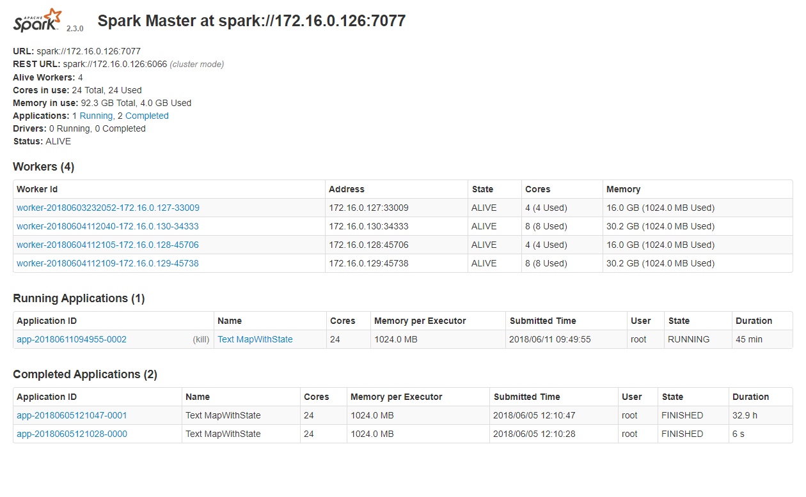
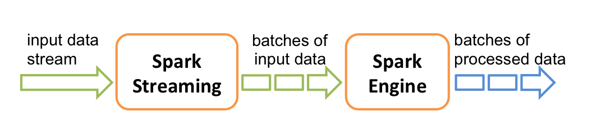

- [概述](#概述)
	- [下载](#下载)
	- [服务配置](#服务配置)
	- [Web UI](#web-ui)
	- [History Server](#history-server)
- [集群模型](#集群模型)
	- [集群管理器类型](#集群管理器类型)
	- [术语表](#术语表)
- [RDD (弹性分布式数据集)](#rdd-弹性分布式数据集)
	- [创建 RDD](#创建-rdd)
	- [RDD 操作](#rdd-操作)
	- [RDD 分区](#rdd-分区)
	- [RDD 依赖](#rdd-依赖)
	- [Shuffle 操作](#shuffle-操作)
		- [背景知识](#背景知识)
		- [性能影响](#性能影响)
	- [作业调度源码分析](#作业调度源码分析)
		- [Job Sumbit](#job-sumbit)
		- [Stage Submit](#stage-submit)
		- [Task Submit](#task-submit)
- [Spark Streaming](#spark-streaming)
	- [Streaming Context](#streaming-context)
	- [DStream](#dstream)
	- [数据变换](#数据变换)
		- [updateStateByKey()](#updatestatebykey)
		- [mapWithState()](#mapwithstate)
	- [Transform Operation (变换操作)](#transform-operation-变换操作)
	- [Window Operations (窗口操作)](#window-operations-窗口操作)
- [Spark SQL](#spark-sql)
	- [SQL](#sql)
	- [Datasets & DataFrames](#datasets--dataframes)
	- [SparkSession](#sparksession)
	- [构建 DataFame](#构建-datafame)
	- [Untyped Dataset Operations (无类型的 Dataset 操作，aka DataFrame Operations)](#untyped-dataset-operations-无类型的-dataset-操作aka-dataframe-operations)
- [Structured Streaming](#structured-streaming)
	- [基础概念](#基础概念)
- [问题注记](#问题注记)
	- [Unable to load native-hadoop library for your platform... using builtin-java classes where applicable](#unable-to-load-native-hadoop-library-for-your-platform-using-builtin-java-classes-where-applicable)
	- [Operation category READ is not supported in state standby](#operation-category-read-is-not-supported-in-state-standby)
	- [org.apache.spark.SparkException: Failed to get broadcast_xxx of broadcast_xxx](#orgapachesparksparkexception-failed-to-get-broadcast_xxx-of-broadcast_xxx)


# 概述
`Apache Spark`是一套**快速**(fast)、**多用途**(general-purpose)的集群计算系统(cluster computing system)。

Spark提供了`Scala`、`Java`、`Python`、`R`等语言的上层API和支持通用执行图的优化引擎。
Spark同时提供了一套高级工具集包括`Spark SQL`(针对SQL和结构化数据处理)、`MLib`(针对机器学习)、`GraphX`(针对图处理)、`Spark Streaming`。

## 下载
在[Spark官网](http://spark.apache.org/downloads.html)下载Saprk软件包。
下载Spark时需要注意Spark版本与Hadoop、Scala版本的对应关系：

- `Spark 2.0`之后官网提供的软件包默认基于`Scala 2.11`构建。
- Spark运行需要的Hadoop最低版本通常会写入压缩包名称中，如`spark-2.3.0-bin-hadoop2.7.tgz`最低需要`Hadoop 2.7`。

Scala版本兼容性：

- 大版本兼容性

	Scala编译器编译出的字节码在不同大版本之间**不具有**二进制兼容性，如`2.10`/`2.11`/`2.12`等。<br>
	在添加`Spark API`依赖时需要根据集群运行的Spark版本使用正确的Scala编译器版本。

- 小版本兼容性

	Scala编译器在小版本之前二进制兼容，如`2.12.1`/`2.12.2`等。<br>
	在小版本内切换编译器版本无需重新编译生成字节码。

## 服务配置
编辑`/etc/profile`或`~/.profile`，配置Spark相关的环境变量：

```sh
export SPARK_HOME=... # 配置软件包路径
PATH+=:$SPARK_HOME/bin # 将Spark工具加入 PATH 中
PATH+=:$SPARK_HOME/sbin # 将Spark工具加入 PATH 中

# 以下配置也可写入 $SPARK_HOME/conf/spark-env.sh 中
export SPARK_MASTER_HOST=172.16.0.126 # 集群的 Master 节点
export SPARK_WORKER_CORES=4 # 指定 Worker 节点使用的核心数
export SPARK_WORKER_MEMORY=16g # 指定 Worker 节点能够最大分配给 Executors 的内存大小
export HADOOP_CONF_DIR=$HADOOP_HOME/etc/hadoop # 指定 Hadoop 集群的配置路径
```

之后创建`$SPARK_HOME/conf/slaves`文件，将需要做为Worker的主机名添加到改文件中：

```sh
spark-slave0
spark-slave1
spark-slave2
...
```

保证集群各机器间能够免密登陆，将配置文件分发到集群的其它机器上，执行指令启动/关闭服务：

```c
// 启动 Master 服务
$ start-master.sh
// 启动 Worker 服务
$ start-slaves.sh

// 停止服务
$ stop-master.sh && stop-slaves.sh
```

正常启动Spark服务后，使用JPS查看进程，主节点应有`Master`进程，从节点应有`Worker`进程。

## Web UI
默认配置下，Spark在`8080`端口提供集群管理的Web界面，可在Web界面中查看集群的工作状态。

Web界面中的提供了以下几类信息：

- `Workers` 展示Worker node(工作节点)的状态。
- `Running Applications` 展示正在执行的Spark应用的信息。
- `Completed Applications` 展示已结束的Spark应用的信息。

如下图所示：



对于正在执行的Spark应用，Spark还提供了`Application Detail UI`，用于查看应用的执行信息，如`Event Timeline`、`DAG Visualization`：


## History Server
Application Detail UI中的信息仅在应用执行期间可查看，默认配置下，应用结束后仅能查看文本日志。
若需要在应用结束后保留应用的执行信息，则需要启动`Spark History Server`。

在HDFS中为Spark创建Spark Event Log路径:

```c
$ hdfs dfs -mkdir [HDFS路径]
```

编辑`$SPARK_HOME/conf/spark-defaults.conf`文件，加入以下配置：

```sh
# 启用 Spark Event Log
spark.eventLog.enabled           true
# 设置 Spark Event Log 的写入路径
spark.eventLog.dir               [HDFS路径]

# 配置 Spark History Server 的服务端口和实现类
spark.history.provider           org.apache.spark.deploy.history.FsHistoryProvider
spark.history.ui.port            18081
# 配置 Spark History Server 访问的日志路径，需要与 spark.eventLog.dir 路径相同
spark.history.fs.logDirectory    [HDFS路径]
```

之后启用Spark History Server服务：

```c
$ start-history-server.sh

// 关闭服务
$ stop-history-server.sh
```


# 集群模型
Spark应用作为独立的进程集在集群中运行，通过`SparkContext`对象在用户主程序(`dirver program`)中与集群组织、交互。

Spark应用在集群中运行时，SparkContext会连接到某种类型的`cluster managers`(集群管理器，如`Mesos`、`YARN`)，
由集群管理器在多个应用间分配资源。一旦连接建立，Spark会在集群的节点中获取`executors`(执行器)，
executors是执行计算操作和存储用户应用数据的进程。
之后，SparkContext将用户的应用代码(在`JAR`中或Python源码文件)发送到executors。
最终，SparkContext发送`tasks`(任务)到executors中运行。

集群结构如下图所示：


关于集群架构的一些注意事项：

1. 每个用户应用拥有属于自己的执行器进程(executor processes)，这些进程保持在整个应用期间，并在多个线程中执行tasks。
这有利于隔离不同的用户应用，包括调度端(每个driver调度自己的tasks)和执行端(来自不同应用的tasks子不同的JVM中执行)。
1. Spark并不知道底层集的群管理器，仅需要能获取执行器进程并能相互通信。
相对而言，将Spark运行在支持其它应用的集群管理器上更加简单(如`Mesos`、`YARN`)。
1. dirver program必须在整个生命周期内监听并接受来自executors的连接。因此，driver program必须能从work nodes寻址。
1. 由于driver在集群中调度tasks，因此需要在网络位置上邻近worker nodes，最好在相同的局域网中。
如果需要向远程集群发送请求，最好为driver开启RPC，在与worker nodes邻近的网络位置启动driver，
使用RPC提交操作，而不是在与worker nodes较远的网络位置上直接执行driver。

## 集群管理器类型
Spark当前支持以下集群管理器：

- `Standalone` Spark内置的简单集群管理器
- `Apache Mesos` 通用的资源管理器，也可用于执行Hadoop MapReduce和服务应用
- `Hadoop YARN` Hadoop2的资源管理器
- `Kubernetes` 用于自动化部署、容器应用管理的开源系统

## 术语表
以下列表总结了在集群概念中提及的术语：

| 术语 | 含义 |
| :- | :- |
| Application | Spark中的用户应用程序，由集群中的driver program和executors组成。 |
| Application jar | 包含用户应用内容的JAR包。JAR包中应打包用户代码所需要的第三方依赖库，但不应该包含Hadoop或Spark库，这些库会在应用运行时添加。 |
| Driver program | 执行用户应用中的main()函数并创建SparkContext的进程。 |
| Cluster manager | 在集群中获取资源的外部服务(如Mesos、YARN)。 |
| Deploy mode | 区分driver进程的执行位置。`cluster`模式下，在集群内部启动driver；`client`模式下，在集群外部启动driver。 |
| Worker node | 可以在集群中执行用户应用代码的节点(部署了Spark服务的IP)。 |
| Executor | 在woker node中启动的用户应用的进程，执行tasks并在内存/磁盘中保存数据。每个用户应用都拥有属于自身的executor。 |
| Task | 将要发往executor的工作单元(a unit of work)。 |
| Job | 由多个Spark操作(如`save()`、`collect()`等)的task组成的并行计算。 |
| Stage | 每个job被拆分成较小的、具有依赖关系的task集合，这些任务集被称为stage。 |


# RDD (弹性分布式数据集)
`RDD`(`Resilient Distributed Datasets`，弹性分布式数据集)是高容错性(fault-tolerant)、可并行操作的的数据集合。
RDD是Spark中对数据的抽象，是Spark中的核心概念。

## 创建 RDD
Spark提供了两种创建RDD的方式：

1. 并行化程序中已存在的普通数据集：

	调用`SparkContext.parallelize()`方法将已存在的普通数据集(`Seq[T]`)转换为`RDD[T]`。<br>
	方法定义如下(源码取自`Spark 2.3.0`)：

	```scala
	class SparkContext(config: SparkConf) extends Logging {
	  ...
	  def parallelize[T: ClassTag](seq: Seq[T], numSlices: Int = defaultParallelism): RDD[T] = ...
	  ...
	}
	```

	使用示例：

	```scala
	scala> val normalData = 1 to 10 //构建普通数据集
	normalData: scala.collection.immutable.Range.Inclusive = Range(1, 2, 3, 4, 5, 6, 7, 8, 9, 10)

	scala> val rddData = sc.parallelize(normalData) //并行化数据集，生成RDD
	rddData: org.apache.spark.rdd.RDD[Int] = ParallelCollectionRDD[0] at parallelize at <console>:26
	```

1. 引用来自外部存储系统的数据集，如本地文件系统、HDFS、HBase、AmazonS3等：

	以文本文件为例，调用`SparkContext.textFile()`方法使用文本文件创建RDD。
	该方法传入文件的URI，按行读取文件构建文本数据集。<br>
	使用示例：

	```scala
	scala> val textRdd = sc.textFile("test.json")
	textRdd: org.apache.spark.rdd.RDD[String] = test.json MapPartitionsRDD[3] at textFile at <console>:24
	```

## RDD 操作
RDD支持两类操作：

1. `Transformation`

	通过已有的RDD创建出新的RDD，常见的transformation操作有`map()`、`filter()`、`flatMap()`等。

1. `Action`

	对RDD进行计算并返回计算结果，常见的action操作有`reduce()`、`collect()`、`count()`、`first()`等。

所有的transformation操作是延迟执行(lazy)的，transformation操作不会立即计算结果，而仅仅是记录要执行的操作。
transformation操作只在action操作要求返回结果时进行计算。Spark这样的设计能够保证计算更有效率，
例如，当一个数据集先后进行了`map()`和`reduce()`操作，Spark服务端便只会返回reduce之后的结果，而不是更大的map之后的数据集。

默认情况下，每个执行transformation操作之后的RDD会每次执行action操作时重新计算。
可以使用`persist()/cache()`方法将RDD在内存中持久化，Spark将在集群中保留这些数据，在下次查询时访问会更加快速。
Spark同样支持将RDD持久化到磁盘中，或是在多个节点之间复制。

简单的RDD操作示例：

给定两个数据集：数据集1(1 ~ 10)、数据集2(10 ~ 20)，筛选出数据集1中的偶数，筛选出数据集2中的奇数，并将两个数据集拼接。

```scala
scala> val dataSet1 = sc.parallelize(Seq(1 to 10: _*))
dataSet1: org.apache.spark.rdd.RDD[Int] = ParallelCollectionRDD[2] at parallelize at <console>:24

scala> val dataSet2 = sc.parallelize(Seq(10 to 20: _*))
dataSet2: org.apache.spark.rdd.RDD[Int] = ParallelCollectionRDD[3] at parallelize at <console>:24

scala> val dataSet3 = dataSet1.filter(_ % 2 == 0)
dataSet3: org.apache.spark.rdd.RDD[Int] = MapPartitionsRDD[7] at filter at <console>:25

scala> val dataSet4 = dataSet2.filter(_ % 2 == 1)
dataSet4: org.apache.spark.rdd.RDD[Int] = MapPartitionsRDD[10] at filter at <console>:25

scala> val result = dataSet3.union(dataSet4)
result: org.apache.spark.rdd.RDD[Int] = UnionRDD[11] at union at <console>:27

scala> result foreach println
6
2
10
11
4
8
17
15
19
13
```

## RDD 分区
RDD在创建完毕后可以被并行地操作。
RDD中的一个重要的参数是分区数量(numbers of partions)，分区数量决定了数据集将会被切分成多少个部分。
Spark执行task时会在集群中的每一个分区进行。

典型的分配方式是根据CPU数目每个CPU分配2～4个分区(CPU双核/四核)。
通常Spark会根据集群配置自动设置分区大小(defaultParallelism)，手动创建RDD时可通过设置`SparkContext.parallelize()`方法的第二参数来显式地设定分区的数量。

## RDD 依赖
每个RDD操作都会依赖之前的RDD，根据对RDD分区的依赖关系，依赖可分为两类：

- **窄依赖**(Narrow Dependency)，父RDD中的一个分区仅被子RDD的一个分区使用(O(1)，常数级)
- **宽依赖**(Wide/Shuffle Dependency)，父RDD中的一个分区可能会被子RDD的多个分区使用(O(n)，随分区大小线性增长)

map()、filter()等窄依赖操作中分区之间平行关系，互不影响。
每个旧分区可独立地执行操作，因而不必要求RDD中所有分区处于相同的操作阶段，旧分区执行完一个窄依赖操作后可立即执行下一个窄依赖操作。
窄依赖操作不会造成跨分区的数据重新排布，Spark将多个窄依赖操作划分到**相同**的stage中。

groupByKey()、reduceByKey()等宽依赖操作中RDD的每个旧分区会被多次使用，
每个新分区依赖所有的父分区，因此宽依赖操作需要等待所有父分区之前的操作执行完毕。
宽依赖操作会引起跨分区的数据复制、再分布(shuffle操作)，Spark将宽依赖操作划分到**新**的stage中。

如下图所示：


## Shuffle 操作
Spark中的宽依赖操作会触发被称为**shuffle**的事件。
Shuffle是Spark中将不同分组、横跨多个分区的数据再分布(re-distributing)的一套机制，
通常会包含跨excutor、跨机器的复制数据。这使得shuffle成为一种复杂(complex)、高开销(costly)的操作。

### 背景知识
以`reduceByKey()`操作为例，该操作对类型为`RDD[(Key, Value)]`的RDD执行，
将相同Key的所有`(Key, Value)`元组通过执行传入的reduce函数聚合到一个`(Key, NewValue)`的新元组中，构成新的RDD。
如下所示：

```
  原RDD                       新RDD
(1, Value1)
(1, Value2)  reduceByKey()  (1, NewValue1)
(1, Value3) ==============> (2, NewValue2)
(2, Value4)                 (3, NewValue3)
(2, Value5)                   ...
(3, Value6)
(4, Value7)
  ...
```

一个Key关联的所有`(Key, Value)`元组未必在相同的分区、甚至相同的机器，但计算结果时需要在相同的位置。

在Spark中，数据通常不会跨分区分布到某个特定操作所需要的位置。在计算期间，单个任务将在单个分区中执行。
事实上，为执行一个reduceByKey()的reduce task，Spark需要执行所有的操作，
必须从所有分区读取所有的Key和Value，并将多个分区中的Value组合，从而为每个Key计算最终结果。
这个重新分配数据的过程即被称为shuffle。

新执行shuffle操作之后，元素在每个分区是确定的(deterministic)，分区的排序也是确定的，但元素的排序不是。
如果需要将元素排序，可以使用下列操作：

- `mapPartitions()` 使用`sorted()`等方法排序每一个分区
- `repartitionAndSortWithinPartitions()` 在重分区同时高效地排序分区
- `sortBy()` 生成一个全局已排序的RDD

会引起shuffle的操作包括：

- `repartition`操作，例如`repartition()`、`coalesce()`方法
- `byKey`操作，例如`groupByKey()`、`reduceByKey()`方法
- `join`操作，例如`join()`、`cogroup()`方法

### 性能影响
Shuffle是高开销(expensive)的操作，因为它涉及磁盘IO、网络IO、数据序列化。
为了shuffle操作组织数据，Spark会生成一系列tasks：

- `map tasks` 组织数据(organize the data)
- `reduce tasks` 聚合数据(aggregate the data)

这样的命名来自`Hadoop MapReudce`，与Spark中的`map()`、`reduce()`方法不直接相关。

## 作业调度源码分析
Spark在提交作业时会为RDD相关操作生成DAG(Directed Acyclic Graph，有向无环图)。

`DAGScheduler`类是Spark中作业调度的核心。
在SparkContext初始化过程中会创建DAGScheduler、TaskScheduler、SchedulerBackend实例，用于作业调度、任务调度。

### Job Sumbit
在driver program中，每次对RDD调用action操作的相关方法(如count()、reduce()、collect()等)，都会提交Job，
执行SparkContext的`runJob()`方法，通过DAGScheduler执行`runJob()`、`submitJob()`，
最终调用EventLoop(实现类DAGSchedulerEventProcessLoop)中post()方法发送`JobSubmitted()`消息通知任务提交完成。

```
RDD
 |
 | action操作
\|/
SparkContext.runJob()
 |
\|/
DAGScheduler.runJob()
 |
\|/
DAGScheduler.submitJob()
 |
\|/
DAGSchedulerEventProcessLoop.post()
```

相关源码分析如下(源码取自`Spark 2.3.0`)：

- RDD中的action操作会调用SparkContext的`runJob()`方法提交Job(以count()、collect()、reduce()为例)：

	```scala
	abstract class RDD[T: ClassTag](
	    @transient private var _sc: SparkContext,
	    @transient private var deps: Seq[Dependency[_]]
	  ) extends Serializable with Logging {

	  ...

	  private def sc: SparkContext = {
	    if (_sc == null) {
	      throw new SparkException(
	        "This RDD lacks a SparkContext. It could happen in the following cases: \n(1) RDD " +
	        "transformations and actions are NOT invoked by the driver, but inside of other " +
	        "transformations; for example, rdd1.map(x => rdd2.values.count() * x) is invalid " +
	        "because the values transformation and count action cannot be performed inside of the " +
	        "rdd1.map transformation. For more information, see SPARK-5063.\n(2) When a Spark " +
	        "Streaming job recovers from checkpoint, this exception will be hit if a reference to " +
	        "an RDD not defined by the streaming job is used in DStream operations. For more " +
	        "information, See SPARK-13758.")
	    }
	    _sc
	  }

	  ...

	  /**
	   * Return the number of elements in the RDD.
	   */
	  def count(): Long = sc.runJob(this, Utils.getIteratorSize _).sum

	  ...

	  /**
	   * Return an array that contains all of the elements in this RDD.
	   *
	   * @note This method should only be used if the resulting array is expected to be small, as
	   * all the data is loaded into the driver's memory.
	   */
	  def collect(): Array[T] = withScope {
	    val results = sc.runJob(this, (iter: Iterator[T]) => iter.toArray)
	    Array.concat(results: _*)
	  }

	  ...

	  /**
	   * Reduces the elements of this RDD using the specified commutative and
	   * associative binary operator.
	   */
	  def reduce(f: (T, T) => T): T = withScope {
	    val cleanF = sc.clean(f)
	    val reducePartition: Iterator[T] => Option[T] = iter => {
	      if (iter.hasNext) {
	        Some(iter.reduceLeft(cleanF))
	      } else {
	        None
	      }
	    }
	    var jobResult: Option[T] = None
	    val mergeResult = (index: Int, taskResult: Option[T]) => {
	      if (taskResult.isDefined) {
	        jobResult = jobResult match {
	          case Some(value) => Some(f(value, taskResult.get))
	          case None => taskResult
	        }
	      }
	    }
	    sc.runJob(this, reducePartition, mergeResult)
	    // Get the final result out of our Option, or throw an exception if the RDD was empty
	    jobResult.getOrElse(throw new UnsupportedOperationException("empty collection"))
	  }

	  ...

	}
	```

- SparkConext的`runJob()`方法会调用自身关联的DAGScheduler中的`runJob()`方法
(SparkContext中的runJob()方法有多个重载，最终都会转发到调用DAGScheduler的重载)：

	```scala
	class SparkContext(config: SparkConf) extends Logging {

	  ...

	  @volatile private var _dagScheduler: DAGScheduler = _

	  ...

	  private[spark] def dagScheduler: DAGScheduler = _dagScheduler
	  private[spark] def dagScheduler_=(ds: DAGScheduler): Unit = {
	    _dagScheduler = ds
	  }

	  ...

	  _dagScheduler = new DAGScheduler(this)

	  ...

	  /**
	   * Run a function on a given set of partitions in an RDD and pass the results to the given
	   * handler function. This is the main entry point for all actions in Spark.
	   *
	   * @param rdd target RDD to run tasks on
	   * @param func a function to run on each partition of the RDD
	   * @param partitions set of partitions to run on; some jobs may not want to compute on all
	   * partitions of the target RDD, e.g. for operations like `first()`
	   * @param resultHandler callback to pass each result to
	   */
	  def runJob[T, U: ClassTag](
	      rdd: RDD[T],
	      func: (TaskContext, Iterator[T]) => U,
	      partitions: Seq[Int],
	      resultHandler: (Int, U) => Unit): Unit = {
	    if (stopped.get()) {
	      throw new IllegalStateException("SparkContext has been shutdown")
	    }
	    val callSite = getCallSite
	    val cleanedFunc = clean(func)
	    logInfo("Starting job: " + callSite.shortForm)
	    if (conf.getBoolean("spark.logLineage", false)) {
	      logInfo("RDD's recursive dependencies:\n" + rdd.toDebugString)
	    }
	    dagScheduler.runJob(rdd, cleanedFunc, partitions, callSite, resultHandler, localProperties.get)
	    progressBar.foreach(_.finishAll())
	    rdd.doCheckpoint()
	  }

	  ...

	}
	```

- DAGScheduler中的`runJob()`会调用自身的`submitJob()`方法提交Job，在submitJob()方法中将Job最终post到EventLoop中：

	```scala
	private[spark]
	class DAGScheduler(
	    private[scheduler] val sc: SparkContext,
	    private[scheduler] val taskScheduler: TaskScheduler,
	    listenerBus: LiveListenerBus,
	    mapOutputTracker: MapOutputTrackerMaster,
	    blockManagerMaster: BlockManagerMaster,
	    env: SparkEnv,
	    clock: Clock = new SystemClock())
	  extends Logging {

	  ...

	  /**
	   * Submit an action job to the scheduler.
	   *
	   * @param rdd target RDD to run tasks on
	   * @param func a function to run on each partition of the RDD
	   * @param partitions set of partitions to run on; some jobs may not want to compute on all
	   *   partitions of the target RDD, e.g. for operations like first()
	   * @param callSite where in the user program this job was called
	   * @param resultHandler callback to pass each result to
	   * @param properties scheduler properties to attach to this job, e.g. fair scheduler pool name
	   *
	   * @return a JobWaiter object that can be used to block until the job finishes executing
	   *         or can be used to cancel the job.
	   *
	   * @throws IllegalArgumentException when partitions ids are illegal
	   */
	  def submitJob[T, U](
	      rdd: RDD[T],
	      func: (TaskContext, Iterator[T]) => U,
	      partitions: Seq[Int],
	      callSite: CallSite,
	      resultHandler: (Int, U) => Unit,
	      properties: Properties): JobWaiter[U] = {
	    // Check to make sure we are not launching a task on a partition that does not exist.
	    val maxPartitions = rdd.partitions.length
	    partitions.find(p => p >= maxPartitions || p < 0).foreach { p =>
	      throw new IllegalArgumentException(
	        "Attempting to access a non-existent partition: " + p + ". " +
	          "Total number of partitions: " + maxPartitions)
	    }

	    val jobId = nextJobId.getAndIncrement()
	    if (partitions.size == 0) {
	      // Return immediately if the job is running 0 tasks
	      return new JobWaiter[U](this, jobId, 0, resultHandler)
	    }

	    assert(partitions.size > 0)
	    val func2 = func.asInstanceOf[(TaskContext, Iterator[_]) => _]
	    val waiter = new JobWaiter(this, jobId, partitions.size, resultHandler)
	    eventProcessLoop.post(JobSubmitted(
	      jobId, rdd, func2, partitions.toArray, callSite, waiter,
	      SerializationUtils.clone(properties)))
	    waiter
	  }

	  /**
	   * Run an action job on the given RDD and pass all the results to the resultHandler function as
	   * they arrive.
	   *
	   * @param rdd target RDD to run tasks on
	   * @param func a function to run on each partition of the RDD
	   * @param partitions set of partitions to run on; some jobs may not want to compute on all
	   *   partitions of the target RDD, e.g. for operations like first()
	   * @param callSite where in the user program this job was called
	   * @param resultHandler callback to pass each result to
	   * @param properties scheduler properties to attach to this job, e.g. fair scheduler pool name
	   *
	   * @note Throws `Exception` when the job fails
	   */
	  def runJob[T, U](
	      rdd: RDD[T],
	      func: (TaskContext, Iterator[T]) => U,
	      partitions: Seq[Int],
	      callSite: CallSite,
	      resultHandler: (Int, U) => Unit,
	      properties: Properties): Unit = {
	    val start = System.nanoTime
	    val waiter = submitJob(rdd, func, partitions, callSite, resultHandler, properties)
	    ThreadUtils.awaitReady(waiter.completionFuture, Duration.Inf)
	    waiter.completionFuture.value.get match {
	      case scala.util.Success(_) =>
	        logInfo("Job %d finished: %s, took %f s".format
	          (waiter.jobId, callSite.shortForm, (System.nanoTime - start) / 1e9))
	      case scala.util.Failure(exception) =>
	        logInfo("Job %d failed: %s, took %f s".format
	          (waiter.jobId, callSite.shortForm, (System.nanoTime - start) / 1e9))
	        // SPARK-8644: Include user stack trace in exceptions coming from DAGScheduler.
	        val callerStackTrace = Thread.currentThread().getStackTrace.tail
	        exception.setStackTrace(exception.getStackTrace ++ callerStackTrace)
	        throw exception
	    }
	  }

	  ...

	}
	```

### Stage Submit
Job提交完成后，DAGScheduler的EventLoop中接收到Job提交完成的消息，开始根据Job中的finalRDD创建finalStage，
之后反向根据RDD的依赖关系类型依次划分、创建stage。

```
DAGSchedulerEventProcessLoop
 |
 | 接收到JobSubmitted()消息
\|/
DAGScheduler.handleJobSubmitted()
 |
\|/
DAGScheduler.createResultStage()
 |
\|/
DAGScheduler.submitStage()
 |
 | 递归调用submitStage()方法
\|/
DAGScheduler.getMissingParentStages()
DAGScheduler.submitStage()
```

相关源码分析如下(源码取自`Spark 2.3.0`)：

- Job提交完成后，JobDAGSchedulerEventProcessLoop接收到`JobSubmitted()`消息，
触发DAGScheduler的`handleJobSubmitted()`方法：

	```scala
	private[scheduler] class DAGSchedulerEventProcessLoop(dagScheduler: DAGScheduler)
	  extends EventLoop[DAGSchedulerEvent]("dag-scheduler-event-loop") with Logging {

	  ...

	    /**
	   * The main event loop of the DAG scheduler.
	   */
	  override def onReceive(event: DAGSchedulerEvent): Unit = {
	    val timerContext = timer.time()
	    try {
	      doOnReceive(event)
	    } finally {
	      timerContext.stop()
	    }
	  }

	  private def doOnReceive(event: DAGSchedulerEvent): Unit = event match {
	    case JobSubmitted(jobId, rdd, func, partitions, callSite, listener, properties) =>
	      dagScheduler.handleJobSubmitted(jobId, rdd, func, partitions, callSite, listener, properties)
	    ...
	  }

	  ...

	}
	```

- 在handleJobSubmitted()方法中，先调用`createResultStage()`根据finalRDD创建finalStage，
之后调用`submitStage()`提交finalStage：

	```scala
	private[spark]
	class DAGScheduler(
	    private[scheduler] val sc: SparkContext,
	    private[scheduler] val taskScheduler: TaskScheduler,
	    listenerBus: LiveListenerBus,
	    mapOutputTracker: MapOutputTrackerMaster,
	    blockManagerMaster: BlockManagerMaster,
	    env: SparkEnv,
	    clock: Clock = new SystemClock())
	  extends Logging {

	  ...

	  private[scheduler] def handleJobSubmitted(jobId: Int,
	      finalRDD: RDD[_],
	      func: (TaskContext, Iterator[_]) => _,
	      partitions: Array[Int],
	      callSite: CallSite,
	      listener: JobListener,
	      properties: Properties) {
	    var finalStage: ResultStage = null
	    try {
	      // New stage creation may throw an exception if, for example, jobs are run on a
	      // HadoopRDD whose underlying HDFS files have been deleted.
	      finalStage = createResultStage(finalRDD, func, partitions, jobId, callSite)
	    } catch {
	      case e: Exception =>
	        logWarning("Creating new stage failed due to exception - job: " + jobId, e)
	        listener.jobFailed(e)
	        return
	    }

	    val job = new ActiveJob(jobId, finalStage, callSite, listener, properties)
	    clearCacheLocs()
	    logInfo("Got job %s (%s) with %d output partitions".format(
	      job.jobId, callSite.shortForm, partitions.length))
	    logInfo("Final stage: " + finalStage + " (" + finalStage.name + ")")
	    logInfo("Parents of final stage: " + finalStage.parents)
	    logInfo("Missing parents: " + getMissingParentStages(finalStage))

	    val jobSubmissionTime = clock.getTimeMillis()
	    jobIdToActiveJob(jobId) = job
	    activeJobs += job
	    finalStage.setActiveJob(job)
	    val stageIds = jobIdToStageIds(jobId).toArray
	    val stageInfos = stageIds.flatMap(id => stageIdToStage.get(id).map(_.latestInfo))
	    listenerBus.post(
	      SparkListenerJobStart(job.jobId, jobSubmissionTime, stageInfos, properties))
	    submitStage(finalStage)
	  }

	  ...

	}
	```

- 在submitStage()方法中，调用了`getMissingParentStages()`方法根据finalStage计算出缺失的父stage，
循环遍历提交这些stage，并递归调用submitStage()，直到没有缺失的父stage：

	```scala
	private[spark]
	class DAGScheduler(
	    private[scheduler] val sc: SparkContext,
	    private[scheduler] val taskScheduler: TaskScheduler,
	    listenerBus: LiveListenerBus,
	    mapOutputTracker: MapOutputTrackerMaster,
	    blockManagerMaster: BlockManagerMaster,
	    env: SparkEnv,
	    clock: Clock = new SystemClock())
	  extends Logging {

	  ...

	  /** Submits stage, but first recursively submits any missing parents. */
	  private def submitStage(stage: Stage) {
	    val jobId = activeJobForStage(stage)
	    if (jobId.isDefined) {
	      logDebug("submitStage(" + stage + ")")
	      if (!waitingStages(stage) && !runningStages(stage) && !failedStages(stage)) {
	        val missing = getMissingParentStages(stage).sortBy(_.id)
	        logDebug("missing: " + missing)
	        if (missing.isEmpty) {
	          logInfo("Submitting " + stage + " (" + stage.rdd + "), which has no missing parents")
	          submitMissingTasks(stage, jobId.get)
	        } else {
	          for (parent <- missing) {
	            submitStage(parent)
	          }
	          waitingStages += stage
	        }
	      }
	    } else {
	      abortStage(stage, "No active job for stage " + stage.id, None)
	    }
	  }

	  ...

	}
	```

	getMissingParentStages()方法中描述了stage的**划分逻辑**，即根据RDD的依赖类型进行划分：

	- `ShuffleDependency` 该RDD需要shuffle操作才能生成，划分新stage
	- `NarrowDependency` 普通依赖，加入当前stage

	如下所示：

	```scala
	private[spark]
	class DAGScheduler(
	    private[scheduler] val sc: SparkContext,
	    private[scheduler] val taskScheduler: TaskScheduler,
	    listenerBus: LiveListenerBus,
	    mapOutputTracker: MapOutputTrackerMaster,
	    blockManagerMaster: BlockManagerMaster,
	    env: SparkEnv,
	    clock: Clock = new SystemClock())
	  extends Logging {

	  ...

	  private def getMissingParentStages(stage: Stage): List[Stage] = {
	    val missing = new HashSet[Stage]
	    val visited = new HashSet[RDD[_]]
	    // We are manually maintaining a stack here to prevent StackOverflowError
	    // caused by recursively visiting
	    val waitingForVisit = new ArrayStack[RDD[_]]
	    def visit(rdd: RDD[_]) {
	      if (!visited(rdd)) {
	        visited += rdd
	        val rddHasUncachedPartitions = getCacheLocs(rdd).contains(Nil)
	        if (rddHasUncachedPartitions) {
	          for (dep <- rdd.dependencies) {
	            dep match {
	              case shufDep: ShuffleDependency[_, _, _] =>
	                val mapStage = getOrCreateShuffleMapStage(shufDep, stage.firstJobId)
	                if (!mapStage.isAvailable) {
	                  missing += mapStage
	                }
	              case narrowDep: NarrowDependency[_] =>
	                waitingForVisit.push(narrowDep.rdd)
	            }
	          }
	        }
	      }
	    }
	    waitingForVisit.push(stage.rdd)
	    while (waitingForVisit.nonEmpty) {
	      visit(waitingForVisit.pop())
	    }
	    missing.toList
	  }

	  ...

	}
	```

### Task Submit
提交stage会根据分区数量计算需要提交的task，根据stage类型生成对应的task，最终提交task到executor。

```
DAGScheduler.submitStage()
 |
\|/
DAGScheduler.submitMissingTasks()
 |
\|/
Stage.findMissingPartitions()
 |
\|/
TaskScheduler.submitTasks()
 |
\|/
SchedulableBuilder.addTaskSetManager()
SchedulerBackend.reviveOffers()
 |
 | SchedulerBackend存在多个实现，以CoarseGrainedSchedulerBackend为例
\|/
DriverEndpoint.send()
 |
\|/
CoarseGrainedSchedulerBackend.makeOffers()
 |
\|/
CoarseGrainedSchedulerBackend.launchTasks()
```

相关源码分析如下(源码取自Spark 2.3.0)：

- 在`submitMissingTasks()`中，先通过`Stage.findMissingPartitions()`得到用于计算的分区，
根据stage类型和分区信息创建了对应的task。

	stage类型和task类型的对应关系：

	- `ShuffleMapStage` 生成`ShuffleMapTask`
	- `ResultStage` 生成`ShuffleMapStage`

	task创建完成后，调用TaskScheduler的`submitTasks()`方法提交任务：

	```scala
	private[spark]
	class DAGScheduler(
	    private[scheduler] val sc: SparkContext,
	    private[scheduler] val taskScheduler: TaskScheduler,
	    listenerBus: LiveListenerBus,
	    mapOutputTracker: MapOutputTrackerMaster,
	    blockManagerMaster: BlockManagerMaster,
	    env: SparkEnv,
	    clock: Clock = new SystemClock())
	  extends Logging {

	  ...

	  private def submitMissingTasks(stage: Stage, jobId: Int) {

	    logDebug("submitMissingTasks(" + stage + ")")

	    // First figure out the indexes of partition ids to compute.
	    val partitionsToCompute: Seq[Int] = stage.findMissingPartitions()

	    // Use the scheduling pool, job group, description, etc. from an ActiveJob associated
	    // with this Stage
	    val properties = jobIdToActiveJob(jobId).properties

	    runningStages += stage

	    ...

	    val tasks: Seq[Task[_]] = try {
	      val serializedTaskMetrics = closureSerializer.serialize(stage.latestInfo.taskMetrics).array()
	      stage match {
	        case stage: ShuffleMapStage =>
	          stage.pendingPartitions.clear()
	          partitionsToCompute.map { id =>
	            val locs = taskIdToLocations(id)
	            val part = partitions(id)
	            stage.pendingPartitions += id
	            new ShuffleMapTask(stage.id, stage.latestInfo.attemptNumber,
	              taskBinary, part, locs, properties, serializedTaskMetrics, Option(jobId),
	              Option(sc.applicationId), sc.applicationAttemptId)
	          }

	        case stage: ResultStage =>
	          partitionsToCompute.map { id =>
	            val p: Int = stage.partitions(id)
	            val part = partitions(p)
	            val locs = taskIdToLocations(id)
	            new ResultTask(stage.id, stage.latestInfo.attemptNumber,
	              taskBinary, part, locs, id, properties, serializedTaskMetrics,
	              Option(jobId), Option(sc.applicationId), sc.applicationAttemptId)
	          }
	      }
	    } catch {
	      case NonFatal(e) =>
	        abortStage(stage, s"Task creation failed: $e\n${Utils.exceptionString(e)}", Some(e))
	        runningStages -= stage
	        return
	    }

	    if (tasks.size > 0) {
	      logInfo(s"Submitting ${tasks.size} missing tasks from $stage (${stage.rdd}) (first 15 " +
	        s"tasks are for partitions ${tasks.take(15).map(_.partitionId)})")
	      taskScheduler.submitTasks(new TaskSet(
	        tasks.toArray, stage.id, stage.latestInfo.attemptNumber, jobId, properties))
	    } else {
	      ...
	    }
	  }

	  ...

	}
	```

- 在TaskScheduler的submitTasks()方法中，通过任务集TaskSet创建了任务管理器TaskSetManager，
调用`SchedulableBuilder.addTaskSetManager()`将TaskSetManager添加到SchedulableBuilder中，
之后调用`SchedulerBackend.reviveOffers()`方法，通知对应的SchedulerBackend处理提交信息。

	```scala
	private[spark] class TaskSchedulerImpl(
	    val sc: SparkContext,
	    val maxTaskFailures: Int,
	    isLocal: Boolean = false)
	  extends TaskScheduler with Logging {

	  ...

	  override def submitTasks(taskSet: TaskSet) {
	    val tasks = taskSet.tasks
	    logInfo("Adding task set " + taskSet.id + " with " + tasks.length + " tasks")
	    this.synchronized {
	      val manager = createTaskSetManager(taskSet, maxTaskFailures)
	      val stage = taskSet.stageId
	      val stageTaskSets =
	        taskSetsByStageIdAndAttempt.getOrElseUpdate(stage, new HashMap[Int, TaskSetManager])
	      stageTaskSets(taskSet.stageAttemptId) = manager
	      val conflictingTaskSet = stageTaskSets.exists { case (_, ts) =>
	        ts.taskSet != taskSet && !ts.isZombie
	      }
	      if (conflictingTaskSet) {
	        throw new IllegalStateException(s"more than one active taskSet for stage $stage:" +
	          s" ${stageTaskSets.toSeq.map{_._2.taskSet.id}.mkString(",")}")
	      }
	      schedulableBuilder.addTaskSetManager(manager, manager.taskSet.properties)

	      if (!isLocal && !hasReceivedTask) {
	        starvationTimer.scheduleAtFixedRate(new TimerTask() {
	          override def run() {
	            if (!hasLaunchedTask) {
	              logWarning("Initial job has not accepted any resources; " +
	                "check your cluster UI to ensure that workers are registered " +
	                "and have sufficient resources")
	            } else {
	              this.cancel()
	            }
	          }
	        }, STARVATION_TIMEOUT_MS, STARVATION_TIMEOUT_MS)
	      }
	      hasReceivedTask = true
	    }
	    backend.reviveOffers()
	  }

	  ...

	}
	```

- SchedulerBackend根据配置，拥有不同的实现类：

	- `LocalSchedulerBackend` 本地模式使用的实现
	- `StandaloneSchedulerBackend` 使用Spark自带的集群管理器时采用此实现
	- `CoarseGrainedSchedulerBackend` 使用外部集群管理器时采用此实现

	以`CoarseGrainedSchedulerBackend`为例，调用`reviveOffers()`方法实际是向DriverEndpoint发送`ReviveOffers`消息。

	```scala
	class CoarseGrainedSchedulerBackend(scheduler: TaskSchedulerImpl, val rpcEnv: RpcEnv)
	  extends ExecutorAllocationClient with SchedulerBackend with Logging {

	  ...

	  override def reviveOffers() {
	    driverEndpoint.send(ReviveOffers)
	  }

	  ...

	}
	```

	DriverEndpoint在CoarseGrainedSchedulerBackend启动服务时(调用`start()`方法)初始化：

	```scala
	class CoarseGrainedSchedulerBackend(scheduler: TaskSchedulerImpl, val rpcEnv: RpcEnv)
	  extends ExecutorAllocationClient with SchedulerBackend with Logging {

	  ...

	  var driverEndpoint: RpcEndpointRef = null

	  ...

	  override def start() {
	    val properties = new ArrayBuffer[(String, String)]
	    for ((key, value) <- scheduler.sc.conf.getAll) {
	      if (key.startsWith("spark.")) {
	        properties += ((key, value))
	      }
	    }

	    // TODO (prashant) send conf instead of properties
	    driverEndpoint = createDriverEndpointRef(properties)
	  }

	  protected def createDriverEndpointRef(
	      properties: ArrayBuffer[(String, String)]): RpcEndpointRef = {
	    rpcEnv.setupEndpoint(ENDPOINT_NAME, createDriverEndpoint(properties))
	  }

	  protected def createDriverEndpoint(properties: Seq[(String, String)]): DriverEndpoint = {
	    new DriverEndpoint(rpcEnv, properties)
	  }

	  ...

	}
	```

- DriverEndpoint在接收到ReviveOffers消息时调用自身的`makeOffers()`方法，
makeOffers()方法中通过`TaskSchedulerImpl.resourceOffers()`向集群管理器申请资源，
之后调用`launchTasks()`启动任务：

	```scala
	private[spark]
	class CoarseGrainedSchedulerBackend(scheduler: TaskSchedulerImpl, val rpcEnv: RpcEnv)
	  extends ExecutorAllocationClient with SchedulerBackend with Logging {

	  ...

	  override def receive: PartialFunction[Any, Unit] = {
	    ...
	    case ReviveOffers =>
	      makeOffers()
	    ...
	  }

	  ...

	  // Make fake resource offers on all executors
	  private def makeOffers() {
	    // Make sure no executor is killed while some task is launching on it
	    val taskDescs = CoarseGrainedSchedulerBackend.this.synchronized {
	      // Filter out executors under killing
	      val activeExecutors = executorDataMap.filterKeys(executorIsAlive)
	      val workOffers = activeExecutors.map {
	        case (id, executorData) =>
	          new WorkerOffer(id, executorData.executorHost, executorData.freeCores)
	      }.toIndexedSeq
	      scheduler.resourceOffers(workOffers)
	    }
	    if (!taskDescs.isEmpty) {
	      launchTasks(taskDescs)
	    }
	  }

	  ...

	  // Launch tasks returned by a set of resource offers
	  private def launchTasks(tasks: Seq[Seq[TaskDescription]]) {
	    for (task <- tasks.flatten) {
	      val serializedTask = TaskDescription.encode(task)
	      if (serializedTask.limit() >= maxRpcMessageSize) {
	        scheduler.taskIdToTaskSetManager.get(task.taskId).foreach { taskSetMgr =>
	          try {
	            var msg = "Serialized task %s:%d was %d bytes, which exceeds max allowed: " +
	              "spark.rpc.message.maxSize (%d bytes). Consider increasing " +
	              "spark.rpc.message.maxSize or using broadcast variables for large values."
	            msg = msg.format(task.taskId, task.index, serializedTask.limit(), maxRpcMessageSize)
	            taskSetMgr.abort(msg)
	          } catch {
	            case e: Exception => logError("Exception in error callback", e)
	          }
	        }
	      }
	      else {
	        val executorData = executorDataMap(task.executorId)
	        executorData.freeCores -= scheduler.CPUS_PER_TASK

	        logDebug(s"Launching task ${task.taskId} on executor id: ${task.executorId} hostname: " +
	          s"${executorData.executorHost}.")

	        executorData.executorEndpoint.send(LaunchTask(new SerializableBuffer(serializedTask)))
	      }
	    }
	  }

	  ...

	}
	```

- launchTasks()方法中将任务信息通过RPC发送到执行器执行，逻辑转到Spark的网络层。

	发送数据的`executorEndpoint`对象为RpcEndpointRef类型，
	实际实现类为NettyRpcEndpointRef，调用的`send()`方法实现如下：

	```scala
	private[netty] class NettyRpcEndpointRef(
	    @transient private val conf: SparkConf,
	    private val endpointAddress: RpcEndpointAddress,
	    @transient @volatile private var nettyEnv: NettyRpcEnv) extends RpcEndpointRef(conf) {

	  ...

	  override def send(message: Any): Unit = {
	    require(message != null, "Message is null")
	    nettyEnv.send(new RequestMessage(nettyEnv.address, this, message))
	  }

	  ...

	}
	```

	`NettyRpcEndpointRef.send()`内部调用了`NettyRpcEnv.send()`，将消息添加到Dispatcher内部队列中等待发送：

	```scala
	private[netty] class NettyRpcEnv(
	    val conf: SparkConf,
	    javaSerializerInstance: JavaSerializerInstance,
	    host: String,
	    securityManager: SecurityManager,
	    numUsableCores: Int) extends RpcEnv(conf) with Logging {

	  ...

	  private[netty] def send(message: RequestMessage): Unit = {
	    val remoteAddr = message.receiver.address
	    if (remoteAddr == address) {
	      // Message to a local RPC endpoint.
	      try {
	        dispatcher.postOneWayMessage(message)
	      } catch {
	        case e: RpcEnvStoppedException => logDebug(e.getMessage)
	      }
	    } else {
	      // Message to a remote RPC endpoint.
	      postToOutbox(message.receiver, OneWayOutboxMessage(message.serialize(this)))
	    }
	  }

	  ...

	}
	```


# Spark Streaming
`Spark Streaming`是对核心`Spark API`的扩展，包含了对实时数据流(live data streams)的可扩展(scalable)、高吞吐(high-throughput)、容错性(fault-tolerant)的流式处理。
数据可从多种数据源中获取，如`Kafka`、`Flume`、`HDFS`或`TCP Socket`，数据能将复杂的算法使用高阶函数表达，如`map()`、`reduce()`、`join()`、`window()`等。
最终，处理过后的数据可被发布到文件系统、数据库、实时仪表等。
实际上，可以将Spark的`Machine Learning`(机器学习)和`Graph Processing`(图处理)算法应用于数据流。


SparkStreaming接收实时的输入数据流并将数据划分批次，每个批次的数据将由Spark引擎处理并在批次中生成最终结果集的流。



SparkStreaming为一个连续的数据流提供了高层抽象，叫做`DStream`(`discretized stream`，离散流)。
DStreams可以从多种数据源(如`Kafka`、`Flume`等)的输入数据流创建，或者通过其它DStream的高阶运算得到。
DStream本质上是一个`RDD`的序列。

## Streaming Context
`Streaming Context`是所有SparkStreaming功能的主要入口点，通过`SparkConf`或已存在的`SparkContext`构建`StreamingContext`实例：

```scala
import org.apache.spark.streaming.{Seconds, StreamingContext}
import org.apache.spark.{SparkConf, SparkContext}

val sparkConf = new SparkConf() {
  setAppName("应用名称...")
  setMaster("spark://xxx:xxx...")
  ...
}

/* 通过 SparkConf 直接构建 StreamingContext 实例
 * 第二参数为生成数据批次的间隔
 */
new StreamingContext(sparkConf, Seconds(1)) {
  /* CheckPoint不设置在运行时会产生异常：
   * java.lang.IllegalArgumentException: requirement failed:
   * The checkpoint directory has not been set. Please set it by StreamingContext.checkpoint().
   */
  checkpoint("hdfs://xxx:xxx...")
  ...
}

/* 获取 SparkContent 实例时，使用伴生对象中的 getOrCreate() 方法
 * 避免分布式场景下多个 SparkContent 实例同时存在发生异常
 */
new StreamingContext(SparkContext.getOrCreate(sparkConf), Seconds(10)) {
  checkpoint("hdfs://xxx:xxx...")
  ...
}
```

通过StreamingContext从不同的数据源构建输入数据的DStream，常见的数据源获取方式如下：

```scala
// 使用 Socket 做为数据源，返回值类型为 org.apache.spark.streaming.dstream.DStream
streamingContext.socketTextStream(...)

// 使用 HDFS 做为数据源
streamingContext.textFileStream(...)
```

## DStream
`DStream`(Discretized Stream)是SparkStreaming提供的基础抽象，表示一串连续的数据流，可以是来自数据源的输入数据流，
也可以由其它数据流转换生成。实质上，DStream是一组连续的RDD，每个DStream中的RDD包含者来自某个时间间隔的数据，如下所示：


DStream中执行的操作将会应用到底层的每个RDD中。例如，对**lines DStream**执行`flatMap()`操作得到**words DStream**，
lines中的每一个RDD均会通过flatMap()生成新的RDD，并构成words，如下所示：


底层的RDD变化由Spark引擎完成计算。DStream操作隐藏了多数的底层细节，给开发者提供了便利的高层次API。

## 数据变换
与RDD类似，DStream允许对输入的数据进行变换操作。
DStream支持多数RDD中可用的变换操作，如`map()`、`flatMap()`、`fliter()`、`reduce()`等，
其中较为特殊的是支持存储状态的`updateStateByKey()`和`mapWithState()`操作。

### updateStateByKey()
`updateStateByKey()`允许保存任意的状态并一直使用数据流中的新数据来更新它。
使用updateStateByKey()需要以下两个步骤：

1. 定义状态，状态可以任意的数据类型。
1. 定义状态更新函数，指定如何根据输入数据和之前的状态来更新状态、输出数据。

updateStateByKey()方法并未直接定义在DStream类型中，而是由`PairDStreamFunctions[K, V]`类型提供，
`PairDStreamFunctions[K, V]`由`DStream[(K, V)]`隐式转换得到，如下所示(源码取自`Spark 2.3.0`)：

```scala
object DStream {

  implicit def toPairDStreamFunctions[K, V](stream: DStream[(K, V)])
      (implicit kt: ClassTag[K], vt: ClassTag[V], ord: Ordering[K] = null):
    PairDStreamFunctions[K, V] = {
    new PairDStreamFunctions[K, V](stream)
  }
  ...
}
```

即调用updateStateByKey()方法的DStream需要为`DStream[(K, V)]`类型。
updateStateByKey()方法包含多个重载，定义如下(源码取自`Spark 2.3.0`)：

```scala
class PairDStreamFunctions[K, V](self: DStream[(K, V)])
  (implicit kt: ClassTag[K], vt: ClassTag[V], ord: Ordering[K]) extends Serializable {
  ...
  def updateStateByKey[S: ClassTag](
    updateFunc: (Seq[V], Option[S]) => Option[S]): DStream[(K, S)] = ...
  def updateStateByKey[S: ClassTag](
    updateFunc: (Seq[V], Option[S]) => Option[S],
    partitioner: Partitioner): DStream[(K, S)] = ...
  def updateStateByKey[S: ClassTag](
    updateFunc: (Seq[V], Option[S]) => Option[S],
    partitioner: Partitioner, initialRDD: RDD[(K, S)]): DStream[(K, S)] = ...
  ...
}
```

方法参数`updateFunc`即为真正的数据处理逻辑，参数类型为：

```scala
(Seq[V], Option[S]) => Option[S]
```

数据处理函数的输入/输出如下：

1. 第一参数为根据Key值归类的值序列，原DStream中Key相同的Value构成`Seq[V]`做为第一输入参数。
1. 第二参数为存储的状态，首次调用为空，之后调用为上一次计算返回的状态。
1. 返回值是更新的状态，下次触发updateStateByKey()方法时相同Key会使用此刻的返回值。

输入数据类型由原DStream的Value类型(`V`)决定，状态类型(`S`)由用户决定。
经过updateStateByKey()处理，生成新的类型为`DStream[(K, S)]`的DStream。

整个计算流程的类型变化关系：

```scala
DStream[(K, V)] => PairDStreamFunctions[K, V] => PairDStreamFunctions.updateStateByKey[S]() => DStream[(K, S)]
```

### mapWithState()
`mapWithState()`直接处理**每一条**数据，通过每一条数据的Key、Value、之前的状态计算出新的数据。

mapWithState()方法同样由`PairDStreamFunctions[K, V]`类型提供，需要原DStream为`DStream[(K, V)]`类型。
截止到`Spark 2.3.0`版本，mapWithState相关API依然带有`@Experimental`注解(实验性的)，定义如下(源码取自`Spark 2.3.0`)：

```scala
class PairDStreamFunctions[K, V](self: DStream[(K, V)])
  (implicit kt: ClassTag[K], vt: ClassTag[V], ord: Ordering[K]) extends Serializable {
  ...
  @Experimental
  def mapWithState[StateType: ClassTag, MappedType: ClassTag](
    spec: StateSpec[K, V, StateType, MappedType]
    ): MapWithStateDStream[K, V, StateType, MappedType] = ...
  ...
}
```

mapWithState()方法接收的参数为`StateSpec`类型，可以使用StateSpec伴生对象中提供的`function()`相关方法构建。
相关方法定义如下(源码取自`Spark 2.3.0`)：

```scala
@Experimental
object StateSpec {
  ...
  def function[KeyType, ValueType, StateType, MappedType](
    mappingFunction: (KeyType, Option[ValueType], State[StateType]) => MappedType
    ): StateSpec[KeyType, ValueType, StateType, MappedType] = ...
  def function[KeyType, ValueType, StateType, MappedType](
    mappingFunction: JFunction3[KeyType, Optional[ValueType], State[StateType], MappedType]
    ): StateSpec[KeyType, ValueType, StateType, MappedType] = ...
  ...
}
```

传入StateSpec.function()的参数`mappingFunction`即为mapWithState()方法真正的处理逻辑，参数类型为：

```scala
(KeyType, Option[ValueType], State[StateType]) => MappedType
```

数据处理函数的输入/输出如下：

1. 第一参数为原DStream中的Key。
1. 第二参数为原DStream中的Value。
1. 第三参数为Key对应存储状态。类型为`State[StateType]`，使用`State.update()`添加、更新状态值，使用`State.remove()`移除状态。
1. 返回值为通过Key、Value、存储状态计算得到的新数据。

KeyType、ValueType实际类型由原DStream决定，存储状态类型StateType、目标数据类型MappedType由用户决定。
经过mapWithState()处理，生成新的类型为`MapWithStateDStream[K, V, StateType, MappedType]`的DStream。

整个计算流程的类型变化关系：

```scala
DStream[(K, V)] => PairDStreamFunctions[K, V] => PairDStreamFunctions.mapWithState[K, V, StateType, MappedType]() => MapWithStateDStream[K, V, StateType, MappedType]
```

`MapWithStateDStream[K, V, StateType, MappedType]`类型继承自`DStream[MappedType]`，
即mapWithState()操作最终生成的是目标数据类型MappedType的DStream。
定义如下所示(源码取自`Spark 2.3.0`)：

```scala
@Experimental
sealed abstract class MapWithStateDStream[KeyType, ValueType, StateType, MappedType: ClassTag](
    ssc: StreamingContext) extends DStream[MappedType](ssc) {
  ...
}
```

## Transform Operation (变换操作)
DStream提供了`transform()/transformWith()`方法可以直接将RDD的变换操作应用到DStream，
通过transform()相关方法可以使用任何DStream API中未直接提供的RDD操作。

相关方法定义如下(源码取自`Spark 2.3.0`)：

```scala
abstract class DStream[T: ClassTag] (
    @transient private[streaming] var ssc: StreamingContext
  ) extends Serializable with Logging {

  ...

  /**
   * Return a new DStream in which each RDD is generated by applying a function
   * on each RDD of 'this' DStream.
   */
  def transform[U: ClassTag](transformFunc: RDD[T] => RDD[U]): DStream[U] = ssc.withScope {
    // because the DStream is reachable from the outer object here, and because
    // DStreams can't be serialized with closures, we can't proactively check
    // it for serializability and so we pass the optional false to SparkContext.clean
    val cleanedF = context.sparkContext.clean(transformFunc, false)
    transform((r: RDD[T], _: Time) => cleanedF(r))
  }

  /**
   * Return a new DStream in which each RDD is generated by applying a function
   * on each RDD of 'this' DStream.
   */
  def transform[U: ClassTag](transformFunc: (RDD[T], Time) => RDD[U]): DStream[U] = ssc.withScope {
    // because the DStream is reachable from the outer object here, and because
    // DStreams can't be serialized with closures, we can't proactively check
    // it for serializability and so we pass the optional false to SparkContext.clean
    val cleanedF = context.sparkContext.clean(transformFunc, false)
    val realTransformFunc = (rdds: Seq[RDD[_]], time: Time) => {
      assert(rdds.length == 1)
      cleanedF(rdds.head.asInstanceOf[RDD[T]], time)
    }
    new TransformedDStream[U](Seq(this), realTransformFunc)
  }

  /**
   * Return a new DStream in which each RDD is generated by applying a function
   * on each RDD of 'this' DStream and 'other' DStream.
   */
  def transformWith[U: ClassTag, V: ClassTag](
      other: DStream[U], transformFunc: (RDD[T], RDD[U]) => RDD[V]
    ): DStream[V] = ssc.withScope {
    // because the DStream is reachable from the outer object here, and because
    // DStreams can't be serialized with closures, we can't proactively check
    // it for serializability and so we pass the optional false to SparkContext.clean
    val cleanedF = ssc.sparkContext.clean(transformFunc, false)
    transformWith(other, (rdd1: RDD[T], rdd2: RDD[U], time: Time) => cleanedF(rdd1, rdd2))
  }

  /**
   * Return a new DStream in which each RDD is generated by applying a function
   * on each RDD of 'this' DStream and 'other' DStream.
   */
  def transformWith[U: ClassTag, V: ClassTag](
      other: DStream[U], transformFunc: (RDD[T], RDD[U], Time) => RDD[V]
    ): DStream[V] = ssc.withScope {
    // because the DStream is reachable from the outer object here, and because
    // DStreams can't be serialized with closures, we can't proactively check
    // it for serializability and so we pass the optional false to SparkContext.clean
    val cleanedF = ssc.sparkContext.clean(transformFunc, false)
    val realTransformFunc = (rdds: Seq[RDD[_]], time: Time) => {
      assert(rdds.length == 2)
      val rdd1 = rdds(0).asInstanceOf[RDD[T]]
      val rdd2 = rdds(1).asInstanceOf[RDD[U]]
      cleanedF(rdd1, rdd2, time)
    }
    new TransformedDStream[V](Seq(this, other), realTransformFunc)
  }

  ...

}
```

使用示例：

```scala
val resultDStream = inputDStream transform { rdd =>
  rdd.join(...).filter(...).union(...) ...
  ...
}
```

使用transform()相关方法，能够直接操作每一个批次数据的RDD本体，通过在RDD上直接执行变换操作来实现那些未在DStream API中提供的功能。

transform()相关方法还可用于执行随时间变化的操作，通过回调方法参数中的时间戳判断时间来执行不同的逻辑：

```scala
val resultDStream = inputDStream transform { (rdd, time) =>
  if (time > ...) {
    ...
  } else if (time < ...) {
    ...
  } else {
    ...
  }
}
```

## Window Operations (窗口操作)
Spark Streaming也提供了窗口操作(windowed computations)，可以对滑动窗口中的数据(sliding window of data)进行变换。
如下所示：


如图所示，落入滑动窗口的源RDD通过窗口操作生成新的RDD，这些新的RDD构成了新DStream。

窗口操作至少需要指定以下参数：

- `window length` 窗口大小，窗口的持续时间
- `sliding interval` 滑动间隔，以多少时间间隔执行窗口操作

| 操作 | 含义 |
| :- | :- |
| **window**(windowLength, slideInterval) | 返回根据原窗口批次计算出的新DStream |
| **countByWindow**(windowLength, slideInterval) | 返回当前滑动窗口内元素的数目 |
| **reduceByWindow**(func, windowLength, slideInterval) | 返回单元素的新DStream，新DStream由原DStream中的元素执func方法聚合得到 |
| **reduceByKeyAndWindow**(func, windowLength, slideInterval, [numTasks]) | 对元素为`(Key, Value)`类型的DStream根据Key归类，对Key相同的元素执行func操作进行聚合 |
| **countByValueAndWindow**(windowLength, slideInterval, [numTasks]) | 统计元素为`(Key, Value)`类型的DStream中每个Key对应的元素数目，构成元素类型为`(Key, Long)`类型的新DStream |


# Spark SQL
`Spark SQL`是用于结构化数据(structured data)处理的Spark模块。与基础的Spark RDD API不同，
Spark SQL提供的接口为Spark提供了更多关于数据结构和正在执行的计算的信息。Spark使用这些额外的信息来进行额外的优化。
可以使用SQL语句或Dataset API与Spark SQL交互。无论用SQL语句或是Dataset API来表达计算逻辑，计算时都采用相同的执行引擎。
开发者可以简单地在不同接口上自由切换，从中选择最自然的方式来描述给定的数据变换。

## SQL
Spark SQL的作用之一是用来执行SQL查询。Spark SQL也可以从已安装的Hive中读取数据。
当使用API执行SQL时，结果将会以`Dataset/DataFrame`类型返回。还可以通过命令行或JDBC/ODBC来使用SQL接口交互。

## Datasets & DataFrames
`Dataset`是分布式的数据集合。Dataset是`Spark 1.6`中新引入的接口，
结合了RDD的优点(强类型，能够使用Lambda)和Spark SQL优化执行引擎的优点。
Dataset可由JVM对象构建并且使用高阶函数进行变换(如`map`、`flatMap`等)。Dataset仅提供Scala和Java的API。
Python不支持Dataset API。但由于Python动态特性，许多Dataset API中的优秀特性已经提供
(如使用`row.cloumnName`通过字段名称来访问一行数据中的某个字段)。R语言的情况类似。

`DataFrame`由Dataset组织到命名的列中构成，概念上等价于关系型数据库中的表或Python/R中的data frame，但具有更深层次的优化。
DataFrame可由各种数据源构造，如：结构化的数据文件、Hive中的表、外部数据库、已存在的RDD等。
DataFrame提供了Scala、Java、Python、R等语言的API，在Scala和Java中，
DataFrame类型由泛型参数为`Row`的Dataset表示，如`Dataset[Row]`(Scala)和`Dataset<Row>`(Java)。

## SparkSession
自`Spark 2.0`开始，Spark SQL提供的`SparkSession`代替了原先的SparkContext做为Spark功能的主要入口点。
使用`SparkSession.builder()`构建SparkSession实例：

```scala
import org.apache.spark.sql.SparkSession

val sparkSession = SparkSession
  .builder()
  .appName(...)
  .master(...)
  .config(...)
  .getOrCreate()

// 导入 Spark SQL 相关的隐式转换，如将 RDD 转换到 DataFrame
import sparkSession.implicits._
```

在`Spark Shell`中，直接提供了配置好的SparkSession实例`spark`：

```scala
scala> spark
res0: org.apache.spark.sql.SparkSession = org.apache.spark.sql.SparkSession@2e8986b6
```

可通过SparkSession获取封装的SparkContext和SQLContext：

```scala
scala> spark.sparkContext
res1: org.apache.spark.SparkContext = org.apache.spark.SparkContext@379df603

scala> spark.sqlContext
res2: org.apache.spark.sql.SQLContext = org.apache.spark.sql.SQLContext@53741683
```

Spark 2.0后的SparkSession提供了内置的Hive特性支持，如使用`HiveQL`、访问`Hive UDFs`、从Hive表中读取数据等。

## 构建 DataFame
Spark应用可通过SparkSession从已存在的RDD、Hive表、Spark Data Source中构建`DataFrame`。

SparkSession类中定义了`createDataFrame()`方法，包含多个重载，提供了多种构建DataFrame的方式：

```scala
class SparkSession private(
    @transient val sparkContext: SparkContext,
    @transient private val existingSharedState: Option[SharedState],
    @transient private val parentSessionState: Option[SessionState],
    @transient private[sql] val extensions: SparkSessionExtensions)
  extends Serializable with Closeable with Logging { self =>
  ...
  def createDataFrame[A <: Product : TypeTag](rdd: RDD[A]): DataFrame = ...
  def createDataFrame[A <: Product : TypeTag](data: Seq[A]): DataFrame = ...
  def createDataFrame(rdd: RDD[_], beanClass: Class[_]): DataFrame = ...
  def createDataFrame(rdd: JavaRDD[_], beanClass: Class[_]): DataFrame = ...
  def createDataFrame(data: java.util.List[_], beanClass: Class[_]): DataFrame = ...
  ...
}
```

从Seq、RDD构建DataFrame时，表格的结构取决于做为RDD的泛型参数的结构：

```scala
// 定义数据结构
scala> case class Test(name: String, age: Int)
defined class Test

scala> val seq = Seq(Test("Haskell", 25), Test("Rust", 6), Test("Scala", 15))
seq: Seq[Test] = List(Test(Haskell,25), Test(Rust,6), Test(Scala,15))

scala> val rdd = sc.parallelize(seq)
rdd: org.apache.spark.rdd.RDD[Test] = ParallelCollectionRDD[0] at parallelize at <console>:26

// 从 Seq 中构建 DataFrame
scala> val dataFrameFromSeq = spark.createDataFrame(seq)
dataFrameFromSeq: org.apache.spark.sql.DataFrame = [name: string, age: int]

// 打印 DataFrame 内容
scala> dataFrameFromSeq.show()
+-------+---+
|   name|age|
+-------+---+
|Haskell| 25|
|   Rust|  6|
|  Scala| 15|
+-------+---+

// 从 RDD 中构建 DataFrame
scala> val dataFrameFromRdd = spark.createDataFrame(rdd)
dataFrameFromRdd: org.apache.spark.sql.DataFrame = [name: string, age: int]

// 打印 DataFrame 内容
scala> dataFrameFromRdd.show()
+-------+---+
|   name|age|
+-------+---+
|Haskell| 25|
|   Rust|  6|
|  Scala| 15|
+-------+---+
```

SparkSession类中定义了`implicits`单例，提供了常用的隐式转换：

```scala
class SparkSession private(
    @transient val sparkContext: SparkContext,
    @transient private val existingSharedState: Option[SharedState],
    @transient private val parentSessionState: Option[SessionState],
    @transient private[sql] val extensions: SparkSessionExtensions)
  extends Serializable with Closeable with Logging { self =>
  ...
  object implicits extends SQLImplicits with Serializable {
    ...
  }
  ...
}
```

编写SparkSQL应用时，需要导入SparkSession实例中提供的隐式转换(导入`SparkSession.implicits`单例内的成员)。
SparkShell环境下默认已经导入了SparkSQL相关的隐式转换。

Seq/RDD经过隐式方法`rddToDatasetHolder()/localSeqToDatasetHolder()`被隐式转换为`DatasetHolder[T]`类型。
DatasetHolder类型提供了`toDF()`方法生成DataFrame：

```scala
abstract class SQLImplicits extends LowPrioritySQLImplicits {
  ...
  implicit def rddToDatasetHolder[T : Encoder](rdd: RDD[T]): DatasetHolder[T] = {
    DatasetHolder(_sqlContext.createDataset(rdd))
  }
  implicit def localSeqToDatasetHolder[T : Encoder](s: Seq[T]): DatasetHolder[T] = {
    DatasetHolder(_sqlContext.createDataset(s))
  }
  ...
}

case class DatasetHolder[T] private[sql](private val ds: Dataset[T]) {
  ...
  def toDF(): DataFrame = ds.toDF()
  def toDF(colNames: String*): DataFrame = ds.toDF(colNames : _*)
  ...
}
```

使用隐式转换构建DataFrame：

```scala
// 使用无参的 toDF() 方法构建DataFrame会使用结构字段名称做为列名
scala> rdd.toDF().show()
+-------+---+
|   name|age|
+-------+---+
|Haskell| 25|
|   Rust|  6|
|  Scala| 15|
+-------+---+

// 使用有参的 toDF() 方法构建DataFrame时可自定义列名
scala> seq.toDF("name1", "age1").show()
+-------+----+
|  name1|age1|
+-------+----+
|Haskell|  25|
|   Rust|   6|
|  Scala|  15|
+-------+----+
```

从各类文件中构建DataFrame：

```scala
val sparkSession: SparkSession = ...

// 从JSON文件中创建DataFrame
val dataFrameJson1 = sparkSession.read.json("xxx/xxx.json")
val dataFrameJson2 = sparkSession.read.format("json").load("xxx/xxx.json")

// 从CSV文件中创建DataFrame
val dataFrameCsv1 = sparkSession.read.csv("xxx/xxx.csv")
val dataFrameCsv2 = sparkSession.read
  .format("csv")
  .option("sep", ";") //设定CSV文件的分隔符
  .option("inferSchema", "true") //使用推断Schema结构的方式
  .option("header", "true") //包含Header
  .load("xxx/xxx.csv")
```

从JDBC数据源中构建DataFrame：

```scala
val sparkSession: SparkSession = ...

val dataFrameJdbc1 = sparkSession.read.jdbc(
  "jdbc:mysql://ip:port/db_name?xxx=xxx...", "tablename",
  new Properties { put("user", "xxx"); put("password", "xxx") })
val dataFrameJdbc2 = sparkSession.read
  .format("jdbc")
  .option("url", "jdbc:mysql://ip:port/db_name?xxx=xxx...")
  .option("dbtable", "tablename")
  .option("user", "xxx")
  .option("password", "xxx")
  .load()
```

## Untyped Dataset Operations (无类型的 Dataset 操作，aka DataFrame Operations)
DataFrame操作结构化数据提供了DSL(domain-specific language，特定领域专用语言)，在Scala、Java、Python、R语言中可用。

`Spark 2.0`之后，在Java/Scala API中，DataFrame仅仅是Dataset使用Row类型作为泛型参数构成的类型。
除了简单的列引用和表达式，Dataset还拥有丰富的函数库包括字符串操作、日期计算、通用数学操作等。
完整的功能列表可查看[DataFrame Function Reference](http://spark.apache.org/docs/latest/api/scala/index.html#org.apache.spark.sql.functions$)。

基础的DataFrame操作：

```scala
// 定义数据结构
scala> case class Test(name: String, age: Int)
defined class Test

// 创建测试数据结构
scala> val dataFrame = spark.createDataFrame(Seq(Test("Haskell", 25), Test("Rust", 6), Test("Scala", 15)))
dataFrame: org.apache.spark.sql.DataFrame = [name: string, age: int]

// 输出DataFrame内容
scala> dataFrame.show()
+-------+---+
|   name|age|
+-------+---+
|Haskell| 25|
|   Rust|  6|
|  Scala| 15|
+-------+---+

// 输出DataFrame结构
scala> dataFrame.printSchema()
root
 |-- name: string (nullable = true)
 |-- age: integer (nullable = false)

// 显示指定列的内容
scala> dataFrame.select("name").show()
+-------+
|   name|
+-------+
|Haskell|
|   Rust|
|  Scala|
+-------+

// 显示列内容时可添加额外处理
// 输出 name，age 列，同时 age 列的值执行 +1 操作
scala> dataFrame.select($"name", $"age" + 1).show()
+-------+---------+
|   name|(age + 1)|
+-------+---------+
|Haskell|       26|
|   Rust|        7|
|  Scala|       16|
+-------+---------+

// 过滤内容
scala> dataFrame.filter($"age" > 10).show()
+-------+---+
|   name|age|
+-------+---+
|Haskell| 25|
|  Scala| 15|
+-------+---+
```


# Structured Streaming
`Structured Streaming`是可扩展(scalaable)和高容错(fault-tolerant)的、构建在`Spark SQL Engine`引擎之上的流处理引擎。
通过Structured Streaming能够使用与批处理静态数据相同的方式表示流式计算。

## 基础概念
Structured Streaming将输入的数据流视为`Input Table`。每个添加到数据流中的数据对象近似于Input Table中追加的行。


在结果中的查询将会生成`Result Table`。
每个触发器间隔(通常为1s)之后，新增的行将追加到Input Table中，最终更新到Result Table。
无论何时结果表获得更新，变化的结果行将会被写入外部输出。


`Output`代表将要被写入的外部存储。输出能够被定义为不同的模式：

- `Complete Mode` 向外部存储中写入整个更新的Result Table，由存储连接器决定如何处理写入的整张表。
- `Append Mode` 仅向外部存储中写入从上次触发器之后Result Table中新追加的数据行。
此模式仅适用于Result Table中已存在的行预计不会发生改变的场景下。
- `Update Mode` 仅向外部存储中写入从上次触发器之后Result Table中更新的数据行(从`Spark 2.1.1`开始添加此模式)。
如果查询中不包含聚合操作(aggregations)，则此模式等同于Append Mode。

当查询开始时，Spark会从Socket连接中持续地检查新数据。如果存在新数据，Spark将会启动"incremental"(递增式)查询，
将先前执行的计算结果与新数据结合进行计算并更新结果。


# 问题注记
记录Spark开发、使用过程中遇到的错误信息以及对应解决方法。

## Unable to load native-hadoop library for your platform... using builtin-java classes where applicable
问题说明：<br>
Spark运行环境中已包含了Scala、Hadoop、Zookeeper等依赖，与Jar包中自带的依赖产生冲突。

解决方式：<br>
开发环境中为确保源码正常编译，需要完整引入Spark相关依赖，但在生成Jar时，需要移除Spark以及相关联的Scala、Hadoop、Zookeeper相关依赖。

## Operation category READ is not supported in state standby
问题说明：<br>
配置了NameNode HA的Hadoop集群会存在`active`、`standby`两种状态。
SparkStreaming使用HDFS为数据源时URL使用standby节点的主机名触发该异常。

解决方式：<br>
登陆HDFS的WEB管理界面查看节点状态，设置HDFS的URL时使用active节点的主机名。
Spark/SparkStreaming访问HDFS时URL需要使用active节点的主机名。

## org.apache.spark.SparkException: Failed to get broadcast_xxx of broadcast_xxx
问题说明：<br>
在集群模式下执行Spark应用时，多个JVM实例间持有不同的SparkContent实例，导致Worker节点间通信出错。

解决方式：<br>
避免使用单例模式保存SparkContent实例，单例模式在集群中存在多个JVM实例时不可靠。
创建SparkContext应在主函数代码中进行，构建SparkContext应使用伴生对象中提供的`SparkContext.getOrCreate()`方法。
