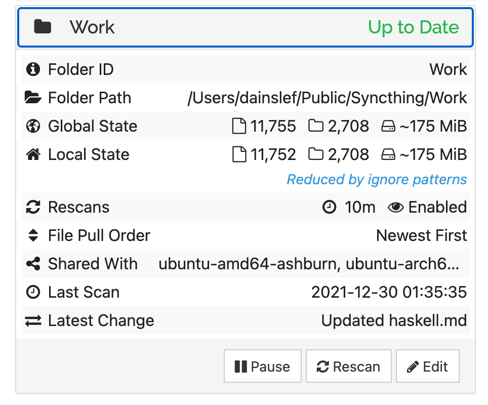

<!-- TOC -->

- [概述](#概述)
	- [服務安裝](#服務安裝)
	- [服務管理](#服務管理)
	- [FreeBSD環境配置](#freebsd環境配置)
- [文件同步規則](#文件同步規則)
- [同步類型](#同步類型)
- [問題註記](#問題註記)
	- [Syncthing服務僅在與服務器存在SSH連接時正常連接，否則連接斷開](#syncthing服務僅在與服務器存在ssh連接時正常連接否則連接斷開)
	- [同步狀態為`Up to Date`，但Local State與Global State文件統計不同](#同步狀態為up-to-date但local-state與global-state文件統計不同)

<!-- /TOC -->


# 概述
[`Syncthing`](https://github.com/syncthing/syncthing)是一套使用Go實現的開源文件同步服務。

## 服務安裝
Syncthing軟件包在各大發行版中均已收錄，直接使用各大發行版的默認包管理器即可安裝：

```html
# apt install syncthing <!-- 大便係 -->
$ brew install syncthing <!-- macOS Homebrew -->
```

在基於systemd的發行版中，以Ubuntu為例，syncthing會創建兩個服務：

- `/lib/systemd/system/syncthing@.service`

	root權限的syncthing服務，使用了systemd中`special executable prefixes`的`@`前綴，
	前綴之後需要追加用戶名：

	```html
	# systemctl start/stop/enable/disable syncthing@用戶.service
	```

- `/usr/lib/systemd/user/syncthing.service`

	普通用戶權限的syncthing服務，每個用戶可獨立管理：

	```html
	$ systemctl --user start/stop/enable/disable syncthing.service
	```

	使用普通用戶權限的syncthing服務需要開啟用戶的`Linger`屬性：

	```html
	$ loginctl enable-linger <!-- 未啟用Linger則無用戶登入時該用戶所屬服務進程會退出 -->
	```

	詳細原因參考[問題描述](#syncthing服務僅在與服務器存在ssh連接時正常連接否則連接斷開)。

使用macOS的Homebrew，則直接使用普通服務管理指令即可：

```
$ brew services start/stop syncthing
```

更多Syncthing服務配置說明可參考[官方文檔](https://docs.syncthing.net/users/autostart.html)。

## 服務管理
默認配置下，服務安裝啟動後，會在`8384`端口提供Web管理頁面，服務數據通信使用`22000`端口，
部署在雲環境上，對應端口均需要開放TCP協議。

首次啟動服務，Syncthing會在`～/.config/syncthing`(Linux)或
`~/Library/Application Support/Syncthing`(macOS)下創建默認配置。
默認配置下，Web管理頁面僅本機地址可訪問，可修改`configuration.gui.address`節點，改成需要的地址。

## FreeBSD環境配置
FreeBSD下，Syncthing的配置文件位於`/usr/local/etc/syncthing/config.xml`。

FreeBSD中的Syncthing服務默認以`syncthing`用戶啟動（即使在root用戶下），
因此，多數目錄無讀寫權限，需要選擇權限為`755`以上的目錄，如`/var`、`/media`等。
以`/media`為例，創建Syncthing存儲路徑：

```
# mkdir /media/syncthing
# chown syncthing:syncthing /media/syncthing
```


# 文件同步規則
Syncthing支持git風格的自定義文件同步忽略規則，類似git中的`.gitignore`，
Syncthing在同步根路徑下創建`.stignore`來定義忽略規則。

`.stignore`文件中包含一組文件/路徑的模式，常用的幾種模式：

- `普通名稱` 匹配任意子路徑下的對應名稱文件
- `*`/`**` 匹配零或多個字符，`*`僅一層路徑有效，`**`任意層級子路徑有效
- `?` 匹配非單個字符(不包括路徑分隔符)
- `!` 反模式，模式以`!`為前綴，則模式的含義由排除變為**包含**
- `#include 文件名` 從其它文件中引用規則
- `//` 註釋語法

更多規則可參考[Syncthing官方文檔](https://docs.syncthing.net/users/ignoring.html)。

當多個模式有衝突時，以排在前的模式為準。
示例，忽略所有除`.gitignore`之外的隱藏文件：

```c
// 忽略所有`.`開頭的文件
.*
// 取消忽略`.gitignore`
!.gitignore
```

按照上述順序寫入`.stignore`並不生效，因為`.*`規則優先匹配(忽略所有隱藏文件)，正確寫法：

```
!.gitignore
.*
```

`.stignore`文件中註釋使用類C語法，但`//`注釋**不能**用於行尾，僅能單獨佔據一行，
用在行尾會導致當前行的規則失效。


# 同步類型
Syncthing中的同步文件夾可設置為以下三種類型：

- Send & Recevie
- Send Only
- Receive Only

三種類型的文件夾分別對應不同的讀寫限制。

當使用Receive Only模式時，本地的修改僅在本地生效，不會推送到其它機器；
本地的修改亦會被記錄狀態，存在本地修改時，
Web UI下對應文件夾頁面中會出現紅色的`Revert Local Changes`按鈕，
點擊該按鈕可roll back本地的改動。


# 問題註記
記錄使用Syncthing中遇到的一些問題。

## Syncthing服務僅在與服務器存在SSH連接時正常連接，否則連接斷開
問題說明：<br>
Linux環境下使用systemd啟用Syncthing**用戶服務**，僅在與服務器存在SSH連接時Syncthing正常連接，
一旦SSH連接退出，Syncthing服務也隨之中斷。參考社區中的[相同問題](https://forum.syncthing.net/t/syncthing-server-disconects-when-the-ssh-session-is-closed/11168)。

解決方案：<br>
該問題實際由systemd機制引起，systemd的默認策略下，管理的用戶服務會在用戶登入時啟動，在用戶登出時退出，
因此當Syncthing作為用戶服務啟動時，會出現SSH連接上Syncthing可連接，SSH退出Syncthing亦中斷的情況。

解決方案是使用`loginctl`啟用對應用戶的`Linger`屬性：

```
$ loginctl enable-linger
```

啟用Linger後，該用戶所屬服務不再與用戶的登入登出關聯，而是如系統服務般始終運行。

## 同步狀態為`Up to Date`，但Local State與Global State文件統計不同
問題說明：<br>
本地目錄顯示已與服務端同步，文件統計數據與服務端不同：



解決方案：<br>
通常該問題是本地與服務端的同步規則差異導致；
常發生在本地修改了文件忽略規則，導致部分文件不再同步，
但服務端依舊使用舊的同步規則，此時即使本地與服務端狀態一致（沒有需要同步的內容），
但由於忽略規則差異，統計各自的文件狀態會產生差異。
