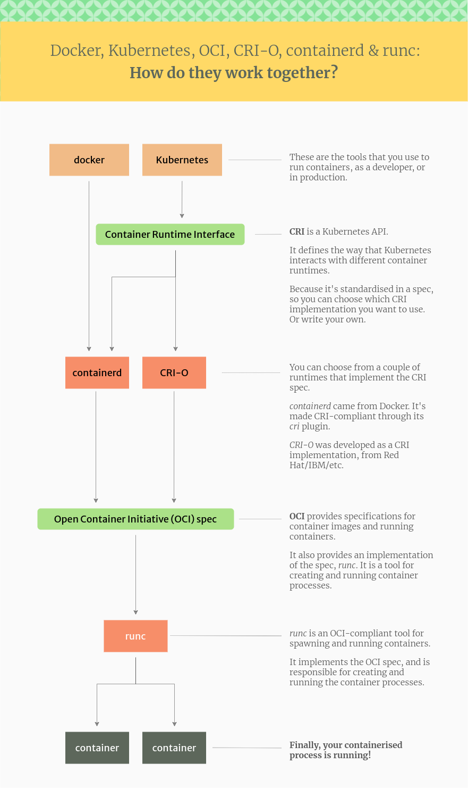

<!-- TOC -->

- [容器技術概述](#容器技術概述)
	- [容器技術實現](#容器技術實現)
	- [Docker容器與傳統虛擬機的區別](#docker容器與傳統虛擬機的區別)
	- [容器相關技術架構](#容器相關技術架構)
	- [Dockershim](#dockershim)
- [Docker安裝與配置](#docker安裝與配置)
	- [docker-machine（已廢棄）](#docker-machine已廢棄)
	- [Docker Desktop for macOS](#docker-desktop-for-macos)
		- [訪問Docker Desktop的虛擬機（HyperKit，已過時）](#訪問docker-desktop的虛擬機hyperkit已過時)
		- [訪問Docker Desktop的虛擬機（HVF）](#訪問docker-desktop的虛擬機hvf)
- [Docker基本使用](#docker基本使用)
	- [Docker容器管理](#docker容器管理)
		- [Docker容器自啟動](#docker容器自啟動)
		- [Docker容器生成鏡像](#docker容器生成鏡像)
		- [Docker容器導入/導出](#docker容器導入導出)
		- [Docker Compose](#docker-compose)
	- [Docker鏡像管理](#docker鏡像管理)
		- [Docker鏡像源](#docker鏡像源)
		- [Docker鏡像導入/導出](#docker鏡像導入導出)
		- [Docker鏡像構建](#docker鏡像構建)
		- [Docker Registry Server](#docker-registry-server)
		- [Docker Hub](#docker-hub)
	- [Docker容器日誌](#docker容器日誌)
	- [Docker容器資源監控](#docker容器資源監控)
	- [Docker環境清理](#docker環境清理)
- [Docker文件系統](#docker文件系統)
	- [Docker文件傳輸](#docker文件傳輸)
	- [Docker綁定掛載（Bind Mounts）](#docker綁定掛載bind-mounts)
	- [Docker Volumes（卷）](#docker-volumes卷)
- [Docker網絡](#docker網絡)
	- [Docker端口映射](#docker端口映射)
	- [Docker修改端口映射](#docker修改端口映射)
	- [Docker設置自定義Hosts](#docker設置自定義hosts)
- [Docker Compose](#docker-compose-1)
	- [安裝Docker Compose](#安裝docker-compose)
	- [Docker Compose服務定義](#docker-compose服務定義)
	- [Docker Compose指令](#docker-compose指令)
- [Habor](#habor)
	- [部署Habor（Docker Compose）](#部署habordocker-compose)
		- [部署Helm Chart倉庫](#部署helm-chart倉庫)
		- [部署Https访问](#部署https访问)
		- [Docker客戶端證書配置](#docker客戶端證書配置)
		- [Habor服務管理](#habor服務管理)
	- [部署Habor（Helm）](#部署haborhelm)
	- [登入Habor](#登入habor)
		- [Docker登入](#docker登入)
		- [podman登入](#podman登入)
		- [containerd登入](#containerd登入)
	- [從其它Harbor倉庫導入鏡像](#從其它harbor倉庫導入鏡像)
- [Lima](#lima)
	- [Lima安裝](#lima安裝)
	- [Lima環境配置](#lima環境配置)
	- [Lima的containerd支持](#lima的containerd支持)
- [Podman](#podman)
	- [Podman on macOS](#podman-on-macos)
	- [Podman容器配置存儲](#podman容器配置存儲)
	- [Podman與Docker差異](#podman與docker差異)
		- [容器服務架構](#容器服務架構)
		- [systemd容器](#systemd容器)
		- [Podman構建tag與Docker的差異](#podman構建tag與docker的差異)
- [LXC/LXD](#lxclxd)
	- [LXD於Docker/Podman的差異](#lxd於dockerpodman的差異)
	- [LXD初始化](#lxd初始化)
	- [LXD基本操作](#lxd基本操作)
	- [LXD容器特權模式](#lxd容器特權模式)
	- [LXD文件傳輸/目錄共享](#lxd文件傳輸目錄共享)

<!-- /TOC -->


# 容器技術概述
容器技術將應用與依賴項一同打包放置在隔離的環境中執行，
僅僅依賴宿主機的**內核**，簡化了應用的運帷與部署。

與傳統虛擬機不同，容器屬於`OS-level virtualization`（操作系統層次的虛擬化），
每個容器實例實際僅僅是獨立的用戶空間實例。

## 容器技術實現
主流的Unix系統均提供了不同的容器技術，以Linux和FreeBSD為例：

- Linux容器基於[`namespaces(7)`](https://man7.org/linux/man-pages/man7/namespaces.7.html)

	Linux的namespaces機制將資源劃分到不同命名空間中，不同命名空間內的進程資源相互隔離，
	Linux的namespaces包含多個類別，包括Cgroup（根目錄隔離）、Network（網絡隔離）、PID（進程號隔離）等。

- FreeBSD容器基於[`Jails`](https://docs.freebsd.org/en/books/handbook/jails/)

	FreeBSD的Jails類似一個高級的`chroot`實現，普通chroot會共享宿主機除根路徑外的其它資源，
	Jails在普通的chroot上添加了多種資源控制等高級功能。

## Docker容器與傳統虛擬機的區別
`Docker`是使用`Go`語言實現的開源容器引擎。

Docker基於容器技術，早期使用LinuX Containers（LXC）實現，之後切換到runC（libcontainer），
直接使用Docker需要宿主機與容器同樣運行Linux系統，容器直接使用宿主機的內核。
傳統虛擬機實例之間不能共享資源，而Docker實例可直接共享主機資源，
以內存為例，傳統虛擬機分配1GB內存，則虛擬機實例會獨佔1GB內存，但多個Docker實例之間則可共享該內存。

參考[StackOverflow](https://stackoverflow.com/questions/16047306/how-is-docker-different-from-a-virtual-machine)
上的相關問答。

Docker同樣相比傳統虛擬機存在一些限制，例如systemd在Docker中不能直接使用，
Docker被設計用於提供單個進程/服務運行的最小環境，通常容器中不會運行systemd此類系統管理服務。

關於在Docker中運行systemd，參考[StackOverflow](https://stackoverflow.com/questions/46800594/start-service-using-systemctl-inside-docker-container)上的相關問答。

## 容器相關技術架構
容器技術體系中，有兩層API標準：

- `Container Runtime Interface (CRI)`

	CRI是Kubernetes定義的、與容器運行時交互的API。
	Kubernetes通過該API對符合標準的容器運行時進行操作，
	主流的容器運行時如`containerd`、`CRI-O`等均實現了該API。

- [`Open Container Initiative (OCI)`](https://opencontainers.org/)

	OCI是Linux基金會下的子項目，目標是創建容器格式、容器運行時的行業標準。
	OCI在2015年6月由Docker和其它行業領導者創建，當前OCI主要包括兩大規範：

	1. `Runtime Specification (runtime-spec)` 容器運行時規範
	1. `Image Specification (image-spec)` 容器鏡像規範

	容器運行時規範描述如何執行一個在磁盤上解包後的「Filesystem Bundle」。
	OCI實現下載OCI鏡像，將其解包為「OCI Runtime Filesystem Bundle」，
	然後由「OCI Runtime」執行「OCI Runtime Bundle」。

	OCI的主要實現是[runc](https://github.com/opencontainers/runc)。

體系結構圖示：



容器技術體系架構參考[博客](https://www.tutorialworks.com/difference-docker-containerd-runc-crio-oci/)。

## Dockershim
Kubernetes早期使用名為dockershim的機制調用Docker，
但現在Kubernetes逐步放棄dockershim，轉而使用CRI與任何符合要求的容器運行時交互(不侷限於Docker)；
自`Kubernetes v1.20`開始，Kubernetes發布了[官方聲明](https://kubernetes.io/blog/2020/12/02/dont-panic-kubernetes-and-docker/)，dockershim已被聲明為**deprecation（廢棄）**。
最新的[官方博客](https://kubernetes.io/blog/2021/11/12/are-you-ready-for-dockershim-removal/)中，
dockershim的廢棄推遲到了`1.24`版本。


# Docker安裝與配置
各類Linux發行版的官方倉庫中均內置了Docker，使用發行版內置的包管理器安裝即可：

```html
# pacman -S docker <!-- Arch Linux -->
# apt install docker.io <!-- Debian系 -->
```

Docker容器使用宿主機的內核，需要宿主機內核版本`3.10+`。

## docker-machine（已廢棄）
Docker使用了諸多`Linux Kernel`專有特性，並非POSIX兼容，無法直接移植到macOS中。
macOS中Docker使用`docker-machine`在VirtualBox中創建Linux虛擬機，並在虛擬機中運行Docker。

安裝Docker和docker-machine：

```
$ brew install docker docker-machine
```

docker-machine主要指令：

```html
# docker-machine create 虛擬機名稱 <!-- 創建虛擬機 -->
# docker-machine rm 虛擬機名稱 <!-- 移除虛擬機 -->
# docker-machine ls <!-- 列出已創建的虛擬機 -->
# docker-machine start/stop 虛擬機名稱 <!-- 啓動/停止虛擬機 -->
# docker-machine env 虛擬機名稱 <!-- 獲取指定已啓動的虛擬機的環境變量 -->
```

啓動虛擬機後，直接在命令行中使用`docker`指令，會得到以下錯誤輸出：

```
Cannot connect to the Docker daemon at unix:///var/run/docker.sock. Is the docker daemon running?
```

docker工具不能立即訪問虛擬機，需要設置相關環境變量。
使用`docker-machine env`指令獲取虛擬機相關環境變量，
使用`eval`使環境變量生效，之後才能正常使用Ddocker相關指令：

```
$ eval $(docker-machine env [環境變量])
```

## Docker Desktop for macOS
通過docker-machine創建VirtualBox虛擬機來使用docker需要較多配置，存在諸多不便，
因而官方推出了[`Docker Desktop`](https://www.docker.com/products/docker-desktop)。

Dcoker Desktop針對Windows、macOS平臺提供了開箱即用的配置整合，內置了docker運行需要的Linux虛擬機，
並提供了美觀的GUI，便於對網絡、存儲、性能等各類配置進行管理。

Docker Desktop在對應平臺使用該平臺推薦的虛擬化技術創建虛擬機(Windows下使用HyperV，macOS下使用HyperKit)，
相比使用VirtualBox更加高效。

### 訪問Docker Desktop的虛擬機（HyperKit，已過時）
在macOS下，Docker Desktop使用HyperKit啟動虛擬機，用以提供docker執行需要的Linux環境。
通過訪問該虛擬機可以查看和配置docker運行的真實主機環境。

HyperKit創建的虛擬機會在以下路徑創建終端虛擬設備：

```html
~/Library/Containers/com.docker.docker/Data/com.docker.driver.amd64-linux/tty

<!-- 該設備實際指向 /dev 路徑下的終端設備 -->
$ ls -alh ~/Library/Containers/com.docker.docker/Data/com.docker.driver.amd64-linux/tty
lrwxr-xr-x  1 dainslef  staff    12B Aug 13 01:00 /Users/dainslef/Library/Containers/com.docker.docker/Data/com.docker.driver.amd64-linux/tty -> /dev/ttys009
<!-- 文件類型為特殊字符設備 -->
$ file ~/Library/Containers/com.docker.docker/Data/com.docker.driver.amd64-linux/tty
/Users/dainslef/Library/Containers/com.docker.docker/Data/com.docker.driver.amd64-linux/tty: character special (16/9)
```

通過`screen`指令可訪問該終端設備並進行交互：

```
$ screen ~/Library/Containers/com.docker.docker/Data/com.docker.driver.amd64-linux/tty
```

screen指令會創建窗口管理器，在窗口管理器中可直接與虛擬機進行交互：

- 普通指令與標準終端類似
- 使用`Ctrl-A k`可退出會話
- 使用`Ctrl-A Ctrl-D`掛起會話，使用`screen -r [pid]`恢復會話

### 訪問Docker Desktop的虛擬機（HVF）
Docker Desktop在macOS上的虛擬機實現從HyperKit遷移到了Apple原生的虛擬化框架
[Hypervisor.Framework(HVF)](https://developer.apple.com/documentation/hypervisor)。

使用HVF的Docker Desktop不存在`~/Library/Containers/com.docker.docker/Data/com.docker.driver.amd64-linux`路徑，
虛擬機位置變為`~/Library/Containers/com.docker.docker/Data/vms/0`，
同時也不再提供虛擬機的tty設備（不可再通過screen訪問終端）。

替代方案是創建特權容器，訪問容器宿主的虛擬機：

```html
<!-- 單次使用添加 --rm 參數，容器進程退出則刪除 -->
$ docker run -it --rm --privileged --pid=host 鏡像 nsenter -m -u -n -t 1 -i sh

<!-- 多次使用可為容器分配固定名稱 -->
$ docker create -it --name=host-vm --privileged --pid=host 鏡像 nsenter -m -u -n -t 1 -i sh
$ docker start host-vm
$ docker exec -it host-vm sh <!-- 進入宿主虛擬機環境 -->
```


# Docker基本使用
Docker在使用前需要開啓對應服務。

在基於`SysV init`的發行版上，執行：

```
# service docker start
```

在使用`systemd`的發行版上，執行：

```
# systemctl start docker
```

Docker提供了對應的命令行工具進行管理操作。

常用指令如下：

| 指令 | 說明 |
| :- | :- |
| `docker run` | 新建容器執行指令 |
| `docker exec` | 在已有的容器中執行指令 |
| `docker container` | 管理容器 |
| `docker create` | 創建容器 |
| `docker build` | 構建鏡像 |
| `docker commit` | 保存容器到鏡像 |
| `docker load/save` | [鏡像導入/導出](#docker容器導入導出) |
| `docker import/export` | [容器導入/導出](#docker鏡像導入導出) |
| `docker tag` | 管理鏡像標籤 |

鏡像與容器是Docker中的核心概念：

- `Container`（容器）是一個/一組在獨立環境中執行的應用。
- `Image`（鏡像）是用於創建容器的模版。

## Docker容器管理
容器是鏡像的運行實例，容器在獨立、隔離的Linux環境中運行一個或一組進程。

使用`docker create`指令創建容器，並在創建容器時指定啓動的進程：

```
# docker create 容器參數... 鏡像 啓動進程 進程參數...
```

以`Ubuntu 14.04 LTS`爲例，創建以`bash`爲啓動進程的容器：

```
# docker create ubuntu:14.04 bash
```

容器信息如下所示：

```
CONTAINER ID        IMAGE               COMMAND             CREATED             STATUS                   PORTS
     NAMES
8790b2625abc        ubuntu              "bash"              5 seconds ago       Created
     wonderful_poitras
```

創建容器時docker會自行爲每個容器分配唯一的`CONTAINER ID`，使用容器ID對指定容器進行操作。
亦可在創建容器時使用`--name`參數爲容器設置名稱，設定了名稱的容器可使用容器名稱替代容器ID。

創建容器時的一些常用參數：

| 參數 | 説明 |
| :- | :- |
| `-t` | 創建容器時，爲容器分配交互終端 |
| `-i` | 保持容器標準輸出到終端 |
| `-u/--user` | 設置執行容器指令的用戶 |
| `--name` | 創建容器時爲容器指定名稱 |

容器創建完成使用`docker start/stop`啓動/停止容器。
容器創建時若未分配**僞終端**，則在容器內進程執行完畢後會立即退出，
若需要容器一直處於執行狀態，則需要保證容器執行的進程爲**守護進程**，
或在創建容器時爲容器分配**僞終端**。

創建可持續執行的容器，並指定容器名稱：

```html
<!-- 創建容器時僅需使用 -i 參數即可保證容器保持執行狀態 -->
$ docker create -i --name 容器實例名稱 容器鏡像 執行指令
<!-- 創建容器時僅需使用 -t 參數會為容器分配虛擬終端（用於 attach 操作） -->
$ docker create -it --name 容器實例名稱 容器鏡像 執行指令
<!-- 創建容器時指定執行容器指令的用戶 -->
$ docker create -itu 用戶名 --name 容器實例名稱 容器鏡像 執行指令

<!-- 示例 -->
$ docker create -i --name Nix nixos/nix sh
$ docker create -it --name Nix nixos/nix sh
```

容器創建完成后，可进入容器自带终端（需要創建容器時使用`-t`參數）：

```html
<!--
進入容器啓動進程的交互終端；
退出交互終端使用 ctrl + p 之後輸入 ctrl + q 組合鍵
-->
# docker attach 容器ID/容器名稱
```

在容器內執行指令：

```html
<!-- 使用 docker exec 指令可以使用已啓動的容器執行指令 -->
# docker exec 選項... 鏡像 啓動進程 進程參數...
<!-- 使用 docker exec 進入已啓動容器內部的僞終端 -->
# docker exec -it 容器ID/容器名稱 bash
<!-- 對於非root用戶的容器，可使用 -u 參數強制進入root用戶的Shell -->
# docker exec -itu root 容器ID/容器名稱 bash
```

查看容器進程的輸出日志：

```html
# docker logs 容器ID/容器名稱 <!-- 默認輸出容器進程的全部日誌 -->
# docker logs -f 容器ID/容器名稱 <!-- 同步日志輸出 -->
# docker logs -n 日誌行數 容器ID/容器名稱 <!-- 僅查看最近指定行數的日誌 -->
```

使用`docker container`相關指令查看、管理容器相關信息。

```html
# docker ps <!-- 查看正在運行中的容器 -->
# docker ps -a <!-- 查看所有創建的容器 -->
# docker rm 容器ID/容器名稱 <!-- 刪除指定容器（無法刪除正在運行的容器） -->
# docker rm -f 容器ID/容器名稱 <!-- 强制刪除指定容器（可以刪除正在運行的容器） -->
# docker inspect 容器ID/容器名稱 <!-- 查看容器的詳細配置 -->

<!-- 亦可使用 docker container 系列指令管理容器 -->
# docker container ls <!-- 同 docker ps -->
# docker container ls -a <!-- 同 docker ps -a -->
# docker container rm 容器ID/容器名稱 <!-- 同 docker rm -->
# docker container inspect 容器ID/容器名稱 <!-- 同 docker inspect -->
```

docker指令的輸出信息支持使用`--format`參數設定輸出格式：

```
# docker 指令... --format "{{格式 .字段1 .字段2 ...}}"
```

format的常用用法是從輸出内容中提取特定字段進行其它操作，示例：

```html
<!-- 刪除所有容器 -->
# docker ps -a --format "{{.Names}}" | xargs docker rm -f
<!-- 刪除所有鏡像 -->
# docker images --format "{{.ID}}" | xargs docker rmi
```

指令輸出内容的字段名稱可通過輸出json格式的内容得到：

```
# docker 指令... --format "{{json .}}"
```

更多輸出格式用法可參考[官方文檔](https://docs.docker.com/config/formatting)。

### Docker容器自啟動
Docker中支持對每個容器設置重啟策略，只要Docker後台服務開啟了自啟動，
容器即可通過策略設置實現自啟動。

完整內容參考[官方文檔](https://docs.docker.com/config/containers/start-containers-automatically)。

Docker中容器使用`--restart`參數設置重啟策略，可用在`create/run/update`等子指令中：

```
# docker create/run/update --restart 重啟策略 ...
```

重啟策略存在下列四種：

| 名稱 | 說明 |
| :- | :- |
| no | 容器不嘗試重啟（默認策略） |
| on-failure[:max-retries] | 僅在失敗時重啟，可選通過`max-retries`設置最大重啟次數 |
| always | 始終重啟 |
| unless-stopped | 與`always`類似，但容器被手動停止時則不會重啟 |

### Docker容器生成鏡像
使用`docker commit`指令爲指定容器生成新的鏡像。

```
# docker commit 選項 容器ID/容器名稱 鏡像倉庫:鏡像TAG
```

docker commit僅會提交相對基礎鏡像變化的部分（OverlayFS）。

### Docker容器導入/導出
使用`docker export`指令將容器的內容導出爲`*.tar`格式的壓縮文件：

```html
# docker export 容器ID/容器名稱 -o 備份tar文件
# docker export > 備份tar文件 <!-- 亦可使用輸出重定向生成備份tar文件 -->
```

使用`docker import`指令將tar容器備份導入爲鏡像：

```
# docker import 備份tar文件 鏡像倉庫:鏡像TAG
```

導入鏡像時`鏡像倉庫:鏡像TAG`參數可以省略，省略該參數時，導入鏡像的REPOSITORY與TAG均爲`<none>`。

### Docker Compose
[`Compose`](https://docs.docker.com/compose)是Docker官方提供的單機容器編排技術。

早期的`docker-compose`為獨立的組件，需要單獨下載使用。
自[`Docker Compose V2`](https://www.docker.com/blog/announcing-compose-v2-general-availability/)開始，
Docker Compose已經與Docker一同提供，並可直接使用`docker compose`指令執行Compose相關操作。

部分發行版（如`ubuntu`）提供的Docker並未包含Compose，
且軟件源中提供的`docker-compose`組件為Python實現的`Docker Compose 1.x`，
因此，需要手動從GitHub下載安裝：

```html
<!-- 安裝到全局路徑 -->
# mkdir -p /usr/local/lib/docker/cli-plugins
# curl -SL https://github.com/docker/compose/releases/download/v2.x.x/docker-compose-linux-x86_64 -o /usr/local/lib/docker/cli-plugins/docker-compose
# chmod +x /usr/local/lib/docker/cli-plugins/docker-compose

<!-- 安裝到用戶路徑 -->
$ mkdir -p ~/.docker/cli-plugins/
$ curl -SL https://github.com/docker/compose/releases/download/v2.x.x/docker-compose-linux-x86_64 -o ~/.docker/cli-plugins/docker-compose
$ chmod +x ~/.docker/cli-plugins/docker-compose
```

## Docker鏡像管理
鏡像包含一個定製的Linux環境，提供創建容器所需的文件。

使用`docker images`指令查看本地存在的鏡像：

```html
<!-- 列出本地包含的鏡像 -->
# docker images

<!-- 列出本地包含的鏡像，同 docker images -->
# docker image ls
```

輸出內容格式如下：

```
REPOSITORY          TAG                 IMAGE ID            CREATED             SIZE
ubuntu              latest              dd6f76d9cc90        7 hours ago         122MB
nixos/nix           latest              3513b310c613        5 weeks ago         177MB
```

- `REPOSITORY`爲鏡像所屬倉庫。
- `TAG`爲鏡像標籤。
- `IMAGE ID`爲鏡像ID，是鏡像的唯一標誌。

`Docker Hub`(`https://hub.docker.com`)提供了鏡像託管服務，可在該網站中查找各類定製鏡像。
各大發行版廠商均在Docker Hub中提供了官方鏡像，一些社區也提供了用於運行特定軟件服務的定製鏡像。

官方鏡像的鏡像名稱由`[鏡像倉庫]:[鏡像TAG]`形式構成，一般情況下，鏡像`TAG`可省略，
省略鏡像TAG時會使用**默認TAG**。一個鏡像倉庫可以提供多個標籤不同的鏡像，
如`ubuntu`倉庫中使用不同`TAG`提供了不同版本的Ubuntu鏡像(`ubuntu:16.04`、`ubuntu:14.04`等)。

使用`docker search`指令搜索鏡像：

```
# docker search 查詢內容
```

`docker search`指令並未提供依據TAG搜索鏡像的功能，名稱相同但TAG不同的鏡像需要在Docker Hub中查找。

使用`docker tag`指令可設置鏡像的名稱：

```
# docker tag 鏡像ID/鏡像名稱 鏡像新名稱
```

對於未設置鏡像名稱的鏡像，會爲原鏡像添加`REPOSITORY`、`TAG`等信息；
對於已設置鏡像名稱的鏡像，會創建內容與原鏡像相同，使用新`REPOSITORY`、`TAG`等信息的新鏡像。

從`docker pull`指令從Docker Hub中拉取鏡像到本地：

```html
<!-- 拉取指定名稱默認TAG的鏡像 -->
# docker pull 鏡像倉庫

<!-- 拉取指定名稱指定TAG的鏡像 -->
# docker pull 鏡像倉庫:鏡像TAG

<!-- 拉取鏡像，與 docker pull 相同 -->
# docker image pull 鏡像倉庫
```

其它鏡像管理指令：

```html
<!-- 刪除指定鏡像 -->
# docker rmi 鏡像ID/鏡像名稱

<!-- 刪除指定鏡像，同 docker rmi -->
# docker image rm 鏡像ID/鏡像名稱

<!-- 顯示鏡像詳情 -->
# docker image inspect 鏡像ID/鏡像名稱
```

### Docker鏡像源
默認Docker會從[**官方源**](https://production.cloudflare.docker.com)中拉取鏡像，
在牆國通常無法連接或下載龜速。

相關配置文件為`daemon.json`，在不同OS和不同Docker發行版下路徑有所差異：

- macOS下，安裝`Docker Desktop`，則配置路徑為`~/.docker/daemon.json`
- Linux下，通過發行版默認包管理器安裝，則配置路徑通常為`/etc/docker/daemon.json`

在該配置中添加`registry-mirrors`配置項（以中科大USTC鏡像源為例）：

```json
{
	...
	"registry-mirrors": ["https://docker.mirrors.ustc.edu.cn/"],
	...
}
```

該配置項為數組結構，內容為文本數組(可添加多個鏡像地址)。

### Docker鏡像導入/導出
使用`docker save`指令將鏡像導出為`*.tar`格式的壓縮文件：

```html
# docker save 鏡像ID/鏡像名稱 -o 備份tar文件
# docker save 鏡像ID/鏡像名稱 > 備份tar文件
```

使用`docker load`指令將tar鏡像備份導入：

```
# docker load -i 備份tar文件
# docker load < 備份tar文件
```

### Docker鏡像構建
Docker使用dockerfile描述鏡像，使用`docker build`指令通過描述文件構建鏡像。

關於Docker鏡像構建，可參考[官方最佳實踐](https://docs.docker.com/develop/develop-images/dockerfile_best-practices/)，
dockerfile詳細說明參考[Dockerfile reference](https://docs.docker.com/engine/reference/builder/)。

典型的dockerfile結構：

```dockerfile
FROM 原始鏡像 as 構建目標1
# 構建時在容器內執行自定義指令
RUN xxx
RUN xxx
...
# 構建時從外部複製資源到容器內
COPY xxx xxx
...
# 導出端口
EXPOSE xxx
# 導出TCP端口
EXPOSE xxx/tcp
# 導出UDP端口
EXPOSE xxx/udp
...
# 容器啟動指令
CMD ["xxx", "xxx", ...]


# 一個dockerfile內可包含多個鏡像的構建邏輯，構建時使用--target指定構建目標區分構建內容
FROM 原始鏡像 as 構建目標2
...
```

鏡像構建指令：

```
$ docker build -t 生成的鏡像tag --target 構建目標 -f 指定dockerfile路徑 當前工作路徑
```

### Docker Registry Server
Docker提供了內置的本地鏡像服務[Docker Registry](https://docs.docker.com/registry/)，
可讓其它Docker實例訪問本機的本地鏡像。

執行指令：

```
# docker run -d -p 5000:5000 --name registry registry:2
```

執行指令後會在本地的5000端口創建本地鏡像服務，
可將需要提交到該服務的鏡像添加tag，之後進行提交：

```
# docker tag 源鏡像 localhost:5000/鏡像名稱
# docker push localhost:5000/鏡像名稱
```

默認提交的鏡像存儲在容器內部，刪除容器會一併刪除提交的內容，
若需要保留提交內容，則應將鏡像存儲路徑掛載到外部目錄：

```
# docker run -d -p 5000:5000 --name registry -v /mnt/registry:/var/lib/registry registry:2
```

Docker Registry僅提供了簡單的鏡像服務，且默認僅提供HTTP服務（多數運行時現在強制要求HTTPS），
更完整的鏡像倉庫功能需要使用Habor等第三方項目。

Docker現在要求鏡像服務支持HTTPS，使用HTTP服務的Docker Registry在推送鏡像時會得到錯誤：

```
The push refers to repository [x.x.x.x:5000/xxx]
Get "https://x.x.x.x:5000/v2/": http: server gave HTTP response to HTTPS client
```

解決該類錯誤可修改Docker配置`~/.config/daemon.json`，將目標地址加入`insecure-registries`中：

```json
{
	...
	"insecure-registries" : ["x.x.x.x:5000"],
	...
}
```

### Docker Hub
Docker官方提供了鏡像託管服務`Docker Hub`。
在`https://hub.docker.com`中註冊，在本機使用`docker login`登陸賬戶後即可使用鏡像託管服務。
將本地的個人鏡像上傳到Docker Hub：

```
$ docker push [鏡像名稱]
```

個人鏡像的鏡像名稱中`REPOSITORY`部分應以**Docker Hub ID**加**正斜槓**起始，鏡像名稱格式如下：

```
[Docker Hub ID]/Xxx:[鏡像TAG]
```

假設個人`Docker ID`爲`danslef`，本地測試鏡像信息如下：

```
REPOSITORY              TAG                 IMAGE ID            CREATED            SIZE
dainslef/test_image     2333               9f0a1d72c464        9 minutes ago       538MB
```

將測試鏡像上傳到Docker Hub：

```
$ docker push dainslef/test_image:2333
```

## Docker容器日誌
Docker容器的終端輸出會存儲在容器目錄下，以`容器ID-json.log`命名。

默認Docker並未限制容器的終端輸出日誌大小，容器可以無限輸出日誌；
創建容器時可使用`--log-opt max-size=日誌大小 -log-opt max-file=日誌數目`參數限制日誌大小、數目，
參數示例：

```html
<!-- 限制日誌最大3個，單個大小10M -->
# docker run -it --log-opt max-size=10m --log-opt max-file=3 容器...
```

若需要對所有創建的容器添加日誌限制，則可修改Docker服務配置`/etc/docker/daemon.json`，
添加日誌配置項：

```json
{
    ...,
    "log-opts": {
      "max-size": "10m",
      "max-file": 3,
    }
}
```

## Docker容器資源監控
使用`docker stats`可查看容器的資源消耗的概況，示例：

```
# docker stats
CONTAINER ID   NAME        CPU %     MEM USAGE / LIMIT   MEM %     NET I/O          BLOCK I/O         PIDS
6a54e81367f8   mangos-db   0.17%     364.3MiB / 16EiB    0.00%     625MB / 1.22GB   648MB / 29.8GB    32
e89945756c87   mangosd     34.05%    4.736GiB / 16EiB    0.00%     39GB / 47.9GB    2.11GB / 1.36GB   46
...
```

使用`docker top 容器名稱/ID`可查看容器內進程的運行狀況，示例：

```
# docker top mangos-db
UID                 PID                 PPID                C                   STIME               TTY                 TIME                CMD
999                 8071                8050                0                   Sep16               pts/0               00:16:17            mariadbd
...
```

## Docker環境清理
Docker中多數資源（`image`、`network`、`buildx`）可通過相應資源的`prune`子指令進行清理。

以鏡像資源為例，使用`docker image prune`指令可清理無用鏡像：

```html
# docker image prune <!-- 清理無任何tag且不被使用的鏡像 -->
# docker image prune -a <!-- 清理所有不被使用的鏡像 -->
```

使用`docker system prune`指令可一次性清理全部冗余資源：

```html
<!-- 清理所有停止的容器，未使用的網絡，無TAG的鏡像以及構建緩存 -->
# docker system prune
WARNING! This will remove:
  - all stopped containers
  - all networks not used by at least one container
  - all dangling images
  - all dangling build cache

Are you sure you want to continue? [y/N]

<!-- 清理鏡像時清理所有未被容器使用的鏡像 -->
# docker system prune -a
WARNING! This will remove:
  - all stopped containers
  - all networks not used by at least one container
  - all images without at least one container associated to them
  - all build cache

Are you sure you want to continue? [y/N]
```


# Docker文件系統
Docker存儲採用特殊的`Union File System`（聯合文件系統）機制，容器內的文件不能直接被外部訪問。
容器與宿主機之間的文件共享可以通過以下方式：

- 使用`docker cp`指令直接在宿主機與容器之間傳輸文件
- 使用`Bind Mounts`(綁定掛載)機制，在容器中的指定路徑下掛載外部宿主機的某個目錄
- 使用`Volumes`(卷)機制，由docker創建並管理的存儲卷，
由容器啓動時掛載，相比`Bind Mounts`具有更好的可管理性和可遷移性

## Docker文件傳輸
將宿主機的文件/目錄複製到容器中：

```
$ docker cp 宿主機文件/目錄 容器ID/容器名稱:絕對路徑
```

將容器的文件目錄複製到宿主機中：

```
$ docker cp 容器ID/容器名稱:絕對路徑 宿主機文件/目錄
```

容器中的文件/目錄需要爲**絕對路徑**，宿主機中的路徑可以爲相對路徑**或**絕對路徑。

## Docker綁定掛載（Bind Mounts）
`Bind Mounts`(綁定掛載)是Docker早期就具有的功能，相比`Volumes`機制部分功能受限。
通過綁定掛載機制可以將主機的指定目錄直接掛載到容器中。

創建容器時，使用`-v/--volume`或`--mount`參數設定宿主機和容器的路徑綁定關係(`宿主機路徑:容器路徑`)，
如下所示：

```
$ docker create -v [宿主機路徑:容器內路徑] [其它容器參數...] [鏡像] [啓動進程] [進程參數...]
$ docker create --mount [宿主機路徑:容器內路徑] [其它容器參數...] [鏡像] [啓動進程] [進程參數...]
```

使用綁定掛載時，宿主機路徑、容器內路徑需要爲**絕對路徑**：

- 宿主機路徑使用相對路徑（不以`/`字符起始）時，指令會被解析爲**卷掛載**模式，宿主機的相對路徑實際成了卷的名稱。
- 容器路徑使用相對路徑時，會在創建容器時直接得到錯誤信息(`Error response from daemon: invalid volume specification: 'xxx...': invalid mount config for type "volume": invalid mount path: 'xxx/xxx...' mount path must be absolute`)。

綁定掛載僅能在容器創建時配置，若需修改已創建容器的掛載配置，
需要使用`docker save/export`指令導出鏡像後重新創建容器，在新創建容器時設定路徑掛載配置。

`-v`和`--mount`參數在創建綁定掛載時行爲存在細微差異：

- `-v` 容器內路徑不存在時會自動創建該路徑
- `--mount` 容器內路徑不存在時輸出錯誤信息，指令執行失敗

與Unix下傳統的mount指令行爲類似，當容器內路徑已存在且包含其它內容時，該路徑下原先存在的內容會被隱藏。

使用`docker inspect`指令查看指定容器信息，`Mounts`區段即爲掛載信息：

```json
{
    ...
        "Mounts": [
            {
                "Type": "bind",
                "Source": "/Users/dainslef/Downloads/BigData",
                "Destination": "/mnt/big_data",
                "Mode": "",
                "RW": true,
                "Propagation": "rprivate"
            }
        ],
    ...
}
```

## Docker Volumes（卷）
`Volumes`（卷）是持久化由容器產生、使用數據的首選機制。
**綁定掛載**依賴於宿主機的物理路徑結構，**卷**則完全由Docker管理。

與綁定掛載相比，卷具有以下優點：

- 卷比綁定掛載更易於備份或遷移。
- 可以使用Docker CLI指令或Docker API管理卷。
- 卷在Windows容器和Linux容器上均可使用。
- 卷可以更安全地在多個容器間共享。
- 通過卷驅動程序，可以將卷存儲在遠程主機、雲提供商中，加密卷的內容，或者添加其它功能。
- 新的卷可以由容器預填充內容。

創建容器時，同樣使用`-v/--volume`或`--mount`參數設定卷掛載，但語法略有不同，如下所示：

```html
<!-- 創建卷時不指定卷名稱會隨機生成名稱 -->
$ docker create -v [容器內路徑] [其它容器參數...] [鏡像] [啓動進程] [進程參數...]
$ docker create --mount [容器內路徑] [其它容器參數...] [鏡像] [啓動進程] [進程參數...]

<!-- 指定卷名稱 -->
$ docker create -v [卷名稱:容器內路徑] [其它容器參數...] [鏡像] [啓動進程] [進程參數...]
$ docker create --mount [卷名稱:容器內路徑] [其它容器參數...] [鏡像] [啓動進程] [進程參數...]
```

卷的物理路徑在宿主機的`/var/lib/docker/volumes/[卷名稱]/_data`路徑下。
不指定卷名稱則每次都會創建新卷，指定卷名稱時若卷已存在則使用已存在的卷，掛載相同卷的容器對應路徑數據互通。

使用`docker volume`指令管理已存在的卷：

```html
<!-- 列出Docker中已存在的卷 -->
$ docker volume ls

<!-- 通過卷名稱/卷ID刪除指定卷 -->
$ docker volume rm [卷名稱/卷ID]

<!-- 刪除所有未被使用(未跟容器關聯)的卷 -->
$ docker volume prune
```

`docker volume ls`的典型輸出信息示例：

```
DRIVER              VOLUME NAME
local               413bfe6e5cf80d99594b379371e90edd5b799122294f8e0230def069af114aa8
local               TestVolume
```

使用`docker inspect`指令查看指定容器信息，卷掛載信息示例：

```json
{
    ...
        "Mounts": [
            {
                "Type": "volume",
                "Name": "TestVolume",
                "Source": "/var/lib/docker/volumes/TestVolume/_data",
                "Destination": "/root/data1",
                "Driver": "local",
                "Mode": "z",
                "RW": true,
                "Propagation": ""
            },
            {
                "Type": "volume",
                "Name": "413bfe6e5cf80d99594b379371e90edd5b799122294f8e0230def069af114aa8",
                "Source": "/var/lib/docker/volumes/413bfe6e5cf80d99594b379371e90edd5b799122294f8e0230def069af114aa8/_data",
                "Destination": "/root/data2",
                "Driver": "local",
                "Mode": "",
                "RW": true,
                "Propagation": ""
            }
        ],
    ...
}
```


# Docker網絡
Docker容器默認與宿主機網絡隔離，容器內服務監聽的端口在宿主機不可直接訪問，
需要添加**端口映射**才能將容器內的端口暴露到宿主機；
通過添加`--network`參數設置網絡模式為`host`可讓容器直接使用宿主機網絡，
使用host網絡模式的容器內服務監聽端口時直接使用宿主機端口。

## Docker端口映射
在docker中，在創建容器時可將容器內的端口映射到宿主機，宿主機可通過映射出的端口訪問容器提供的服務。

創建容器時使用`-p`參數指定端口的映射信息：

```html
$ docker create -p 主機端口:容器端口 鏡像 啓動進程 進程參數...

<!-- 映射多個端口需要多次使用 -p 參數 -->
$ docker create -p 主機端口1:容器端口2 -p 主機端口2:容器端口2 ...
```

## Docker修改端口映射
創建了容器之後，容器的端口不能直接修改。
修改端口映射可採用commit（提交）/export（導出）鏡像的方式將容器的內容提交，
之後再重新使用`docker create`創建新容器，在創建新容器時使用新的`-p`參數設定新的端口映射。

還可以通過修改容器信息的方式來修改端口映射，修改配置後重啓整個Docker服務，之後重新啟動容器，
重新啟動的容器會使用修改後的配置，新的端口映射會隨之生效。
使用`docker inspect`查看目標容器的具體信息（以SSH服務的22端口為例）：

```json
# docker inspect 容器ID

[
    {
        ...
        "HostConfig": {
            ...
            "PortBindings": {
                "22/tcp": [
                    {
                        "HostIp": "",
                        "HostPort": "22"
                    }
                ],
                ...
            },
            ...
        },
        ...
        "NetworkSettings": {
            ...
            "Ports": {
                "22/tcp": [
                    {
                        "HostIp": "0.0.0.0",
                        "HostPort": "22"
                    }
                ],
                ...
            },
        }
        ...
    }
]
```

在容器詳細信息中的`HostConfig.PortBindings`以及`NetworkSettings.Ports`等配置段可看到容器的端口映射信息。
在宿主機中修改docker容器的相關配置文件：

- `/var/lib/docker/containers/[容器ID]/hostconfig.json`

	修改`PortBindings`配置段：

	```json
	{
		...
		"PortBindings": {
			"22/tcp": [
				{
					"HostIp": "",
					"HostPort": "22"
				}
			],
			...
		},
		...
	}
	```

- `/var/lib/docker/containers/[容器ID]/config.v2.json`

	修改`Config.ExposedPorts`和`NetworkSettings.Ports`配置段：

	```json
	{
		...
		"Config": {
			...
			"ExposedPorts": {
				"22/tcp": {},
				...
			},
			...
		},
		...
		"NetworkSettings": {
			...
			"Ports": {
				"22/tcp": [
					{
						"HostIp": "0.0.0.0",
						"HostPort": "22"
					}
				],
				...
			},
			...
		}
		...
	}
	```

## Docker設置自定義Hosts
Docker在構建鏡像、常見容器時均可使用`--add-host`參數添加自定義主機映射：

```html
<!-- 構建容器時添加自定義Hosts -->
$ docker build --add-host 主機名1:IP1 --add-host 主機名2:IP2 ...

<!-- 創建容器時添加自定義Hosts -->
$ docker run --add-host 主機名1:IP1 --add-host 主機名2:IP2 ...
$ docker create --add-host 主機名1:IP1 --add-host 主機名2:IP2 ...
```

使用相關參數創建容器後，容器內的`/etc/hosts`文件中會添加相應的主機IP映射。


# Docker Compose
[`Docker Compose`](https://docs.docker.com/compose)是Docker提供的輕量級容器部署工具，
相比`Docker Swarm`、`Kubernetes`等容器編排服務，
Docker Compose僅用於本地部署容器，不提供容器多節點集群部署。

## 安裝Docker Compose
Docker官方版本已集成了Docker Compose，直接使用`docker compose`或`docker-compose`指令即可。

Linux發行版中打包的Docker通常不直接包含Docker Compose，需要單獨安裝：

```html
# pacman -S docker-compose <!-- Arch係 -->
# apt install docker-compose <!-- Debian係 -->
```

## Docker Compose服務定義
與Kubernetes類似，Docker Compose使用YAML文件描述服務
（默認文件名為`compose.yaml`或`docker-compose.yaml`），
文件規範參考[官方文檔](https://docs.docker.com/compose/compose-file/03-compose-file)。

簡單的服務示例：

```yaml
services:
  服務名稱:
    container_name: 容器名稱
    image: 鏡像:版本
    network_mode: host
    command: ...
    # 引用配置，掛載到容器內
    configs:
      - source: 配置名稱
        target: 容器內路徑
      ...
    # 引用Secrets
    secrets:
      - source: 配置名稱
        target: 容器內路徑
      ...
    # 掛載卷
    volumes:
      - type: bind
        source: 宿主機路徑
        target: 容器內路徑
secrets:
  配置名稱:
    file: 宿主機路徑
  ...
configs:
  配置名稱:
    file: 宿主機路徑
  ...
```

## Docker Compose指令
Docker Compose常用指令：

```html
<!-- 首次運行，創建容器並啟動服務 -->
# docker compose up
# docker compose up -d <!-- 啟動容器後掛到後台運行 -->

# docker compose ls <!-- 查看容器運行狀態 -->

<!-- 啟動/停止關聯容器 -->
# docker compose start
# docker compose stop
```


# Habor
Habor是基於Docker的離線鏡像管理倉庫。

## 部署Habor（Docker Compose）
從[官方Release頁面](https://github.com/goharbor/harbor/releases)下載對應版本的Habor壓縮包，
在服務端解壓；復制配置模板`harbor.yml.tmpl`到`harbor.yml`文件，修改文件中的下列內容：

```yaml
hostname: xxx.xxx.. # IP或主機名
...
harbor_admin_password: xxx...
...
```

主機名稱後續其它容器服務查找鏡像以及HTTPS證書生成時會用到，需要保證一致。

Habor依賴於Docker和docker-compose，並存在最低版本限制，
docker-compose官方倉庫中的版本可能不滿足Habor的要求，
可從官方[GitHub](https://github.com/docker/compose/releases)頁面中下載對應版本。
需要注意docker-compose 1.x和2.x的區別，若安裝信息中提示需要的docker-compose為1.x版本，
則應下載大版本號匹配的版本，而非最新的2.x版本。

安裝完必備的依賴後，可執行安裝腳本：

```
# ./install.sh
```

執行安裝腳本後會自動啟動Habor服務。

### 部署Helm Chart倉庫
Harbor支持Helm Chart倉庫，開啟該功能可在安裝Harbor時使用下列參數：

```
# ./install.sh --with-chartmuseum
```

### 部署Https访问
若需要部署HTTPS訪問，則需要生成或獲取對應域名的證書。

Https證書的生成流程：

1. 證書簽名者生成**根密鑰**和**根證書**（CRT）。
1. 證書申請者生成**域名密鑰**，以及**域名簽名請求**（CSR），提交給根證書提供者。
1. 根證書簽名者使用自身的根證書和根密鑰簽名證書申請者提交的域名簽名請求，生成**域名證書**（CRT）。
1. 證書申請者在自身站點配置**域名密鑰**和**域名證書**。
1. 用戶導入根證書簽名者提供的**根證書**即可合法認證訪問使用**域名證書**加密的站點。

可使用`openssl`工具生成對應私有根證書和私鑰：

```
$ openssl req -new -newkey rsa -x509 -sha512 -days 有效日期數 -nodes -subj "/C=JP/ST=Tokyo/L=Tokyo/O=Company/OU=Personal/CN=xxxdomain.xxx" -out ca.crt -keyout ca.key
```

HTTPS配置的完整說明參考[Harbor官方文檔](https://goharbor.io/docs/2.0.0/install-config/configure-https/)。

用私有證書生成特定域名的簽名證書：

1. 生成私有密鑰：

	```
	$ openssl genrsa -out xxxdomain.xxx.key 4096
	```

1. 生成域名的認證簽名請求（Certificate Signing Request，CSR）：

	```
	$ openssl req -sha512 -new \
	-subj "/C=CN/ST=Tokyo/L=Tokyo/O=Company/OU=Personal/CN=xxxdomain.xxx" \
	-key xxxdomain.xxx.key \
	-out xxxdomain.xxx.csr
	```

1. 生成自簽名證書擴展（x509 v3 extension）：

	```html
	$ cat > v3.ext <<-EOF
	authorityKeyIdentifier=keyid,issuer
	basicConstraints=CA:FALSE
	keyUsage = digitalSignature, nonRepudiation, keyEncipherment, dataEncipherment
	extendedKeyUsage = serverAuth
	subjectAltName = @alt_names

	[alt_names]
	DNS.1=xxxdomain.xxx
	DNS.2=xxxdomain
	DNS.3=hostname
	IP.1=xxx.xxx.xxx.xxx <!-- 支持證書綁定IP -->
	IP.2=xxx.xxx.xxx.xxx <!-- 證書綁定IP需要Harbor對應的host配置也使用相同的IP -->
	EOF
	```

1. 使用自簽名擴展`v3.ext`和先前創建的CSR生成證書：

	```
	$ openssl x509 -req -sha512 -days 3650 \
	-extfile v3.ext \
	-CA ca.crt -CAkey ca.key -CAcreateserial \
	-in xxxdomain.xxx.csr \
	-out xxxdomain.xxx.crt
	```

1. 將證書轉換為Docker使用的證書（可選，僅當Harbor未指定證書路徑時使用）：

	```
	$ openssl x509 -inform PEM -in xxxdomain.xxx.crt -out xxxdomain.xxx.cert
	```

生成證書後，修改下列配置：

```yaml
...
https:
  port: 443
  # 指定證書路徑，證書為先前生成的 xxxdomain.xxx.crt 和密鑰 xxxdomain.xxx.key
  certificate: /xxx../xxxdomain.xxx.crt
  private_key: /xxx../xxxdomain.xxx.key
...
```

若不在配置文件中指定證書路徑，則需要在默認路徑`/etc/docker/certs.d/xxxdomain.xxx`，
在該路徑下需要存在`xxxdomain.xxx.cert`、`xxxdomain.xxx.key`、`ca.crt`三個文件。

修改配置後需要重新執行`./install.sh`重新部署後才生效。

### Docker客戶端證書配置
客戶端使用docker則需要導入根證書`ca.crt`。
不同系統導入方式有所不同。

紅帽係：

```
# cp /xxx/.../xxx_ca.crt /etc/pki/ca-trust/source/anchors/
# update-ca-trust
# systemctl restart docker
```

大便係：

```
# cp /xxx/.../xxx_ca.crt /usr/local/share/ca-certificates/
# update-ca-certificates
# systemctl restart docker
```

導入根證書後，需要重啟Docker服務訪客生效：

```
# systemctl restart docker
```

### Habor服務管理
Habor使用docker-compose管理服務：

```html
# docker-compose stop --project-directory harbor安裝路徑 <!-- 停止服務 -->
# docker-compose start --project-directory harbor安裝路徑 <!-- 啟動服務 -->
```

## 部署Habor（Helm）
若使用Kubernetes環境，可使用Helm部署Habor，操作較為簡單：

```
$ helm repo add harbor https://helm.goharbor.io
$ helm install --set 配置=值... -n 命名空間 harbor harbor/harbor
```

相關配置參考[GitHub頁面](https://github.com/goharbor/harbor-helm)，
較為重要的配置：

- `expose.type` 控制如何對外暴露服務，默認為`ingress`，簡單配置可使用`nodePort`
- `expose.tls.enabled` 控制是否啟用TLS，默認為`true`，簡單配置可使用`false`
- `expose.nodePort` 控制NodePort導出端口相關配置
- `externalURL` 控制docker login等命令行登入的URL
- `harborAdminPassword` Harbor管理員admin用戶密碼，默認為`Harbor12345`

使用NodePort導出時externalURL應使用實際NodePort端口和對應節點IP，
示例關閉TLS，Kubernetes節點IP為10.89.64.64，NodePort端口為30002，
則externalURL應填寫：`http://10.89.64.64:30002`。

## 登入Habor
Habor默認用戶為`admin`，密碼為部署時配置文件中`harbor_admin_password`字段的內容。
容器服務需要登入Habor方可上傳鏡像。

### Docker登入
Docker使用`docker login`指令登入Habor：

```
$ docker login http://x.x.x.x
```

現在Docker默認使用HTTPS協議訪問Habor（即使顯式指定了HTTP），
若Habor未配置HTTPS會登入錯誤，要允許Docker以HTTP方式登入，
則應修改Docker配置`~/.docker/daemon.json`的`insecure-registries`配置，
參考[Docker Registry Server](#docker-registry-server)中的對應內容。

### podman登入
podman同樣使用`podman login`指令登入Habor：

```
$ podman login http://x.x.x.x
```

podman同樣不支持直接登入HTTP協議，需要修改配置`~/.config/containers/registries.conf`，
添加如下內容：

```toml
# 設置非HTTPS的倉庫地址
[registries.insecure]
registries = ['x.x.x.x']

# 需要重新顯式指定倉庫地址，否則拉取鏡像會失敗（會全部從配置的本地倉庫進行拉取）
[registries.search]
registries = ['docker.io', 'registry.access.redhat.com']
```

### containerd登入
使用containerd從Harbor拉取鏡像需要禁用TLS加密或添加倉庫認證信息，
則需修改`/etc/containerd/config.toml`下列配置：

```toml
# 使用HTTP協議
[plugins."io.containerd.grpc.v1.cri".registry.mirrors."xxx.xxx.xxx:端口"]
endpoint = ["http://xxx.xxx.xxx:端口"] # 默認拉取鏡像使用HTTPS協議，使用HTTP協議拉取鏡像需要手動配置端點

# 禁用TLS證書驗證
[plugins."io.containerd.grpc.v1.cri".registry.configs."xxx.xxx.xxx:端口".tls]
insecure_skip_verify = true

# 設置認證信息
[plugins."io.containerd.grpc.v1.cri".registry.configs."xxx.xxx.xxx:端口".auth]
username = "xxx"
password = "xxx"
```

## 從其它Harbor倉庫導入鏡像
登入Harbor管理頁面，選擇`Administration - Registries - NEW ENDPOINT`菜單，
登記作為導入源的Harbor倉庫地址。

選擇`Administration - Replications - NEW REPLICATION RULE`菜單，添加鏡像複製規則。
複製規則菜單中，`Replication mode`設置為`Pull-based`才是從其它倉庫拉取鏡像；
`Source resource filter`配置項下，`Name`配置項可配置基於鏡像名稱的過濾，
並支持使用`*`通配符，如`library/*`即為拉取library倉庫下的所有鏡像。

複製規則創建完成後，選中規則點擊`REPLICATE`可手動開始同步操作。


# Lima
[Lima](https://github.com/lima-vm/lima)提供了macOS下開箱即用的Linux虛擬環境。
Lima自動配置了文件共享，端口/指令轉發等功能，整體類似於Windows下的WSL2技術。

## Lima安裝
Homebrew中已經提供了Lima軟件包，可直接安裝：

```
$ brew install lima
```

Lima默認通過QEMU創建、管理虛擬機，因此Lima依賴於`qemu`軟件包。

Lima軟件包包含`lima`和`limactl`指令：

- `lima`指令用訪問虛擬機環境，以及轉發指令到虛擬機
- `limactl`指令用於管理虛擬機

## Lima環境配置
安裝Lima軟件包之後，使用`limactl`指令創建虛擬機，基本指令：

```html
$ limactl start --name=虛擬機名稱 虛擬機配置模板
```

操作示例：

```html
<!-- 創建虛擬機 -->
$ limactl start <!-- 首次執行會創建虛擬機，默認配置使用Ubuntu鏡像，創建名為default的虛擬機 -->
$ limactl start --name=default /usr/local/share/lima/examples/archlinux.yaml <!-- 使用ArchLinux模板創建默認虛擬機 -->
```

創建虛擬機會在`~/.lima`路徑下根據虛擬機名稱生成虛擬機的對應配置，
如default虛擬機，配置路徑即為`~/.lima/default`，主要的虛擬機配置為`~/.lima/default/lima.yaml`，
虛擬機配置項可參考官方的[默認配置模板](https://github.com/lima-vm/lima/blob/master/examples/default.yaml)，
其中較為重要的配置項如下：

```yaml
# 配置虛擬機雙核CPU、2G內存、50G磁盤
cpus: 2 # 虛擬機核心數，默認配置為 min(4, host CPU cores)
memory: 2G # 虛擬機內存，默認配置為 min("4GiB", half of host memory)
disk: 50G # 虛擬機磁盤，默認配置為 100GiB
mount-type: 9p # 宿主機文件系統掛載模式，默認使用 reverse-sshfs 模式，存在長時間使用自動丟失掛載的問題

# 設置虛擬機對macOS宿主機家目錄的寫入權限，出於安全考量，默認禁用寫入權限
mounts:
  ...
  - location: "~"
    writable: true
```

創建虛擬機完成後，可使用limactl指令查看、啟動、停止虛擬機：

```html
$ limactl list <!-- 查看已安裝的虛擬機 -->
$ limactl start <!-- 啟動默認虛擬機（名為default的虛擬機），等價於 limactl start default，後續的其它操作類似 -->
$ limactl start 虛擬機名稱 <!-- 啟動指定名稱的虛擬機 -->
$ limactl stop 虛擬機名稱 <!-- 關閉指定名稱的虛擬機 -->
$ limactl delete 虛擬機名稱 <!-- 刪除指定名稱的虛擬機 -->
```

## Lima的containerd支持
Lima對`containerd`提供了直接支持，使用Lima創建虛擬機環境後，
可直接在外部環境執行nerdctl指令，使用與Docker類似的指令管理容器。

Lima不使用虛擬機發行版包管理提供的containerd軟件包，
而是直接部署containerd的GitHub官方打包版本（保證不同發行版的容器環境一致），
相關文件存放在`/usr/local/bin`路徑下。

Lima使用sshfs將macOS宿主機的家目錄（`/Users/用戶名`）掛載到虛擬機內部的同名路徑下，
以此支持宿主機路徑的容器綁定掛載，默認配置下宿主機的家目錄為只讀掛載，需要手動修改配置。


# Podman
[Podman](https://podman.io/)是紅帽主導的一項容器技術，提供與Docker兼容的接口和命令行。
Podman相比Docker，無常駐後台服務，同時原生支持systemd容器。

## Podman on macOS
macOS上的Podman會使用qemu創建Fedora Linux虛擬機，在虛擬機中運行Podman，
而macOS宿主機實際上通過`podman-remote`連接到虛擬機中的Podman。

使用`podman machine`指令管理虛擬機：

```html
$ podman machine init <!-- 初始化虛擬機 -->
$ podman machine rm <!-- 移除虛擬機 -->
$ podman machine ssh <!-- 通過ssh連接訪問虛擬機內部 -->
```

## Podman容器配置存儲
與Docker不同，Podman中已創建的容器配置並不以文本的形式直接存儲，
而是使用[`BoltDB`](https://github.com/boltdb/bolt)格式，
存儲在`.local/share/containers/storage/libpod/bolt_state.db`文件中。
因此修改容器配置需要安裝boltbrowser工具。

## Podman與Docker差異
Podman雖號稱最大程度兼容Docker，但技術架構與Docker存在較大差異，
也解決了Docker的部分設計缺陷，部分指令參數與Docker行為亦不相同。

### 容器服務架構
Docker服務需要在後端常駐Daemon服務（Client-Server架構），
Podman則不依賴Deamon服務（Daemon-Less架構）。

### systemd容器
Podman原生支持systemd容器，創建容器時，將容器的默認啟動進程設置為`/sbin/init`，
則容器內可使用`systemctl`系列工具管理systemd服務。

Docker則不提供直接支持，需要使用一些Hack手段。

### Podman構建tag與Docker的差異
對於存在多組構建的Dockerfile，如下所示：

```dockerfile
FROM ImageName1 as tag1
...

FROM ImageName2 as tag2
...

FROM ImageName3 as tag3
...
```

使用build指令進行構建操作：

```html
$ docker build -t tag2 ...
$ podman build -t tag2 ...
```

Docker構建tag2時，僅僅執行tag2的構建邏輯，
而Podman構建tag2時，會從Dockerfile的起始位置開始執行到tag2位置。


# LXC/LXD
[`LXC`](https://linuxcontainers.org/lxc/introduction/)是Linux下的容器技術，早期的Docker底層便使用LXC。
[`LXD`](https://linuxcontainers.org/lxd/introduction/)是LXC技術的擴展，
為LXC提供了統一、簡單的命令行接口，提供了各類發行版的鏡像，支持直接從鏡像創建容器和虛擬機（通過QEMU）。

## LXD於Docker/Podman的差異
Docker/Podman等容器技術為Application Container（應用容器），被設計為在隔離的環境中執行**單一**進程；
而LXC為System Container（系統容器）則更近似虛擬機，在容器中提供完整的操作系統，並執行**多個**進程。

應用容器適合提供獨立的組件，而系統容器提供則提供完整的庫、應用、數據庫等完整解決方案。

Docker等容器存在部分限制，如無法使用systemd等，LXC則無此類限制。

## LXD初始化
LXD基本操作參考[官方文檔](https://linuxcontainers.org/lxd/getting-started-cli)。

LXD操作需要root權限，普通用戶可加入lxd用戶組中獲得操作權限。
首次使用LXD前需要執行初始化操作：

```html
# lxd init <!-- 進入交互式初始化 -->
# lxd init --minimal <!-- 使用默認配置初始化 -->
```

初始化完成後，會在`/var/lib/lxd/storage-pools`路徑下生成存儲池。
以默熱配置完成初始化，則配置名稱為default，查看配置，示例：

```
$ lxc profile show default
config: {}
description: Default LXD profile
devices:
  eth0:
    name: eth0
    network: lxdbr0
    type: nic
  root:
    path: /
    pool: default
    type: disk
name: default
used_by: []
```

## LXD基本操作
創建操作與Docker類似，通過鏡像創建容器：

```html
<!-- 創建容器、虛擬機 -->
# lxc launch images:發行版/版本 容器名稱 <!-- 使用指定鏡像創建容器 -->
# lxc launch images:發行版/版本 容器名稱  --vm <!-- 使用指定鏡像創建虛擬機 -->
```

官方支持的鏡像可在[Linux Containers - Image server](https://us.lxd.images.canonical.com/)查詢。

列出、啟動、停止容器：

```html
<!-- 啟動、關閉容器 -->
# lxc start 容器名稱
# lxc stop 容器名稱

<!-- 列出容器 -->
# lxc list
```

訪問容器、執行容器指令：

```html
<!-- 使用容器默認shell訪問容器 -->
# lxc shell 容器名稱
<!-- 執行容器內的指定指令 -->
# lxc exec 容器名稱 -- 容器內指令
```

## LXD容器特權模式
默認創建容器為**普通權限**，可創建**特權模式**的容器：

```html
<!-- 默認創建的容器為非特權容器，創建特權模式容器 -->
# lxc launch images:發行版/版本 容器名稱 -c security.privileged=true
```

查看容器是否處於特權模式：

```html
<!-- 查看指定容器的配置（查找輸出內容中是否存在 security.privileged: "true"） -->
$ lxc lxc config show 容器

<!-- 列出所有特權模式的容器 -->
$ lxc list security.privileged=true
```

修改容器的特權模式：

```
# lxc config set 容器名稱 security.privileged=true/false
```

## LXD文件傳輸/目錄共享
與Docker類似，LXD提供了`lxc file`指令參數用提供文件傳輸功能：

```html
<!-- 推送、拉取文件 -->
# lxc file push 宿主機文件路徑 容器名稱/容器文件路徑
# lxc file pull 容器名稱/容器文件路徑 宿主機文件路徑
```

可將宿主機的路徑直接掛載到容器中：

```
# lxc file mount 容器名稱/容器目錄 宿主機目錄
```
