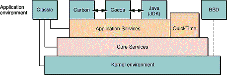
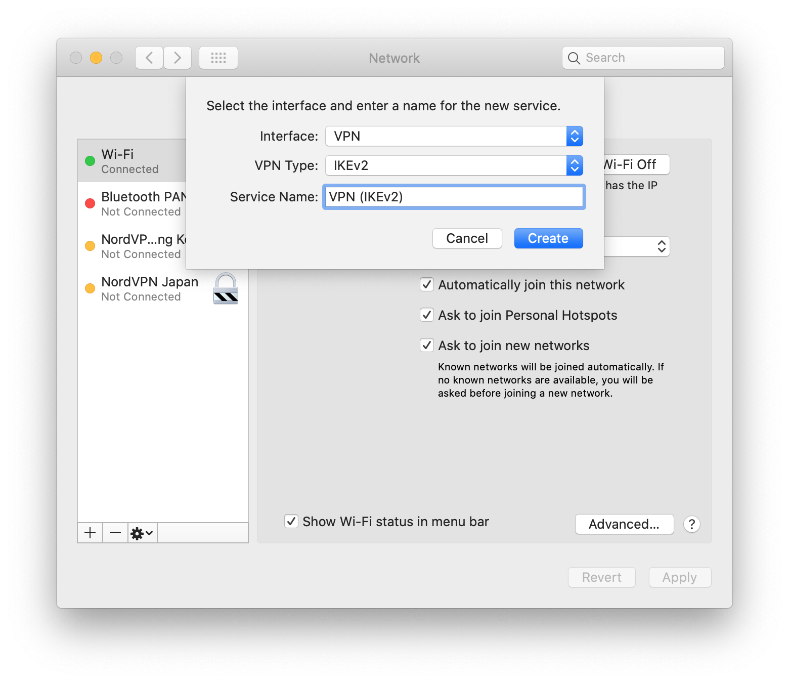
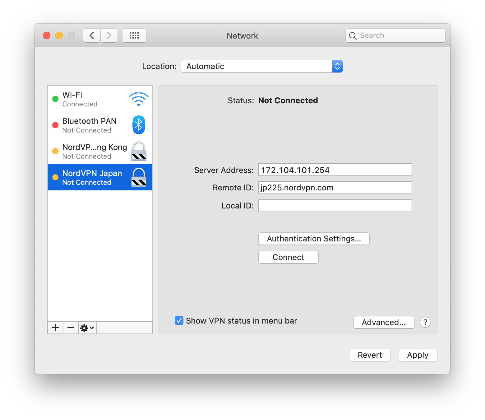
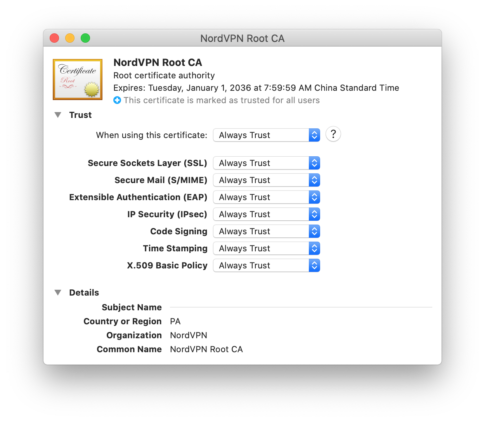
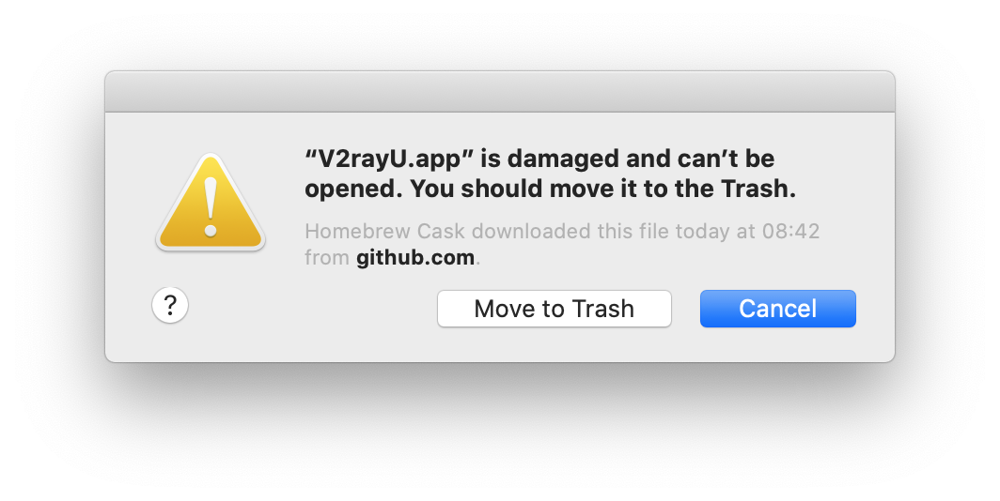
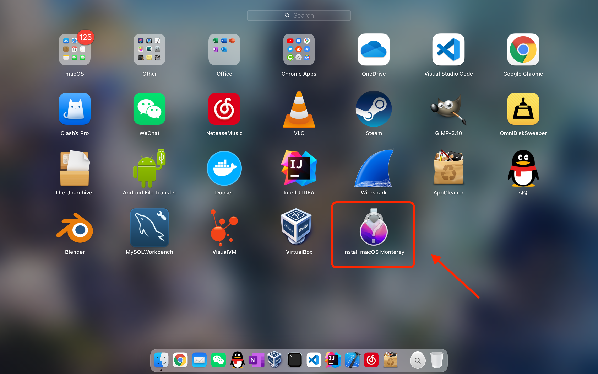

<!-- TOC -->

- [macOS 層次結構](#macos-層次結構)
- [常用功能](#常用功能)
	- [常用快捷鍵](#常用快捷鍵)
	- [常用命令行指令](#常用命令行指令)
	- [常用軟件](#常用軟件)
	- [托盤圖標](#托盤圖標)
	- [特殊目錄](#特殊目錄)
	- [垃圾清理](#垃圾清理)
- [與常規PC的不同之處](#與常規pc的不同之處)
	- [Darwin 與 GNU/Linux 的差異](#darwin-與-gnulinux-的差異)
	- [NVRAM](#nvram)
	- [重置 NVRAM](#重置-nvram)
	- [禁用翻蓋自啓](#禁用翻蓋自啓)
- [包管理](#包管理)
	- [Homebrew](#homebrew)
		- [配置與安裝](#配置與安裝)
		- [基本指令](#基本指令)
		- [路徑信息](#路徑信息)
		- [安裝參數](#安裝參數)
		- [bottled](#bottled)
		- [依賴查詢](#依賴查詢)
		- [展示安裝包信息](#展示安裝包信息)
		- [Homebrew Taps](#homebrew-taps)
		- [Homebrew Cask](#homebrew-cask)
		- [Homebrew Services](#homebrew-services)
		- [配置國內源](#配置國內源)
- [macOS下的軟件格式](#macos下的軟件格式)
	- [Bundle](#bundle)
	- [pkg](#pkg)
	- [軟件路徑](#軟件路徑)
- [文件系統](#文件系統)
	- [掛載 NTFS 讀寫](#掛載-ntfs-讀寫)
	- [diskutil](#diskutil)
	- [NTFS-3G](#ntfs-3g)
		- [安裝配置](#安裝配置)
		- [使用 NTFS-3G](#使用-ntfs-3g)
- [Xcode](#xcode)
	- [CommandLineTools](#commandlinetools)
	- [Developer Path](#developer-path)
- [System Integrity Protection (SIP)](#system-integrity-protection-sip)
- [常見問題](#常見問題)
	- [切換分辨率/語言時，登陸界面的分辨率/語言依然不變](#切換分辨率語言時登陸界面的分辨率語言依然不變)
	- [更改默認應用程序](#更改默認應用程序)
	- [在BootCamp安裝的Windows中調整分區，重啓後Mac分區在啓動頁中消失](#在bootcamp安裝的windows中調整分區重啓後mac分區在啓動頁中消失)
	- [引導 Linux](#引導-linux)
	- [重置 Launchpad](#重置-launchpad)
	- [簽名 GDB](#簽名-gdb)
	- [安裝 mysql/mariadb](#安裝-mysqlmariadb)
	- [JDK](#jdk)
		- [OpenJDK](#openjdk)
		- [刪除JDK](#刪除jdk)
	- [刪除 GarageBand](#刪除-garageband)
	- [MacBook 合蓋無法正常休眠](#macbook-合蓋無法正常休眠)
- [VPN](#vpn)
	- [IKEv2](#ikev2)
	- [Shadowsocks](#shadowsocks)
	- [V2Ray](#v2ray)
- [問題記錄](#問題記錄)
	- [<W> fish: An error occurred while redirecting file '/etc/paths.d/Wireshark'](#w-fish-an-error-occurred-while-redirecting-file-etcpathsdwireshark)
	- ["Xxx.app" is damaged and can't be opened. You should move it to the Trash.](#xxxapp-is-damaged-and-cant-be-opened-you-should-move-it-to-the-trash)
	- [Error: Your CLT does not support macOS 11.0.](#error-your-clt-does-not-support-macos-110)
	- [LaunchPad內出現無效的`Install macOS xxx`圖標](#launchpad內出現無效的install-macos-xxx圖標)

<!-- /TOC -->


# macOS 層次結構
`macOS`基於`Darwin`(對應`GNU/Linux`)，系統架構圖如下所示：



- `Darwin`包含內核`XNU`(對應`Linux Kernel`)以及shell環境(對應`GNU Tools`)。
- `XNU`內核由微內核`Mach`和`BSD`層以及一些其它組件(主要爲驅動層`IoKit`)構成。
- `Mach`微內核提供了基本的硬件抽象，提供了一套獨有的`Mach Trap`(`Mach`系統調用)。
- `BSD`層提供了文件系統抽象以及`POSIX`調用。
- `macOS`在文件佈局以及配置方式上與傳統的Linux發行版**有較大不同**。

macOS系統架構可參考[Apple官方內核架構文檔](https://developer.apple.com/library/archive/documentation/Darwin/Conceptual/KernelProgramming/Architecture/Architecture.html)。


# 常用功能
記錄macOS的常用快捷鍵、工具指令。

## 常用快捷鍵
macOS系統的常用快捷鍵於Windows有較大差異，需要一段時間的肌肉記憶。

| 功能 | 快捷鍵 |
| :- | :- |
| 鎖屏 | Control + Shift + Power |
| 全屏截圖 | Shift + Command + 3 |
| 指定位置截圖 | Shift + Command + 4 |
| 指定窗口截圖 | Shift + Command + 4然後將光標放在需要截圖的窗口上，按Space確認 |
| 保存 | Command + S |
| 全選 | Command + A |
| 行首/行尾 | Control + A/E(僅默認終端) |
| Home/End/PageDown/PageUp | Fn + Left/Right/Down/Up |
| 複製/粘貼文件 | Command + C/V |
| 剪切文件 | Command + Option + V |
| 切換程序 | Command + Tab |
| 切換當前程序的窗口 | Command + ` |
| 退出程序 | Command + Q |
| 關閉當前窗口 | Command + W |
| 最小化窗口 | Command + M |
| 立即息屏進入睡眠 | Command + Alt + Power |
| 切換Finder是否顯示隱藏文件： | Command + Shift + . |
| Spotlight | Command + Space |
| 跳轉到字典(Spotlight搜索中) | Command + L |

## 常用命令行指令
`macOS`中的一些配置項沒有提供圖形化的配置方式，需要通過命令行進行配置。

- 主機信息相關

	設置主機名稱：

	```
	# scutil --set HostName [主機名]
	```

	設置主機共享名稱：

	```
	# scutil --set ComputerName [主機共享名稱]
	```

- 顯示/取消顯示隱藏文件：

	```html
	<!-- 現在版本的macOS可直接使用 "Command + Shift + ." 快捷鍵開關隱藏文件顯示 -->
	$ defaults write com.apple.finder AppleShowAllFiles YES/NO <!-- 重新登陸賬戶後生效 -->
	```

## 常用軟件
macOS常用軟件：

| 軟件名稱 | 說明 |
| :- | :- |
| `The Unarchiver` | 解壓軟件 |
| `VLC` | 多媒體播放器 |
| `AppCleaner` | APP卸載工具 |
| `Xcode` | 集成開發環境 |
| `iTerm2` | 終端模擬器，相比自帶終端擁有更多高級特性 |
| `ClashX Pro` | Clash在macOS上的客戶端 |
| `Android File Transfer` | Android文件傳輸客戶端 |
| `OmniDiskSweeper` | 計算文件系統下各個路徑的大小，用於清理垃圾 |

## 托盤圖標
`macOS`下托盤圖標可以使用`Command + 鼠標左鍵`點選，拖動進行排序。

鎖屏托盤圖標無法直接在系統設置中調出，需要打開`Keychain Access.app`，
在`Reference`中勾選`Show keychain status in menu bar`選項。

## 特殊目錄
系統中特定功能相關的路徑介紹。

| 路徑 | 說明 |
| :- | :- |
| /System/Library/Fonts | 系統默認字體目錄 |
| /Library/Fonts | 系統可選字體目錄 |
| /Volumes | 系統默認掛載目錄 |
| ~/Library/Fonts | 用戶字體目錄 |
| ~/Library/Caches | 緩存目錄 |
| ~/Library/Application Support | 用戶程序文件、配置目錄 |
| /Library/Application Support | 系統程序配置目錄 |
| ~/Library/Preferences | 用戶程序配置目錄 |
| ~/Library/Saved Application State | 用戶程序狀態目錄 |
| ~/Library/VirtualBox | VirtualBox的配置文件目錄，刪除則VirtualBox恢復初始狀態，需要重新添加虛擬機 |
| /Library/InstallerSandboxes | 子路徑：系統軟件(`.PKInstallSandboxManager-SystemSoftware`)；App Store軟件(`.PKInstallSandboxManager`)更新緩存路徑。當更新大型軟件失敗(如XCode)時，該路徑下會保存大量安裝文件且不自動清理 |

刪除一個應用後，通常需要檢查Library路徑下的`Caches`、`Preferences`、`Application Support`、
`Saved Application State`等路徑，清理軟件的殘餘配置；
建議使用`AppCleaner`卸載軟件，能在卸載軟件時檢測相關配置目錄，清理軟件相關配置。

## 垃圾清理
macOS內置了`System Information`工具中提供了基本的存儲佔用分析，
但大部分內容會被歸類到`Others`中，需要使用更專業的存儲分析工具來分析每個路徑的佔用空間，
進而確定過多佔用存儲的路徑。

推薦使用[`OmniDiskSweeper`](https://www.omnigroup.com/more)，
Homebrew Cask中已收錄該軟件，可直接安裝：

```
$ brew install omnidisksweeper
```

默認該軟件以普通權限執行，部分路徑無法分析，
導致存儲計算大小可能與內置System Information工具中展示的大小存在差異。
應使用sudo執行方能正確分析所有路徑：

```
$ sudo /Applications/OmniDiskSweeper.app/Contents/MacOS/OmniDiskSweeper
```


# 與常規PC的不同之處
Mac機與常規的PC有較大的差異，需要一個適應過程。

基本操作差異:

1. 缺少一些常用按鍵，且**按鍵邏輯不統一**：

	- 沒有`Home`、`End`、`PageDown`、`PageUp`等按鍵，需要通過`Fn`搭配**方向鍵**等組合鍵才能實現行首、行尾、翻頁等操作。
	- 在部分編輯器以及終端中，跳轉到**行首/行尾**需要通過`Control + A/E`等按鍵完成。
	- 在部分開發環境中，行首行尾的快捷鍵不使用系統方案，而由程序自身定義(如在`Eclipse`中，行首/行尾爲`Command + 方向鍵左/右`)。

1. `Finder.app`缺少必備的功能：

	- `Finder.app`右鍵菜單中沒有創建文件的選項，甚至新建文件都需要使用`touch`指令。
	- `Finder.app`右鍵菜單沒有剪切功能，通過組合鍵能實現類似效果。

1. 主要按鍵名稱與`PC`機不同：

	- `Windows/Linux`中以`Control`作爲組合鍵觸發的一些快捷操作在`macOS`中全部使用`Command`鍵進行觸發。
	- `Windows/Linux`中的`Alt`鍵在`macOS`中名稱爲`Option`鍵。

## Darwin 與 GNU/Linux 的差異
`Darwin`提供的Unix環境基於`FreeBSD`，與傳統`GNU/Linux`有較大差異。

1. Darwin爲混合內核架構，Linux爲宏內核架構。
1. Linux中普通用戶UID從`1000`開始，macOS中UID從`500`開始。
1. 家目錄與Linux/BSD中不同，macOS中的`/home`目錄默認爲**空**，用戶家目錄的位置爲`/Users`。
1. root用戶家目錄與Linux中不同，位於`/var/root`。
1. Darwin沒有用於展示系統運行狀態的`/proc`文件系統。
1. Darwin沒有提供原生的包管理器。
1. Darwin的PATH環境變量記錄在文件`/etc/paths`中。
1. Darwin的微內核Mach使用`Mach-O`作爲二進制格式，而傳統的Linux/Unix使用`EFL`作爲二進制格式。
1. Darwin中動態鏈接庫後綴名爲`dylib`，傳統Unix中一般爲`so`，靜態庫後綴名與傳統Unix相同，皆爲`a`。
1. Darwin不使用GNU工具鏈，默認工具鏈爲FreeBSD工具鏈。
1. macOS採用`Aqua`作爲GUI實現，傳統Unix使用`X11`。

Mach內核的技術細節可參見[Darwin內核開發者文檔](https://developer.apple.com/library/archive/documentation/Darwin/Conceptual/KernelProgramming/Mach/Mach.html)。


## NVRAM
`NVRAM`全稱`Non-volatile random-access memory`(非易失性隨機訪問存儲器)，用於在關機狀態下保存信息。
Mac使用NVRAM存儲音量、顯示屏分辨率、啓動磁盤選擇、時區，內核崩潰轉儲等信息。

在`macOS`中使用`nvram`指令操作NVRAM相關功能：

```
nvram: (usage: no such option as -h)
nvram [-x] [-p] [-f filename] [-d name] [-c] name[=value] ...
	-x         use XML format for printing or reading variables
	           (must appear before -p or -f)
	-p         print all firmware variables
	-f         set firmware variables from a text file
	-d         delete the named variable
	-c         delete all variables
	name=value set named variable
	name       print variable
Note that arguments and options are executed in order.
```

## 重置 NVRAM
啓動配置異常時，可嘗試重置NVRAM。
開機時按下組合鍵`Option + Command P + R`，按住組合鍵20秒後可鬆開。
在此期間Mac可能看似在重新啓動。

## 禁用翻蓋自啓
從`New MacBook`和`MacBook Pro 2016`開始，MacBook會在翻蓋後自動開機。
可通過修改NVRAM參數關閉此特性：

```
# nvram AutoBoot=%00
```

禁用翻蓋自動開機特性後，翻蓋後機器會短暫地在屏幕顯示電量信息。

恢復翻蓋自動開機特性：

```
# nvram AutoBoot=%03
```


# 包管理
`Homebrew`是macOS當下最流行、最主流的包管理器；`MacPorts`來自於`FreeBSD`，亦是優秀的包管理器。

二者之間的差異：

- Homebrew基於Git，是輕量級的包管理器，傾向於最大化利用macOS自帶的Unix組件。
- MacPorts是FreeBSD中`Ports`系統的移植，使用源碼編譯軟件，不依賴原有macOS中的軟件包，而是獨立構建出一套環境。
- Homebrew中軟件包多數以二進制形式提供，默認安裝路徑爲`/usr/local`。
- MacPorts編譯的軟件包一般安裝在`/opt`目錄下。

## Homebrew
Homebrew使用`Ruby`語言實現。

與傳統的包管理器不同，使用Homebrew並不需要使用root用戶，管理員權限用戶即可。
Homebrew將軟件包安裝在`/usr/local`目錄下，在macOS中該目錄默認情況下爲**空**，
因此當用戶不再需要使用Homebrew時，只需完整刪除`/usr/local`目錄下的所有內容即可。
(需要注意，某些非Bundle形式安裝的軟件亦會將一些內容安裝在`/usr/local`目錄下，
如VirtualBox。若安裝了此類軟件，清理`/usr/local`目錄時需要仔細辨別)

默認情況下，在macOS中，`/usr/local`的所有者爲`root`，用戶組爲`wheel`，安裝Homebrew時，
安裝腳本會將該目錄所有者會更改爲**當前管理員用戶**，並將用戶組改爲`admin`。

### 配置與安裝
Homebrew採用Ruby語言開發，macOS中默認已經集成了Ruby環境。
Homebrew需要用到Git等工具，在安裝Homebrew之前需要先安裝**Xcode命令行**工具(或者直接完整安裝Xcode)。

之後在終端內執行：

```sh
$ ruby -e "$(curl -fsSL https://raw.githubusercontent.com/Homebrew/install/master/install)"
```

### 基本指令
Homebrew基本操作與其它包管理器類似：

```html
$ brew update <!-- 更新源 -->
$ brew ugrade <!-- 升級包 -->
$ brew info 包名 <!-- 顯示指定包的信息 -->
$ brew install 包名 <!-- 安裝指定包 -->
$ brew switch 包名 版本號 <!-- 若安裝了多個版本的包，切換指定包的使用版本 -->
$ brew dockor <!-- 檢測可能存在的問題，並給出修復提示 -->
$ brew prune <!-- 移除無效的符號鏈接 -->
```

與Linux下的常規包管理器不同，Homebrew在安裝、卸載包時，不會有多餘的確認提示，輸入指令後立即執行。

### 路徑信息
homebrew倉庫中的包安裝後文件保存在`/usr/local/Cellar`路徑下。
caskroom倉庫中的包安裝後文件保存在`/usr/local/Caskroom`路徑下。

homebrew倉庫默認的包緩存路徑爲`~/Library/Caches/Homebrew`。
caskroom倉庫默認的包緩存路徑爲`~/Library/Caches/Homebrew/Cask`。

可使用指令查看Homebrew的相關路徑：

- `$ brew --cache` 查看緩存路徑
- `$ brew --repo` 查看Hombrew安裝路徑

在緩存中的包重複安裝無需重新下載。
由於國內網絡問題，直接通過brew指令安裝包有時會頻繁下載失敗。
可直接使用其它下載工具從符合要求的源地址下載包文件放置於對應緩存路徑下，進行離線安裝。

對於帶有頭文件的包(如`boost、gcc`等)，會在`/usr/local/include`目錄下創建符號鏈接，
指向`/usr/local/Cellar`目錄中的具體包內容。

### 安裝參數
Homebrew使用`brew install`指令安裝包時可以附加額外選項，用於定製包的依賴。
每個包擁有不同的依賴項，使用`brew info`指令查看選項說明。

以`neofetch`爲例，brew info輸出信息如下：

```
$ brew info neofetch
neofetch: ...
...
==> Dependencies
Recommended: screenresolution ✘, imagemagick ✘
==> Options
--without-imagemagick
	Build without imagemagick support
--without-screenresolution
	Build without screenresolution support
--HEAD
	Install HEAD version
```

neofetch需要兩個可選依賴包`screenresolution`、`imagemagick`，默認安裝時會同時安裝依賴包。
使用參數`--without-imagemagick --without-screenresolution`安裝可忽略依賴。

### bottled
Homebrew對於常用的包如`gcc、gdb、python3、qt`等均提供了**預編譯包**(`bottled`)，
但部分包默認安裝時會優先選擇從源碼編譯(如`gcc`、`python`)，
可在安裝時使用`--force-bottle`參數強制安裝預編譯的包：

```
$ brew install 軟件包 --force-bottle
```

`--force-bottle`參數與其它安裝參數不同，不會記錄到安裝信息中，
默認使用源碼編譯的包即使強制安裝預編譯包在下次升級時依舊會從源碼編譯。
要使源碼編譯包在升級時安裝預編譯包，則在使用升級指令時也需要添加--force-bottle參數：

```
$ brew upgrade --force-bottle
```

需要注意，bottled版本的gcc在編譯時需要手動指定`sys_root`參數，否則會出現找不到頭文件的情況。
以`GCC 7.2.0`和`XCode 8.3.3`爲例：

```
$ cc-7 [源碼文件]... --sysroot=/Applications/Xcode.app/Contents/Developer/Platforms/MacOSX.platform/Developer/SDKs/MacOSX10.12.sdk
```

### 依賴查詢
Hombrew在軟件包的安裝信息中並不記錄**安裝原因**，即無法區分一個軟件包是主動安裝還是作爲其它軟件包的依賴而安裝。
使用brew remove卸載軟件包時，不會卸載該軟件包的依賴包，即使這些依賴包沒有再被其它安裝的軟件包依賴。

查看所有不被其它已安裝軟件包依賴的包：

```
$ brew leaves
```

通過brew leaves指令的輸出結果中篩選出不是主動安裝的軟件包進行卸載，以此達到清理無用依賴的目的。

其它依賴管理相關指令：

```html
<!-- 查看指定軟件包的依賴 -->
$ brew deps 軟件包名稱

<!-- 顯示指定軟件包被哪些軟件包依賴 -->
$ brew uses 軟件包名稱
<!-- 顯示指定軟件包被哪些已安裝的軟件包依賴 -->
$ brew uses --installed 軟件包名稱
```

### 展示安裝包信息
使用`brew list`指令可展示所有安裝的軟件包：

```
$ brew list
==> Formulae
aria2		icu4c		libssh2		ncurses		openjdk@8	protobuf	sqlite
brotli		jemalloc	libuv		neofetch	openssl@1.1	readline	syncthing
c-ares		jmeter		lz4		nghttp2		openvpn		redis		zstd
cmake		krb5		lzo		nmap		p7zip		rustup-init
fish		libev		maven		node		pcre2		sbt
freetype	libevent	mysql		opencc		pkcs11-helper	scala
haskell-stack	libpng		nasm		openjdk		postgresql	six

==> Casks
android-file-transfer	docker			microsoft-office	tencent-meeting		vlc
android-platform-tools	dotnet-sdk		mysqlworkbench		the-unarchiver		wechat
appcleaner		gimp			neteasemusic		virtualbox		wireshark
blender			google-chrome		qq			visual-studio-code
clashx-pro		intellij-idea		steam			visualvm
```

使用`brew list [包名]`：

```html
$ brew list redis
/usr/local/Cellar/redis/6.2.4/.bottle/etc/ (2 files)
/usr/local/Cellar/redis/6.2.4/bin/redis-benchmark
/usr/local/Cellar/redis/6.2.4/bin/redis-check-aof
/usr/local/Cellar/redis/6.2.4/bin/redis-check-rdb
/usr/local/Cellar/redis/6.2.4/bin/redis-cli
/usr/local/Cellar/redis/6.2.4/bin/redis-sentinel
/usr/local/Cellar/redis/6.2.4/bin/redis-server
/usr/local/Cellar/redis/6.2.4/homebrew.mxcl.redis.plist

<!-- 默認查看文件會會忽略部分目錄，使用-v/--verbose查看所有路徑 -->
$ brew list -v redis
/usr/local/Cellar/redis/6.2.4/INSTALL_RECEIPT.json
/usr/local/Cellar/redis/6.2.4/bin/redis-check-rdb
/usr/local/Cellar/redis/6.2.4/bin/redis-server
/usr/local/Cellar/redis/6.2.4/bin/redis-cli
/usr/local/Cellar/redis/6.2.4/bin/redis-check-aof
/usr/local/Cellar/redis/6.2.4/bin/redis-sentinel
/usr/local/Cellar/redis/6.2.4/bin/redis-benchmark
/usr/local/Cellar/redis/6.2.4/.brew/redis.rb
/usr/local/Cellar/redis/6.2.4/README.md
/usr/local/Cellar/redis/6.2.4/homebrew.mxcl.redis.plist
/usr/local/Cellar/redis/6.2.4/COPYING
/usr/local/Cellar/redis/6.2.4/.bottle/etc/redis-sentinel.conf
/usr/local/Cellar/redis/6.2.4/.bottle/etc/redis.conf
```

### Homebrew Taps
使用`brew tap/untap`相關指令管理Homebrew啓用的倉庫，常用指令：

```html
$ brew tap <!-- 列出已啓用的倉庫 -->
$ brew tap 倉庫名稱 <!-- 啓用指定名稱的倉庫 -->
$ brew untap 倉庫名稱 <!--  禁用指令名稱的倉庫 -->
```

常用的官方倉庫包括`homebrew/core`和`homebrew/cask`。
首次使用`brew services`指令還會啟用`homebrew/services`倉庫。

倉庫本地目錄位於`$(brew --repo)/Library/Taps`路徑下，
每個倉庫是獨立的git repo，切換源時需要為每個倉庫替換remote的origin分支路徑。

### Homebrew Cask
Homebrew提供了macOS專屬Bundle封裝應用的軟件倉庫`homebrew/cask`(原`caskroom/cask`倉庫)。
啟用Homebrew Casks倉庫：

```
$ brew tap homebrew/cask
```

早期Homebrew提供了`brew cask`指令現在已經**廢棄**，
現在對於Casks的處理方式與普通包類似，僅將其視為一個軟件倉庫，
使用與普通包相同的指令進行操作，必要時使用`--cask`參數指定操作。

通常Casks應用直接使用普通的`brew install`指令即可安裝，
只有Casks倉庫內軟件包名稱與默認倉庫衝突時(如docker，同時存在Formulae和Casks版本)，
才需要使用`brew install --cask`等相關指令顯式指定安裝Casks版本。

安裝的Cask應用位於`/Application`路徑下。
安裝常用應用：

```
$ brew install --cask appcleaner the-unarchiver intellij-idea microsoft-office visual-studio-code blender qq the-unarchiver vlc docker google-chrome virtualbox visualvm dotnet-sdk steam wechat wireshark clashx-pro neteasemusic gimp mysqlworkbench android-file-transfer android-platform-tools
```

部分應用打包時並未寫明確切的版本號(如`google-chrome`)，此類應用升級需要執行重新安裝指令：

```
$ brew reinstall --cask 需要更新的應用名稱
```

默認的`Homebrew Cask`倉庫`homebrew/cask`僅保存最新版的應用，若需要同時安裝多個版本(如`Java SDK`)，
則需要開啓`homebrew/cask-versions`(原`caskroom/versions`倉庫)倉庫。
執行指令：

```
$ brew tap homebrew/cask-versions
```

`homebrew/cask-versions`倉庫保存了常見應用的長期維護版本，
如`Java SDK`的`java6/java8`，`FireFox`的`firefox-beta/firefox-esr`。

### Homebrew Services
對於使用Homebrew安裝的包，若包提供了服務，則可以使用`brew services`指令進行服務狀態管理。
常用指令：

```html
$ brew services list <!-- 列出可用服務 -->
$ brew services run 服務名稱 <!-- 啓動服務 -->
$ brew services start 服務名稱 <!-- 啓動服務並設置服務開機自啓 -->
$ brew services stop 服務名稱 <!-- 停止服務並移除服務開機自啓 -->
$ brew services restart 服務名稱 <!-- 重啓服務 -->
$ brew services cleanup <!-- 清理未被使用的服務 -->
```

### 配置國內源
默認情況下，Homebrew訪問`GitHub`來更新包數據，速度較慢，可使用中國源替代，
推薦使用清華大學[`TUNA`源](https://mirrors.tuna.tsinghua.edu.cn/help/homebrew/)，
以及[`USTC`源](https://mirrors.ustc.edu.cn/help/brew.git.html)。

- 替換更新數據源：

	TUNA源提供了Homebrew本體、以及部分Tap倉庫(core、cask)等。

	```html
	<!--
		亦可使用USTC(中科大源)地址替換：
		"brew --repo" https://mirrors.ustc.edu.cn/brew.git
		"brew --repo homebrew/core" https://mirrors.ustc.edu.cn/homebrew-core.git
		"brew --repo homebrew/cask" https://mirrors.ustc.edu.cn/homebrew-cask.git
		"brew --repo homebrew/cask-versions" https://mirrors.ustc.edu.cn/homebrew-cask-versions.git
	-->

	<!-- bash -->
	$ git -C "$(brew --repo)" remote set-url origin https://mirrors.tuna.tsinghua.edu.cn/git/homebrew/brew.git
	$ git -C "$(brew --repo homebrew/core)" remote set-url origin https://mirrors.tuna.tsinghua.edu.cn/git/homebrew/homebrew-core.git
	$ git -C "$(brew --repo homebrew/cask)" remote set-url origin https://mirrors.tuna.tsinghua.edu.cn/git/homebrew/homebrew-cask.git

	<!-- fish -->
	$ git -C (brew --repo) remote set-url origin https://mirrors.tuna.tsinghua.edu.cn/git/homebrew/brew.git
	$ git -C (brew --repo homebrew/core) remote set-url origin https://mirrors.tuna.tsinghua.edu.cn/git/homebrew/homebrew-core.git
	$ git -C (brew --repo homebrew/cask) remote set-url origin https://mirrors.tuna.tsinghua.edu.cn/git/homebrew/homebrew-cask.git
	```

	替換源地址後，需要執行`brew update-reset`重新拉取倉庫信息。
	替換更新源完成後，可使用查看各個倉庫的信息：

	```html
	<!-- Homebrew自身 -->
	$ git -C (brew --repo) remote show origin
	* remote origin
	  Fetch URL: https://mirrors.tuna.tsinghua.edu.cn/git/homebrew/brew.git
	  Push  URL: https://mirrors.tuna.tsinghua.edu.cn/git/homebrew/brew.git
	  HEAD branch: master
	  Remote branches:
	    dependabot/bundler/Library/Homebrew/rubocop-0.89.1 new (next fetch will store in remotes/origin)
	    master                                             tracked
	    test-automate-tapioca-update                       new (next fetch will store in remotes/origin)
	  Local branch configured for 'git pull':
	    master merges with remote master
	  Local ref configured for 'git push':
	    master pushes to master (up to date)

	<!-- Homebrew軟件倉庫 -->
	$ brew tap-info --installed
	homebrew/cask: 1 command, 3636 casks
	/usr/local/Homebrew/Library/Taps/homebrew/homebrew-cask (4,753 files, 1.3GB)
	From: https://mirrors.tuna.tsinghua.edu.cn/git/homebrew/homebrew-cask.git

	homebrew/core: 2 commands, 5184 formulae
	/usr/local/Homebrew/Library/Taps/homebrew/homebrew-core (5,748 files, 1.1GB)
	From: https://mirrors.tuna.tsinghua.edu.cn/git/homebrew/homebrew-core.git

	homebrew/services: 1 command
	/usr/local/Homebrew/Library/Taps/homebrew/homebrew-services (488 files, 470.5KB)
	From: https://github.com/Homebrew/homebrew-services
	```

- 替換`Bottles`源：

	Homebrew在Bottles源中提供了常用包的預編譯二進制包。
	在默認Shell的**配置文件**中設置`HOMEBREW_BOTTLE_DOMAIN`環境變量：

	```
	export HOMEBREW_BOTTLE_DOMAIN=https://mirrors.tuna.tsinghua.edu.cn/homebrew-bottles/
	```

- 恢復官方源：

	恢復官方源操作與設置第三方源相反：

	```html
	<!-- bash / zsh -->
	$ git -C "$(brew --repo)" remote set-url origin https://github.com/Homebrew/brew
	$ git -C "$(brew --repo homebrew/core)" remote set-url origin https://github.com/Homebrew/homebrew-core
	$ git -C "$(brew --repo homebrew/cask)" remote set-url origin https://github.com/Homebrew/homebrew-cask
	$ git -C "$(brew --repo homebrew/cask-versions)" remote set-url origin https://github.com/Homebrew/homebrew-cask-versions

	<!-- fish -->
	$ git -C (brew --repo) remote set-url origin https://github.com/Homebrew/brew
	$ git -C (brew --repo homebrew/core) remote set-url origin https://github.com/Homebrew/homebrew-core
	$ git -C (brew --repo homebrew/cask) remote set-url origin https://github.com/Homebrew/homebrew-cask
	$ git -C (brew --repo homebrew/cask-versions) remote set-url origin https://github.com/Homebrew/homebrew-cask-versions
	```

	恢復官方源後，也應使用`brew update-reset`重新拉取倉庫信息。


# macOS下的軟件格式
在macOS中，軟件包常以`dmg`格式的鏡像封存，而安裝軟件的方式分爲`Bundle`以及`pkg`形式。

## Bundle
在macOS中最常見的軟件包是以`Bundle`的形式存在的，`Bundle`是一個以`.app`爲後綴的**目錄**，
外觀爲可執行程序的圖標，封裝了程序執行所需的一些必要資源以及真正的可執行文件。

`dmg`鏡像中若直接包含`Bundle`，
則將其複製到`/Application`或`~/Application`目錄下即可(推薦存放在用戶的`Application`目錄下)。
常規的`Bundle`程序所有者爲**當前用戶**。

## pkg
一些大型的軟件包如Adobe系列、Office系列等的dmg鏡像中保存的是pkg格式的安裝包，雙擊進行安裝，
步驟與Windows系統下的安裝流程類似。

通過pkg安裝的軟件最終也會在`/Application`目錄下創建軟件的Bundle，
但通過此種方式安裝的軟件往往會在系統的其它目錄創建程序所需的額外文件。

通過pkg安裝的軟件所有者一般爲`root`，不能隨意移動到`~/Application`路徑下。

## 軟件路徑
默認情況下，`Bundle`形式的軟件一般存在於`/Application`目錄或`~/Application`目錄下。
`macOS`的系統默認`Bundle`應用存放在`/Application`目錄下，
一些以`pkg`形式安裝或通過`AppStore`安裝的應用也在該目錄下。

默認情況下`~/Application`目錄不存在，需要自行創建。
用戶自行安裝的Bundle應用推薦存放在`~/Application`目錄下，避免與系統程序混淆。


# 文件系統
macOS默認文件系統爲`HFS+`，此類文件系統同時支持區分大小寫(`Case-Sensitive`)和忽略大小寫兩種類型，
在格式化時可以進行選擇。若選擇了區分大小寫形式的`HFS+`文件系統，則部分軟件將無法安裝(如`PhotoShop`等)。

文件系統類型在安裝了macOS之後除了重裝系統之外無法更改，需要**慎重選擇**。

## 掛載 NTFS 讀寫
默認情況下，macOS以**只讀**形式掛載`NTFS`文件系統，但`macOS`本身實現了對`NTFS`文件系統的寫入功能，
創建`/etc/fstab`文件，在其中添加掛載選項：

```
LABEL=[label_name] none ntfs rw,auto,nobrowse
```

- `label_name`爲分區的名稱。
- `rw`參數表示以**讀寫**的方式掛載分區。
- `nobrowse`參數表示分區不直接顯示在Finder中，`rw`參數必須與`nobrowse`參數搭配，否則無法掛載`NTFS`分區。

使用`open`指令可以在`Finder.app`中查看設置了`nobrowse`屬性的分區：

```
$ open /Volumes
```

在`macOS 10.14 (Darwin Kernel Version 18.7.0)`上，使用此方法對NTFS讀寫無效。

## diskutil
macOS中自帶的`fdisk`工具為BSD版本，與Linux版本有較大差異。
在macOS中通常使用`diskutil`工具進行磁盤管理。

常用工具指令：

```html
<!-- 列出所有分區信息 -->
$ diskutil list
<!-- 列出指定分區的詳細信息(包含文件系統等) -->
$ diskutil info [分區路徑]

<!-- 監視磁盤分區變化 -->
$ diskutil activity

<!-- 掛載/取消掛載分區 -->
$ diskutil mount/unmount [分區路徑]
<!-- 彈出整個磁盤，磁盤下的所有已掛載分區均會被卸載 -->
$ diskutil eject [設備]

<!-- 格式化磁盤 -->
# diskutil eraseDisk format name [APM[Format] | MBR[Format] | GPT[Format]] device
<!-- 格式化卷 -->
# diskutil eraseVolume format name device
```

當某些進程佔用磁盤時，使用`umount`指令將無法取消掛載，此時可嘗試使用`diskutil unmount`取消掛載，
diskutil指令在無法取消掛載時會輸出佔用磁盤的進程信息。

## NTFS-3G
[`NTFS-3G`](https://www.tuxera.com/community/ntfs-3g-manual/)項目為各類Unix系統提供了對Windows文件系統的讀寫支持。

### 安裝配置
NTFS-3G可直接通過Homebrew安裝：

```
$ brew install ntfs-3g
```

與其它工具不同，NTFS-3G會在`/usr/local/sbin`路徑下創建符號鏈接，需要保證該路徑存在(默認該路徑不存在，需要手動創建)，
否則安裝時會出現錯誤信息：

```
Error: The `brew link` step did not complete successfully
The formula built, but is not symlinked into /usr/local
Could not symlink sbin/mkntfs
/usr/local/sbin is not writable.

You can try again using:
  brew link ntfs-3g
```

需要手動創建`/usr/local/sbin`路徑，並將該路徑修改為與其它Hombrew路徑相同的權限，
之後執行`brew link ntfs-3g`再次創建符號鏈接。

### 使用 NTFS-3G
插入NTFS文件系統的U盤，macOS會使用系統自帶工具`mount_ntfs`自動掛載，首先需要使用`umount`指令取消U盤的掛載：

```c
# umount /Volumes/[U盤名稱]
```

取消U盤掛載後，使用`diskutil`指令查看插入U盤的詳細信息：

```
$ diskutil list

...

/dev/disk2 (external, physical):
   #:                       TYPE NAME                    SIZE       IDENTIFIER
   0:     FDisk_partition_scheme                        *30.8 GB    disk2
   1:               Windows_NTFS                         30.7 GB    disk2s1
```

確認U盤的NTFS分區的設備名稱後，使用`ntfs-3g`指令進行掛載：

```c
// 示例： ntfs-3g /dev/disk2s1 /Volumes/ntfs_device
# ntfs-3g /dev/[分區對應磁盤設備] /Volumes/[分區掛載設備]
```

取消U盤掛載使用umount指令而不是直接彈出U盤，彈出U盤會斷開系統的鏈接，無法再使用ntfs-3g指令掛載。


# Xcode
[`Xcode`](https://developer.apple.com/xcode/)是Apple提供的macOS下的官方IDE(集成開發環境)，
提供了macOS、iOS等所有Apple係產品的App開發平台，地位相當於Windows下Microsoft官方推出的Visual Studio。

## CommandLineTools
Xcode中附帶了一系列命令行工具如`clang`、`git`等，
一些依賴Unix工具鏈的程序(如Homebrew)的安裝依賴於這些命令行工具。

完整的Xcode在安裝完成首次啟動時，會提示是否安裝命令行工具；
Apple對Xcode附帶的命令行工具部分可以通過獨立的安裝包安裝(不必安裝完整的Xcode)；
可主動執行Xcode命令行工具的安裝：

```
$ xcode-select --install
```

Xcode提供的命令行工具相關內容會安裝在路徑`/Library/Developer/CommandLineTools`下，
安裝命令行工具同時還會在該路徑下安裝對應版本macOS的開發SDK和部分開發庫，
內容與`Xcode.app/Contents/Developer/Platforms/MacOSX.platform/Developer`相同。

需要注意，安裝新版本的命令行工具時不會刪除舊版的macOS SDK，安裝/升級過多個版本Xcode的命令行工具後，
`/Library/Developer/CommandLineTools/SDKs`路徑下的SDK版本會越來越多：

```
$ pwd
/Library/Developer/CommandLineTools/SDKs
$ ls -al
total 0
drwxr-xr-x  5 root  wheel  160 Dec 20  2019 ./
drwxr-xr-x  5 root  admin  160 Nov  8  2019 ../
lrwxr-xr-x  1 root  wheel   15 Dec 20  2019 MacOSX.sdk@ -> MacOSX10.15.sdk
drwxr-xr-x  7 root  wheel  224 Dec 20  2019 MacOSX10.14.sdk/
drwxr-xr-x  8 root  wheel  256 Dec 20  2019 MacOSX10.15.sdk/
```

若已安裝了完整的Xcode，則**不必**單獨安裝命令行工具，若已安裝命令行工具，
則`/Library/Developer/CommandLineTools`路徑亦可直接移除，
使用`xcode-select --switch`切換到`Xcode.app/Contents/Developer`即可。

## Developer Path
查看Xcode命令行路徑：

```
$ xcode-select -p
```

對於單獨安裝CommandLineTools的用戶，會得到以下輸出：

```
/Library/Developer/CommandLineTools
```

對於從AppStore安裝Xcode的用戶，會得到以下輸出：

```
/Applications/Xcode.app/Contents/Developer
```

多數依賴Xcode相關工具的程序會將Xcode的默認安裝路徑做為查找路徑。
若用戶移動了`Xcode.app`的位置，則需要重新設定Xcode的路徑，否則會出現找不到命令行工具的情況。
使用xcode-select設定Xcode的安裝位置：

```
# xcode-select --switch [Xcode.app路徑]/Contents/Developer
```

若該變了Xcode.app的位置，即使使用xcode-select重新設定Xocde.app的路徑，
通過Homebrew安裝的編譯器(如`gcc`)依然會出現找不到頭文件的情況，此時需要重新安裝包。


# System Integrity Protection (SIP)
從`macOS El Capitan`(Mac OS X 10.11)開始，
macOS引入了`System Integrity Protection`(系統安全保護模式，簡稱SIP)。

SIP是一項安全技術，用於防止潛在的惡意軟件修改Mac中受保護的文件和目錄。
SIP技術限制了root用戶在macOS中受保護部分的操作權限。

在SIP技術出現前，root用戶在系統中擁有不被限制的權限，能夠訪問Mac內的任何系統目錄或App。
軟件在獲得了root級別的權限後會被允許修改任何系統文件或App。
在SIP模式下，系統的關鍵目錄將處於只讀模式，不可被外部程序刪改，能夠極大地提升系統安全性，
El Capitan版本之後的macOS均默認開啟了此模式。

SIP技術將保護以下系統路徑和內容：

- /System
- /usr
- /bin
- /sbin
- /var
- macOS預裝App

以下路徑第三方App和安裝器依舊能夠繼續寫入：

- /Applications
- /Library
- /usr/local

關於SIP技術的詳細介紹，可參考[Apple官網](https://support.apple.com/en-us/HT204899)。

El Capitan版本之後的macOS提供了`csrutil`工具用以查看和變更系統的SIP狀態：

```c
$ csrutil status // 查看SIP狀態不需要root權限
System Integrity Protection status: enabled.

# csrutil disable // 啟動/關閉SIP在Recovery模式下進行，使用root權限也無法直接更改
csrutil: This tool needs to be executed from Recovery OS.
```

修改系統的SIP狀態需要重啟Mac後使用`Command + R`組合鍵進入Recovery模式。


# 常見問題
記錄一些常見問題的解決方案。

## 切換分辨率/語言時，登陸界面的分辨率/語言依然不變
可以嘗試更改登錄界面的選項。
或嘗試以下指令:

```
# languagesetup
```

登陸界面的分辨率/語言未發生變化是由於登陸界面的數據未更新，
使用`root`權限執行`languagesetup`重設語言即會刷新登陸界面信息。

## 更改默認應用程序
macOS沒有為默認程序提供統一的配置面板，除了瀏覽器可直接在System Preferences的General面板中設置外，
其它文件類型需要在Finder中找到對應類型的文件進行設置：

1. 使用`Command + i`查看目標文件的詳細信息(或在文件上點擊右鍵選擇`Get Info`)。
1. 在`Open With:`條目中可以選擇打開此文件使用的默認程序，修改爲需要的程序。
1. 選擇`Change All...`將所有此類文件全部修改爲自定義的程序。

## 在BootCamp安裝的Windows中調整分區，重啓後Mac分區在啓動頁中消失
發生此種情況的原因是Windows下的一些分區管理工具將Mac分區的分區`Type UUID`改成了Windows的`Type UUID`，
只需將分區類型ID改回來即可恢復Mac分區。

具體解決方法：

- 使用`Windows`自帶的`diskpart`分區工具更改`Type UUID`。

	在`CMD`下執行以下指令：

	- `> diskpart` 進入diskpart分區工具
	- `> list disk` 列出所有磁盤
	- `> select disk [磁盤號]` 指定正在使用的磁盤
	- `> list partition` 列出所選磁盤中的所有分區
	- `> select partition [分區號]` 指明macOS所在的分區號
	- `> set id=48465300-0000-11AA-AA11-00306543ECAC` 設置分區的`Type UUID`

- 在`Linux/Unix`系統中，亦可使用`parted`工具進行分區類型ID變更。

	在分區標識中去掉`msdata`(Windows分區標誌)：

	```html
	# parted [磁盤路徑] print all <!-- 查看所有磁盤信息，確認分區編號 -->
	# parted [磁盤路徑] set [分區號] msdata on/off <!-- 移除msdata分區標誌 -->
	```

## 引導 Linux
使用默認的bootloader可以直接引導Linux系統。
需要創建一個`100MB`左右的分區(其實可以更小)，在分區的中創建`System/Library/CoreServices`目錄：

```
$ mkdir -p /Volumes/[啓動分區名稱]/System/Library/CoreServices
```

並在該目錄中放入`Linux`的`efi`啓動文件。
同時創建系統描述文件：

```
$ nano /Volumes/[啓動分區名稱]/System/Library/CoreServices/SystemVersion.plist
```

在描述文件中添加以下內容：

```xml
<?xml version="1.0" encoding="utf-8"?>
<plist version="1.0">
<dict>
	<key>ProductBuildVersion</key>
	<string></string>
	<key>ProductName</key>
	<string>Linux</string>
	<key>ProductVersion</key>
	<string>Arch Linux</string>
</dict>
</plist>
```

然後使用macOS系統的啓動管理器`bless`來創建啓動項，執行指令：

```
# bless --folder=/Volumes/[啓動分區名稱]/System/Library/CoreServices/ --file=/Volumes/[啓動分區名稱]/System/Library/CoreServices/boot.efi --setBoot
```

## 重置 Launchpad
`Launchpad`中數據保存在`~/Library/Application Support/Dock`路徑下，
若Launchpad圖標出現異常(如已刪除軟件圖標依然存在)，可以嘗試清空其中的數據。
刪除該目錄之後，`Launchpad`會在下次開機之後重置圖標佈局，
恢復成默認的樣式(Apple自帶的軟件佔一頁，用戶自行安裝的軟件從第二頁開始)。

## 簽名 GDB
新版的macOS系統中，`clang`作爲默認編譯器取代了`gcc`，`lldb`作爲默認編譯器取代了`gdb`。
默認配置下，使用Homebrew安裝的`gdb`調試器**不能**在普通用戶下正常調試代碼，
需要對其進行**簽名**後才能使其正常調試代碼。

簽名步驟：

1. 使用`KeyChain Access.app`創建一個證書(`certificate`)。
1. 證書的`Certificate Type`要設爲`Code Signing`。
1. 證書的`KeyChain`要設爲`System`，`Trust`列表中的`CodeSigning`屬性要設置爲`Always Trust`。

成功創建了證書之後，使用`codesign`命令對`gdb`進行簽名：

```
$ codesign -s [證書名稱] [gdb安裝路徑]
```

證書需要在系統重啓之後纔會生效。
需要注意的是，每次gdb包升級，都需要重新使用證書對其進行簽名，否則不能正常調試代碼。

## 安裝 mysql/mariadb
通過Homebrew安裝的mysql/mariadb使用時不需要root權限。

- mariadb/mysql數據庫的操作指令相同，因此mariadb與mysql軟件包相互衝突。
- mariadb/mysql數據庫存儲位置相同，路徑爲`/usr/local/var/mysql`。
- mariadb/mysql配置文件相同，路徑爲`/usr/local/etc/my.cnf`。

mariadb/mysql使用`mysql.server`指令管理服務：

- `$ mysql.server start` 啓動服務
- `$ mysql.server stop` 停止服務

亦可通過`brew services`相關指令管理管理服務。

## JDK
早期版本(`Mac OS X 10.6`以及更早的版本)中的macOS曾經自帶了Oracle JDK，
從`Mac OS X 10.7 (Lion)`開始，macOS不再預置JDK，JDK需要手動安裝，
現在的macOS中，存放JDK的路徑`/Library/Java/JavaVirtualMachines/`為空，
macOS系統依舊保留了一套空的java工具鏈(位於`/usr/bin`路徑下)，該工具鏈並未綁定實際的JDK，
執行時會產生錯誤信息，提示需要下載JDK。

早期Homebrew Cask中提供了OracleJDK軟件包，可以直接安裝；
自從Oracle更改了OracleJDK的分發協議，多數Linux發行版以及Homebrew軟件源中都取消了Oracle JDK的軟件包的分發。

### OpenJDK
現在多使用OpenJDK代替Oracle JDK，相比Oracle JDK，OpenJDK完全開源，允許自由分發。
在Homebrew中可以直接安裝：

```html
$ brew install openjdk <!-- 默認安裝當前最新版本的JDK -->
$ brew install openjdk@8 <!-- 使用率最高的JDK版本 -->
```

Homebrew中直接安裝的OpenJDK緊緊作為一個庫安裝，並未綁定到macOS默認的java工具鏈，
需要手動綁定安裝的OpenJDK到macOS提供的java工具鏈：

```
$ sudo ln -sfn /usr/local/opt/openjdk/libexec/openjdk.jdk /Library/Java/JavaVirtualMachines/openjdk.jdk
```

默認Homebrew中提供了各個LTS版本的JDK(openjdk@8、openjdk@11)以及最新版本的JDK，
若需要更多歷史版本的JDK，可考慮[AdoptOpenJDK](https://adoptopenjdk.net/)；
AdoptOpenJDK提供了多個版本OpenJDK的預編譯包。
`homebrew/cask-versions`中提供了AdoptOpenJDK項目的所有版本的預編譯包，可直接安裝：

```html
$ brew tap homebrew/cask-versions <!-- 啟用 cask-versions 倉庫 -->
$ brew install --cask adoptopenjdk <!-- 最新版本JDK -->
$ brew install --cask adoptopenjdk8 <!-- 使用頻率最高的JDK8 -->
```

### 刪除JDK
`JDK`需要自行手工刪除，相關文件位於以下路徑：

1. `/Library/Java/JavaVirtualMachines/*`
1. `/Library/Internet Plug-Ins/JavaAppletPlugin.plugin`
1. `/Library/PreferencePanes/JavaControlPanel.prefPane`

刪除JDK時需要手動移除這些目錄、文件。
安裝新版本的JDK時，舊版本JDK不會自動卸載，相關文件依然位於`/Library/Java/JavaVirtualMachines`路徑下，
文件夾名稱即爲對應的JDK版本，手動刪除不需要的版本即可。

完整移除JDK還需刪除以下配置：

1. `/Library/Preferences/com.oracle.java.Helper-Tool.plist`
1. `/Library/LaunchDaemons/com.oracle.java.Helper-Tool.plist`
1. `/Library/LaunchAgents/com.oracle.java.Java-Updater.plist`

## 刪除 GarageBand
macOS預裝了音頻編輯軟件`GarageBand`，卸載時需要刪除以下路徑的內容：

1. `/Applications/GarageBand.app`
1. `/Library/Application Support/GarageBand`
1. `/Library/Application Support/Logic`
1. `/Library/Audio/Apple Loops`

僅刪除`GarageBand.app`，在`System Information`中的`Music Creation`類別中依舊會顯示包含大量空間佔用。

## MacBook 合蓋無法正常休眠
MacBook可能會因爲`tcpkeepalive`配置問題導致合蓋時WIFI不關閉，進而機器不進入休眠狀態，
導致合蓋後電量消耗過大(一晚15%電量左右，正常休眠一晚消耗1% ~ 3%電量)。

使用`pmset`工具查看、管理電源配置：

```c
// 列出使用的電源配置
$ pmset -g custom
Battery Power:
 lidwake              1
 autopoweroff         1
 autopoweroffdelay    28800
 standbydelay         10800
 standby              1
 ttyskeepawake        1
 hibernatemode        3
 powernap             0
 gpuswitch            2
 hibernatefile        /var/vm/sleepimage
 displaysleep         2
 sleep                1
 tcpkeepalive         1
 halfdim              1
 acwake               0
 lessbright           1
 disksleep            10
AC Power:
 lidwake              1
 autopoweroff         1
 autopoweroffdelay    28800
 standbydelay         10800
 standby              1
 ttyskeepawake        1
 hibernatemode        3
 powernap             1
 gpuswitch            2
 hibernatefile        /var/vm/sleepimage
 displaysleep         30
 womp                 1
 networkoversleep     0
 sleep                0
 tcpkeepalive         1
 halfdim              1
 acwake               0
 disksleep            10
```

輸出結果中，`Battery Power`代表電池供電時的電源管理策略；`AC Power`代表電源供電時的電源管理策略。

tcpkeepalive選項值爲`1`代表改特性已啓用，啓用該特性會導致合蓋WIFI不關閉，進而休眠失敗。
禁用tcpkeepalive特性：

```c
// 禁用電池供電時的tcpkeepalive特性
# pmset -b tcpkeepalive 0

// 禁用電源供電時的tcpkeepalive特性
# pmset -c tcpkeepalive 0

// 禁用所有電源策略下的tcpkeepalive特性
# pmset -a tcpkeepalive 0
```

禁用tcpkeepalive特性需要以root權限執行pmset指令。
禁用tcpkeepalive特性時終端會輸出以下信息，提示部分功能如`Find My Mac`會受到影響：

```
Warning: This option disables TCP Keep Alive mechanism when sytem is sleeping. This will result in some critical features like 'Find My Mac' not to function properly.
```

需要注意，在`System Reference`的`Energy Saver`中選擇`Restore Defaults`將電源管理策略重置爲默認值時，
tcpkeepalive配置也會被重置爲默認值(`1`)，會重新導致休眠失敗。


# VPN
macOS提供了開箱即用的VPN功能，在`System Preferences/Network`選項卡下，可手動添加VPN配置，
macOS原生支持`IKEv2/L2TP over IPSec/Cisco IPSec`等多種VPN協議，如下圖所示：



## IKEv2
`IKEv2(Internet Key Exchange version 2)`是一種處理請求/響應行為的VPN加密協議。
該協議通過在安全套件(通常是IPSec，從IKEv2開始基於並內置了此協議)中建立和處理SA(Security Association)屬性來確保數據傳輸安全。

配置IKEv2的VPN需要**服務器地址**(Server Address)、**遠程ID**(Remote ID)等信息，對於需要身份驗證的VPN提供商，
還需要額外的用戶名和密碼信息，如下圖所示：



部分VPN(如`NordVPN`)還需要導入VPN提供商的根證書，否則無法進行身份驗證。
NordVPN官方沒有提供macOS版的配置教程，但可參照[iOS版本教程](https://nordvpn.com/tutorials/ios/ikev2)。
下載並導入根證書到`System Keychans`中，並設置證書的信任級別：



## Shadowsocks
`Shadowsocks`是專為解決牆國`Great Fire Wall (GFW)`而誕生的協議，解決了傳統VPN的在翻牆這一特殊應用場景下的一些缺陷：

- 定向流量代理，Shadowsocks為不同流向選擇不同的路徑，對於牆內站點直連，僅代理牆外流量；VPN僅能全局代理。
- 速度更快，Shadowsocks能同時在工作在多個TCP連接下。
- 流量偽裝，Shadowsocks會偽裝牆外流量以繞過GFW，Shadowsocks偽裝後的數據難以識別和攔截；傳統VPN則很容易被GFW識別。

Shadowsocks目前託管在[GitHub](https://github.com/shadowsocks)上，由於TG追殺，
最初的Python實現已被原作者刪除，目前主流的實現是C語言，亦有Rust、Golang等語言的實現。

在macOS下，主流的Shadowsocks客戶端為[ShadowsocksX-NG](https://github.com/shadowsocks/ShadowsocksX-NG)
(受TG追殺，其它客戶端作者相繼慘遭喝茶，幾乎已全部停止開發)，可以使用Homebrew直接安裝：

```c
$ brew cask install shadowsocksx-ng
```

目前ShadowsocksX-NG缺少**訂閱**功能，管理多個連接地址較為不便。

## V2Ray
[`V2Ray`](https://github.com/v2ray/v2ray-core)是`Project V`項目的核心，負責網絡協議和通信。
V2Ray支持以下特性：

- 內置多種主流協議的支持：包括Socks、HTTP、Shadowsocks、VMess等等。
- 支持多種協議的輸入/輸出：一個V2Ray進程可同時支持多種輸入、輸出協議，同時這些協議可各自獨立運行。
- 自定義路由：基於配置(如：域名、IP地址)對輸入的流量可分發到不同出口。
- 流量混淆：V2Ray內置了流量混淆機制，將流量隱藏在TLS協議中，
同時與Web服務器一併運行，能實現更好的流量偽裝，以規避GFW的流量探測。

在macOS下，常用V2Ray客戶端是[V2rayu](https://github.com/yanue/V2rayU)，
採用Swift語言編寫，支持節點訂閱功能。


# 問題記錄
記錄macOS下遇到的一些問題的解決方案。

## <W> fish: An error occurred while redirecting file '/etc/paths.d/Wireshark'
問題描述：<br>
使用Homebrew Cask安裝Wireshark後，普通用戶使用fish shell啟動時會出現該錯誤。

解決方案：<br>
出現該錯誤信息的原因是Wireshark安裝過程中創建了`/etc/path.d/Wireshark`文件。
該文件創建時的權限為`600`：

```
# ls -al /etc/paths.d/Wireshark
-rw-------  1 root  wheel  43 Nov 21 07:19 /etc/paths.d/Wireshark
```

普通用戶所屬的用戶組不具備讀取權限，而fish shell的補全功能需要訪問該文件。
修改權限為`644`後，普通用戶fish shell不再出現該錯誤信息：

```
# chmod +r /etc/paths.d/Wireshark
# ls -al /etc/paths.d/Wireshark
-rw-r--r--  1 root  wheel  43 Nov 21 07:19 /etc/paths.d/Wireshark
```

## "Xxx.app" is damaged and can't be opened. You should move it to the Trash.
問題描述：<br>
運行一些未經簽名的App時，會出現上述提示，出現該提示後程序運行終止，App無法運行。



解決方案：<br>
通過`xattr`查詢App是否帶有附加屬性，以[`V2rayU.app`](https://github.com/yanue/V2rayU)為例：

```
$ xattr /Applications/V2rayU.app
com.apple.quarantine
```

與之對比，普通的App通常並不包含任何屬性：

```
$ xattr /Applications/Visual\ Studio\ Code.app

```

因此，可嘗試使用xattr清除`com.apple.quarantine`屬性：

```c
// -r 代表遞歸設置屬性
// -d 代表清除指定名稱的屬性
# xattr -rd com.apple.quarantine /Applications/V2rayU.app

// -c 表示清除所有屬性
# xattr -rc /Applications/V2rayU.app
```

## Error: Your CLT does not support macOS 11.0.
問題描述：<br>
macOS大版本更新，但Xcode(CommandLineTools SDK)未同步更新到匹配的版本；
使用Homebrew安裝部分軟件包時出現如下錯誤：

```
Error: Your CLT does not support macOS 11.0.
It is either outdated or was modified.
Please update your CLT or delete it if no updates are available.
Error: An exception occurred within a child process:
  SystemExit: exit
```

解決方案：<br>
查看`/Library/Developer/CommandLineTools/SDKs/MacOSX.sdk`指向的實際SDK版本，
若SDK版本與當前macOS版本不匹配，則應更新到SDK到macOS匹配的版本。

若已經安裝了Xcode，則可以直接刪除`/Library/Developer/CommandLineTools`路徑。

## LaunchPad內出現無效的`Install macOS xxx`圖標
問題描述：<br>
當嘗試升級macOS失敗時，可能出現`Install macOS xxx`圖標停留在LaunchPad中，
然而`/Application`以及`~/Application`路徑下卻不存在該App的情況。

示例：



解決方案：<br>
將App圖標從LaunchPad中直接拖到垃圾桶內，圖標自動消失。
